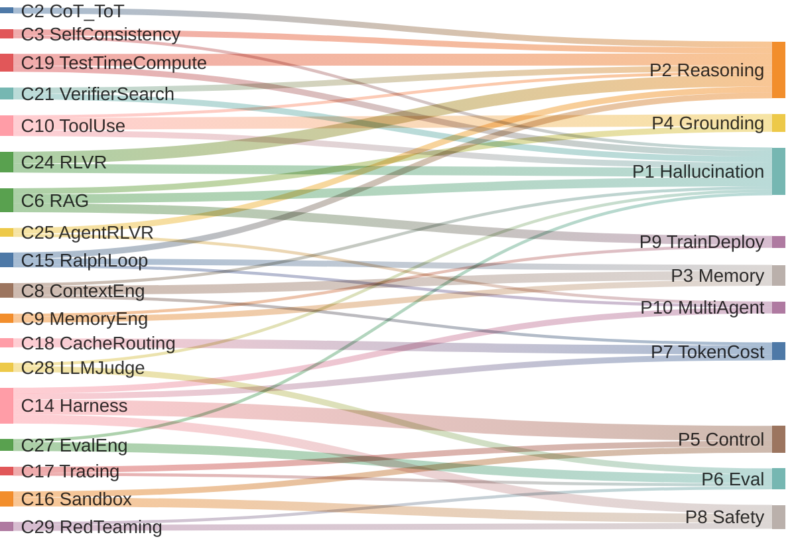
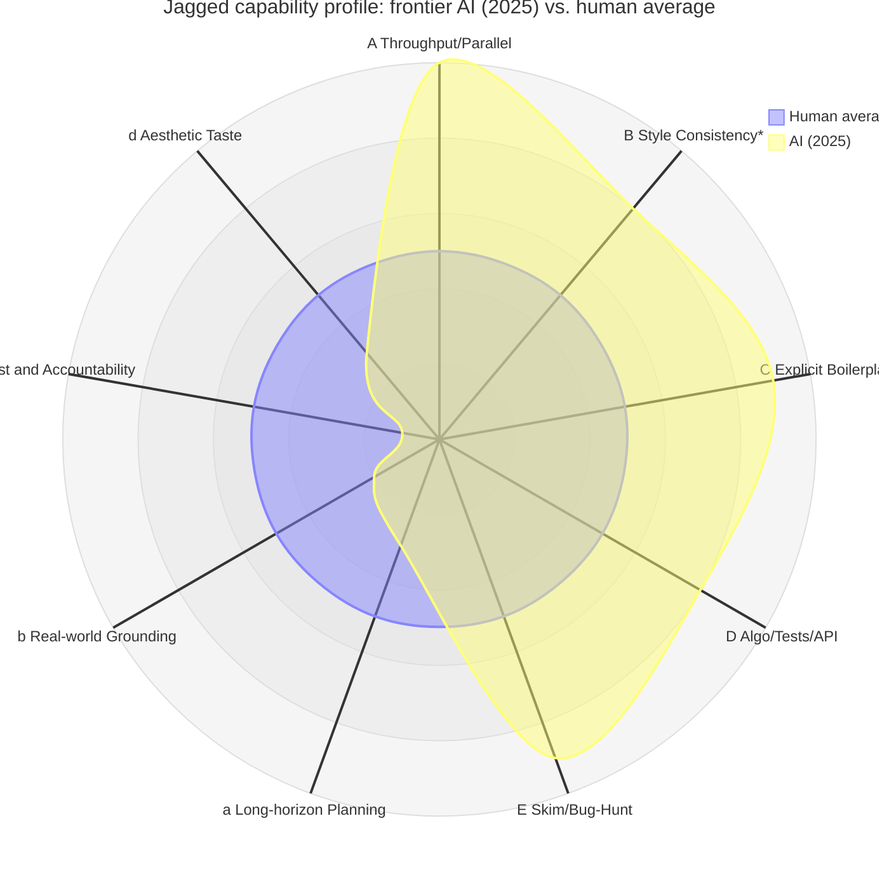

# Chapter 1. Introduction

## 1. Fundamental Issues of LLMs

After ChatGPT (late 2022), scaled-up next-token prediction was shown to elicit surprising language, knowledge, and rudimentary reasoning capabilities. But industry and academia quickly discovered that **the stronger the model itself becomes, the more conspicuous its "this is not how it should behave" failure modes get**. These can be roughly grouped into six fundamental issues:

1. **P1. Hallucination** — *Hallucination*
   Research has shown this is a structural consequence of the next-token objective plus evaluation incentives that reward "confident guessing," and cannot be eliminated by data or parameter scaling alone [[1]](https://arxiv.org/abs/2401.11817); current frontier models still exhibit 15%–52% factual error rates on low-resource languages, multimodal tasks, and long-document QA [[2]](https://www.lakera.ai/blog/guide-to-hallucinations-in-large-language-models), [[3]](https://blogs.library.duke.edu/blog/2026/01/05/its-2026-why-are-llms-still-hallucinating/). "Locating relevant information" and "resisting confabulation" are two weakly correlated capabilities; a high benchmark score ≠ trustworthy [[1]](https://arxiv.org/abs/2401.11817).

2. **P2. Lack of reasoning and long-horizon planning** — *Reasoning & Planning*
   LLMs predict "one token at a time," without an explicit world state, goal stack, or backtracking mechanism. CoT appears to be thinking, but is essentially turning "intermediate steps" into token distributions as well — LeCun and others point out this is merely **taking a few more steps along the pattern-matching trajectory**, and does not solve compositional generalization or reasoning in new situations [[4]](https://www.newsweek.com/nw-ai/ai-impact-interview-yann-lecun-llm-limitations-analysis-2054255).

3. **P3. Context and memory** — *Context & Memory*
   The "context window" is a one-shot sliding buffer, not structured memory: no persistent state, no priorities, no forgetting curve, no conversation-level consistency. Long-context models do not truly understand "this was decided ten minutes ago."

4. **P4. Real-world grounding** — *Real-World Grounding*
   Lacking perceptual grounding, the model cannot verify whether its outputs correspond to the external world. Will the code run? Will the SQL execute? Does the API actually exist? — a pure model cannot judge.

5. **P5. Uncontrollability and unauditability** — *Controllability & Auditability*
   The same prompt at the same temperature can yield different results depending on the time, batch, or KV cache hit pattern; after preference alignment, sycophancy, over-refusal, and style drift emerge. Model behavior is not a signable artifact.

6. **P6. Evaluation crisis** — *Evaluation Crisis*
   Benchmark contamination, leaderboard optimization, and single-shot accuracy mask tail failures. A gap has opened between "the model can do X" and "the model can reliably do X in production" — the latter requires success-rate distributions, long tails, and drift monitoring, not a single mean number.

In addition, there are several "secondary lesions" that engineering cannot ignore:

7. **P7. Token economics** — *Token Economics*: as context grows longer, per-step cost and latency rise linearly or even superlinearly.
8. **P8. Safety boundary** — *Safety Boundary*: once a model is allowed to "act," prompt injection, privilege escalation, and irreversible operations become a new class of attack surface.
9. **P9. Train–deploy gap** — *Train–Deploy Gap*: the model is an offline-trained "frozen brain," but tasks are online, private, and long-tailed; fine-tuning is expensive and not sustainable.
10. **P10. Multi-agent coordination** — *Multi-Agent Coordination*: multi-agent systems exhibit deadlocks, mutual hallucination, goal drift, and other systemic — rather than model-level — failures.

**None of these ten classes of problems can be solved by a "ten times bigger" model itself**. This is why the industry's center of gravity from 2023 onward has gradually shifted from "training larger models" to "engineering around the model."

---

## 2. The Conceptual Map That Emerged After 2022

Below is a layout of widely-circulated and less-known concepts grouped by "which layer they address."

### A. Input Layer
- **C1. Prompt Engineering**: ways of writing single-turn text instructions (role, few-shot, format constraints, CoT triggers).
- **C2. Chain-of-Thought / Tree-of-Thoughts / Graph-of-Thoughts (CoT/ToT/GoT)**: making the intermediate reasoning explicit, parallelized, and backtrackable.
- **C3. Self-Consistency**: multi-sample + majority vote, using statistical stability to override single-shot randomness.
- **C4. Self-Refine / Reflexion / Self-Critique**: having the model read its own output and revise.
- **C5. Constitutional AI / Principles-based Prompting**: using a plain-text "constitution" to constrain behavior, partially replacing RLHF.

### B. Context Layer
- **C6. RAG (Retrieval-Augmented Generation)**: retrieving external knowledge into the context to patch "no-memory + easy-hallucination" [[17]](https://arxiv.org/pdf/2507.09477).
- **C7. Agentic RAG / RAT (Retrieval-Augmented Thoughts)**: turning retrieval from a "one-shot pre-load" into "on-demand triggering during reasoning" [[17]](https://arxiv.org/pdf/2507.09477).
- **C8. Context Engineering**: a 2024–2025 framing that treats "what appears in the context" as a first-class design concern — instructions, state, memory, tool outputs, retrieval results, history assembly, compression, and eviction strategies. Prompt Engineering is a subset of it [[11]](https://www.philschmid.de/context-engineering), [[12]](https://www.elastic.co/search-labs/blog/context-engineering-vs-prompt-engineering), [[13]](https://www.gartner.com/en/articles/context-engineering).
- **C9. Memory Engineering**: stratification of long-term / short-term / semantic / episodic memory; vector stores, KV summaries, scratchpads, persona stores.

### C. Action Layer
- **C10. Tool Use / Function Calling**: the model emits structured calls; external code executes and feeds the result back.
- **C11. ReAct**: the alternating loop of Thought ↔ Action ↔ Observation, the ancestor of almost every agent framework.
- **C12. Agent / Multi-Agent**: packaging "loop + tools + planning + memory" into an entity that can be driven by tasks; multi-agent adds protocols, roles, and scheduling.
- **C13. Computer Use / Browser Use / Code Execution Sandbox**: extending "tools" to operating-system-level, browser-level, and IDE-level full capability surfaces.

### D. Runtime & Infrastructure
- **C14. Harness Engineering**: the most important paradigm shift of 2025–2026 [[5]](https://martinfowler.com/articles/harness-engineering.html), [[6]](https://www.firecrawl.dev/blog/what-is-an-agent-harness), [[7]](https://parallel.ai/articles/what-is-an-agent-harness), [[8]](https://addyosmani.com/blog/agent-harness-engineering/). A harness is the full runtime wrapped around the model: execution loop, tool whitelist, context lifecycle, sub-task dispatch, sandbox, audit, rollback, rate limiting, budget, hooks, and observability [[5]](https://martinfowler.com/articles/harness-engineering.html), [[7]](https://parallel.ai/articles/what-is-an-agent-harness). Claude Agent SDK, Codex SDK, and the OpenAI Agents SDK are all instantiations of harness APIs [[9]](https://aakashgupta.medium.com/2025-was-agents-2026-is-agent-harnesses-heres-why-that-changes-everything-073e9877655e). In one line: **"2025 was the year of agents; 2026 is the year of agent harnesses"** [[9]](https://aakashgupta.medium.com/2025-was-agents-2026-is-agent-harnesses-heres-why-that-changes-everything-073e9877655e).
- **C15. Ralph Loop (Ralph Wiggum Technique)**: a minimalist agent loop proposed by Geoffrey Huntley in late 2025 that spread virally — at its core a `while true; do cat PROMPT.md | claude-code; done` infinite loop, where each iteration restarts with a **clean context** so the agent repeatedly re-reads PRD/state files, decides its own next step, and continues until every checklist item is done [[19]](https://ghuntley.com/ralph/), [[20]](https://ghuntley.com/loop/). It externalizes "context management" to markdown on disk, replaces "long-horizon planning" with "infinite retry + persisted scratchpad," and works astonishingly well for greenfield projects — a paragon of harness minimalism.
- **C16. Sandboxing & Permission Modes**: fine-grained read/write/execute permission models borrowed from OS security thinking.
- **C17. Observability / Tracing** (LangSmith, Langfuse, OpenLLMetry): turning every prompt, token, tool call, latency, and cost into an indexable trace.
- **C18. Cache / Routing / Cascade**: KV reuse, prompt cache, routing to different models by difficulty — the main engineering levers of token economics.

### E. Inference-Time
- **C19. Test-Time Compute Scaling / Inference Scaling Laws**: spending more compute at inference time (sampling, search, verification) can be more economical than scaling the model in many tasks (the OpenAI o1 and DeepSeek-R1 lineage) [[14]](https://iclr.cc/virtual/2025/oral/31924), [[15]](https://arxiv.org/html/2506.12928v1), [[18]](https://rlhfbook.com/c/14-reasoning).
- **C20. Process Reward Model (PRM) / Outcome Reward Model (ORM)**: training a "scorer" to grade intermediate steps or final answers to guide best-of-N, beam search, or MCTS [[14]](https://iclr.cc/virtual/2025/oral/31924), [[16]](https://arxiv.org/abs/2504.02495).
- **C21. Verifier-Guided Search / Self-Evolving Verification**: using verifiable signals (compilation passes, unit tests pass, formal-proof checker accepts) as "hard" rewards [[16]](https://arxiv.org/abs/2504.02495).

### F. Training
- **C22. RLHF / DPO / KTO**: aligning the model to "obedient" via human preferences.
- **C23. RLAIF / Constitutional RL**: replacing some human-labeled preferences with AI-generated ones.
- **C24. RLVR (RL from Verifiable Rewards)**: rewards come from **machine-verifiable** signals — is the math problem correct, do the code tests pass, does the formal-proof checker accept. This is the key recipe behind reasoning models like o1 / R1 / Kimi-k1.5 [[18]](https://rlhfbook.com/c/14-reasoning).
- **C25. Agent-RLVR**: extending RLVR from "is the answer right" to multi-step agent trajectories — especially important for software-engineering tasks [[10]](https://arxiv.org/html/2506.11425v2).
- **C26. Curriculum / Self-Play / Synthetic Data**: re-training on data generated by the model itself and filtered by a verifier.

### G. Eval & Governance
- **C27. Eval Engineering**: upgrading evaluation from static benchmarks to **product-oriented, continuously-running evaluation systems** — regression sets, A/B testing, adversarial sets, drift monitoring, and production monitoring.
- **C28. LLM-as-a-Judge**: using one (usually stronger) LLM to score another LLM's output or to compare pairs, a shared foundation of Eval Engineering and RLAIF [[21]](https://openreview.net/forum?id=3GTtZFiajM), [[22]](https://en.wikipedia.org/wiki/LLM-as-a-Judge). A GPT-4-class judge can reach about 80% agreement with humans (≈ inter-human agreement); but research has repeatedly shown the judge itself has **position bias, verbosity bias, stance bias, and score drift**, with agreement dropping into the low 60s in specialized fields (medicine, law, psychology) [[21]](https://openreview.net/forum?id=3GTtZFiajM) — so "LLM as judge" is a necessary-but-not-trustworthy tool that requires judge calibration and adversarial sets.
- **C29. Red-Teaming / Jailbreak Eval / Prompt Injection Benchmarks**: making safety a quantifiable evaluation dimension.
- **C30. Model Cards / System Cards / Responsible Scaling Policies**: the governance layer.

---

## 3. How Many Fundamental Issues Have These Concepts Solved?

Matching the ten issues from Section 1 against the "remedies" of Section 2, the conclusion is not encouraging.

The Sankey diagram below gives an intuitive "flow" — the left side lists engineering concepts (corresponding to the C-numbers in §2), the right side lists the ten fundamental issues (corresponding to the P-numbers in §1), and the thickness of each link represents that concept's **mitigation contribution** to that problem (a subjective 1–5 score for visualization only; not a claim of complete elimination). At a glance: Harness and Ralph Loop-style "runtime" concepts concentrate on P5 / P8 / P10 and P3 Memory; RLVR and Test-time Compute concentrate their weight on P2 Reasoning + P1 Hallucination; RAG/Tool simultaneously handle P1 + P4 + P9; Eval-Eng and LLM-as-Judge jointly carry P6 Eval; while **the right-side inflow to P10 Multi-Agent and P9 Train-Deploy (deep personalization) is still thin** — which is precisely the two weakest links today.

| Fundamental issue | Primary engineering remedies | Degree of mitigation | Residual problems |
|---|---|---|---|
| 1. Hallucination | RAG, Tool use, RLVR, Verifier-guided search, Self-consistency [[1]](https://arxiv.org/abs/2401.11817), [[17]](https://arxiv.org/pdf/2507.09477) | **Medium**: drops significantly in domains with external ground truth / verifiers (code, math, retrieval QA); persists systemically in open-domain and long-form writing | Domains without a "hard floor" are structurally unsolvable [[1]](https://arxiv.org/abs/2401.11817); retrieval itself can be poisoned by erroneous/malicious content (PoisonedRAG showed this systemically; in 2025 benchmarks, existing defenses fail across 13 attack surfaces) [[23]](https://arxiv.org/abs/2402.07867), [[24]](https://arxiv.org/abs/2505.18543) |
| 2. Reasoning and planning | CoT/ToT, ReAct, Test-time compute, PRM, RLVR, Agent loop [[14]](https://iclr.cc/virtual/2025/oral/31924), [[15]](https://arxiv.org/html/2506.12928v1), [[18]](https://rlhfbook.com/c/14-reasoning) | **Medium to high (narrow domains)**: near top human level in math / competitive programming; still brittle on cross-domain, long-horizon, common-sense-heavy open planning | "A longer chain of thought ≠ real planning" — CoT is often **unfaithful to the model's actual computation**, and the chain frontier models present is post-hoc rationalization [[25]](https://arxiv.org/abs/2503.08679); multi-step error accumulation remains [[4]](https://www.newsweek.com/nw-ai/ai-impact-interview-yann-lecun-llm-limitations-analysis-2054255) |
| 3. Context / memory | Context Engineering, Memory store, long context, summary compression [[11]](https://www.philschmid.de/context-engineering), [[13]](https://www.gartner.com/en/articles/context-engineering) | **Low to medium**: can "fit it in," but discrimination, eviction, and consistency maintenance remain hand-crafted | No native, differentiable, learnable long-term memory mechanism — parameter-level continual learning still suffers from catastrophic forgetting [[26]](https://arxiv.org/abs/2404.16789), [[27]](https://arxiv.org/abs/2504.01241) |
| 4. Real-world grounding | Tool use, Computer use, RAG, Code execution | **Medium**: grounding in the digital world is already quite usable; the physical world still requires VLA / robotics-specific stacks | Knowing "what the tool said" is not the same as "understanding why it said so" — LLMs **bypass** rather than solve the Symbol Grounding problem; symbol manipulation and semantic content remain two separate things [[28]](https://arxiv.org/html/2512.09117) |
| 5. Uncontrollable / unauditable | Harness, Sandboxing, Tracing, Permission mode, Hooks [[5]](https://martinfowler.com/articles/harness-engineering.html), [[6]](https://www.firecrawl.dev/blog/what-is-an-agent-harness), [[8]](https://addyosmani.com/blog/agent-harness-engineering/) | **Medium to high (in engineering)**: replayable, auditable, permission-restricted are already engineering reality | Model randomness itself has not disappeared — the same prompt at different batch sizes, different GPUs, different concurrent loads yields different outputs (floating-point non-associativity + batching), requiring batch-invariant kernels to reproduce [[29]](https://thinkingmachines.ai/blog/defeating-nondeterminism-in-llm-inference/), [[30]](https://arxiv.org/abs/2506.09501) |
| 6. Evaluation crisis | Eval engineering, LLM-as-judge, adversarial sets, production monitoring | **Medium**: shifting from "benchmark-grinding" to "continuous evaluation" is real progress | Judge bias (position / verbosity / stance) is systemic [[21]](https://openreview.net/forum?id=3GTtZFiajM); benchmark contamination is serious — LessLeak / AntiLeakBench and other 2025 work show mainstream benchmark training-set leakage is widespread, and continuously constructing "post-training-only" new items is required to avoid it [[31]](https://aclanthology.org/2025.acl-long.901/) |
| 7. Token economics | Context compression, caching, KV reuse, model routing, cascade | **Medium**: caching and small-model offloading cut cost substantially | Increasingly long contexts + ever-growing test-time compute are structural trends; per-unit cost reduction cannot keep up with demand growth [[14]](https://iclr.cc/virtual/2025/oral/31924), [[15]](https://arxiv.org/html/2506.12928v1) |
| 8. Safety boundary | Sandboxing, Permission, Prompt injection eval, Constitutional AI | **Low to medium**: injection attacks continue to evolve, a cat-and-mouse game | Prompt injection is an **architectural** vulnerability: LLMs do not internally distinguish "code" from "data"; OWASP has listed Prompt Injection as #1 on the LLM Top-10, and industry consensus is that it is not curable under current architectures [[32]](https://genai.owasp.org/llmrisk/llm01-prompt-injection/) |
| 9. Train–deploy gap | RAG, In-context learning, lightweight fine-tuning (LoRA/PEFT), Agent memory | **Medium**: externalizing "knowledge" works | "Skills" remain hard to externalize; personalization and continual learning are not truly solved — any parameter-level update risks catastrophic forgetting, and forgetting worsens with scale [[26]](https://arxiv.org/abs/2404.16789), [[27]](https://arxiv.org/abs/2504.01241) |
| 10. Multi-agent coordination | Orchestration, protocols (A2A, MCP), scheduling frameworks | **Low**: still early; multi-agent often brings more failure modes than fewer | No agreed-upon "multi-agent OS": the MAST taxonomy, based on 1600+ failure traces across 7 mainstream frameworks, gives 14 systemic failure modes; production failure rates are 41–86.7%, and a "coordination tax" sets in beyond 4 agents [[33]](https://arxiv.org/abs/2503.13657) |

In one line:

> **This wave of "peripheral engineering" is not curing the disease — it is building scaffolding, monitoring, and nursing around an organ with congenital structural defects.** It tames the LLM from a "talking monster" into a "controllable workforce that can complete tasks in a constrained environment." But on the LLM's root problems — hallucination, compositional generalization, a true world model — none of this engineering touches the root; it merely **contains the impact within tolerable bounds**.

---

## 4. The Software-Engineering Context

Inspecting the ten fundamental issues from §1 against decades of software-engineering pathology, **none of them is a new symptom — only the active subject has changed from "human" to "model," and the time constant of each onset has been compressed by one or two orders of magnitude**. It is the **overall compression of the Software Development Life Cycle (SDLC) along the time axis**: construction gets faster, and decay gets faster in proportion.

### 1.4.1 The LLM "fundamental issues" and software-engineering "old problems" are isomorphic

From Brooks's *The Mythical Man-Month* and *No Silver Bullet* [34] to Fowler's *Refactoring*, what software engineering has cared about for decades is never "the algorithm or the machine is too slow," but rather **human memory, communication, coordination, knowledge transfer, and the limits of attention**.

| LLM fundamental issue (§1) | The "old problem" already present in software engineering |
|---|---|
| **P1 Hallucination** | Engineers writing the wrong API from memory, confusing dependency versions — empirical studies of code review show reviewers mostly "understand the code" rather than "find bugs," and defect-detection rates are limited [43]; CoT is unfaithful [[25]](https://arxiv.org/abs/2503.08679) ↔ design docs drift from the actual code over time, ending up as post-hoc rationalization [[37]](https://www.cs.drexel.edu/~yc349/CS451/RequiredReadings/SoftwareAging.pdf) |
| **P2 Lack of reasoning and long-horizon planning** | Requirement drift and forever-optimistic estimates — **Hofstadter's Law**: "It always takes longer than you expect, even when you take into account Hofstadter's Law" [40]; the essential complexity of software cannot be eliminated, and design drifting mid-way is the norm rather than the exception [34] |
| **P3 Context and memory** | Documentation rots as systems evolve, and comments fall out of sync with code — Parnas called this "software aging" [[37]](https://www.cs.drexel.edu/~yc349/CS451/RequiredReadings/SoftwareAging.pdf); Lehman's first law: "An E-type system must continually evolve or become progressively less useful," with documentation and design intent drifting accordingly [36]; onboarding studies show tribal knowledge is mostly transferred via mentors, not docs [[42]](https://www.semanticscholar.org/paper/Novice-software-developers,-all-over-again-Begel-Simon/0d34d4c7618d531b84d0fe78cb36c4e1b02e0709); catastrophic forgetting in models [[26]](https://arxiv.org/abs/2404.16789), [[27]](https://arxiv.org/abs/2504.01241) ↔ knowledge gaps after key engineers leave |
| **P4 Grounding** | "It works on my laptop" — software ages as real environments change [[37]](https://www.cs.drexel.edu/~yc349/CS451/RequiredReadings/SoftwareAging.pdf); Brooks distinguishes software's **essence** (conceptual structure) from its **accident** (syntactic representation): even compilable code can be semantically wrong [34]; LLMs bypass Symbol Grounding [[28]](https://arxiv.org/html/2512.09117) ↔ engineers writing code that compiles but behaves wrongly |
| **P5 Uncontrollable / unauditable** | Bugs that resist reproduction — Jim Gray in 1985 coined **"Heisenbug"** for transient faults that "vanish when re-observed," and measured 131 of 132 production faults (~99%) as belonging to this class [[39]](https://www.hpl.hp.com/techreports/tandem/TR-85.7.pdf); non-deterministic model behavior [[29]](https://thinkingmachines.ai/blog/defeating-nondeterminism-in-llm-inference/), [[30]](https://arxiv.org/abs/2506.09501) ↔ heisenbugs and "voodoo issues" engineers have always known |
| **P6 Evaluation crisis** | High coverage but missing critical paths — Inozemtseva & Holmes, on 5 systems and 31,000 test suites, proved that **after controlling for test count, the correlation between coverage and defect-finding is only low-to-medium; coverage should not be used as a quality metric** [[38]](https://www.cs.ubc.ca/~rtholmes/papers/icse_2014_inozemtseva.pdf); benchmark contamination [[31]](https://aclanthology.org/2025.acl-long.901/) ↔ the false confidence of "I ran all the tests" |
| **P7 Token economics** | Engineer cognitive bandwidth is limited — long-context cost rises ↔ per-capita output declines on large projects; **Brooks's Law: "Adding manpower to a late software project makes it later,"** precisely because communication overhead grows superlinearly with team size [34] |
| **P8 Safety boundary** | Prompt injection is an architectural defect [[32]](https://genai.owasp.org/llmrisk/llm01-prompt-injection/) ↔ social engineering works just as well on humans — Mitnick, in *The Art of Deception*, argues repeatedly that **"the human is the weakest link in the security chain,"** and no amount of encryption or firewalls can stop a verbal attacker [41] |
| **P9 Train–deploy gap** | Onboarding new hires is slow and training is expensive — Begel & Simon, tracking new engineers at Microsoft for their first 6 months, found that the acquisition of coding, debugging, design, and team-collaboration skills depended mostly on mentors rather than documentation [[42]](https://www.semanticscholar.org/paper/Novice-software-developers,-all-over-again-Begel-Simon/0d34d4c7618d531b84d0fe78cb36c4e1b02e0709); catastrophic forgetting in models [[26]](https://arxiv.org/abs/2404.16789), [[27]](https://arxiv.org/abs/2504.01241) ↔ "skills" have never been externalizable in the way "documents" are |
| **P10 Multi-agent coordination** | **Conway's Law**: "Any system designed by an organization mirrors that organization's communication structure" [[35]](https://www.melconway.com/Home/pdf/committees.pdf); Brooks further notes that the communication overhead of n-person collaboration grows as O(n²) [34]; MAST gives a 41–86.7% multi-agent failure rate [[33]](https://arxiv.org/abs/2503.13657) ↔ the "coordination tax" any engineering team of more than four or five people knows well |

This table is deliberate: **LLMs have not created any wholly new failure mode**. They inherit every existing software-engineering pathology of the human agent, only compressing the onset frequency of these pathologies from "weeks/months" to "seconds/minutes."

### 1.4.2 So what does LLM/Agent actually change in software engineering? — Subject replacement

AI Coding tools (Copilot, Cursor, Claude Code, Codex, Ralph Loop, etc.) are closer to **"adding an ever-tireless, N-fold parallel, but somewhat unreliable junior-to-mid engineer"** than to "a new engineering paradigm." Three pieces of empirical evidence:

1. **Failure modes are isomorphic**: the 14 failure classes MAST summarized from 1600+ failure traces across 7 mainstream multi-agent frameworks [[33]](https://arxiv.org/abs/2503.13657) — role misunderstanding, duplicated work, skipped verification, cascading hallucination, spec ambiguity — map almost one-to-one onto the failure modes that Brooks/DeMarco/Fowler have summarized for **human teams** over the years [34].
2. **Engineering guardrails are recycled**: Harness Engineering [[5]](https://martinfowler.com/articles/harness-engineering.html) reuses a great deal of mature concepts from OS, distributed systems, and team management — permission models, audit logs, code-review hooks, budget caps, rollbacks. This itself acknowledges: "we are not solving new problems, we are putting familiar guardrails on a faster execution subject."
3. **Verifiability is a return to 1970s discipline**: the essence of RLVR and verifier-guided search [[10]](https://arxiv.org/html/2506.11425v2), [[16]](https://arxiv.org/abs/2504.02495), [[18]](https://rlhfbook.com/c/14-reasoning) is to distill the old discipline of TDD / formal verification into a feedback signal for the model. **Making the agent learn to write correct methods is still making it face the compiler and the tests** — the same path as teaching a new hire.

In other words, **the LLM is a "subject-replacement experiment" for software-engineering methodology**: every engineering discipline that worked on humans (small commits, reversible operations, explicit contracts, incremental refactoring, regression tests) still works on agents; every discipline that did not work on humans ("write a flawless specification," "let the team naturally form tacit understanding") still does not work on agents.

Given this, the industry today (early 2026) primarily manages AI by directly transplanting its way of managing human engineers, aiming for human-average and human-team-average outcomes — typical examples include Superpowers [[46]](https://github.com/obra/superpowers), which makes AI agents execute a set of human best-practice workflows. So beyond AI's problems, its advantages relative to humans also need to be examined.

#### 1.4.2.1 The "jagged frontier" of AI capability

The phrase "Jagged Technological Frontier" comes from a large-scale field experiment by Dell'Acqua et al. in 2023 in collaboration with BCG [[47]](https://www.hbs.edu/faculty/Pages/item.aspx?num=64700): 758 BCG consultants were randomly assigned whether or not to use GPT-4 to complete 18 realistic consulting tasks. The result split sharply:

- On tasks falling **within** the capability frontier, consultants using AI completed **12.2%** more tasks on average, **25.1%** faster, and at **40%+** higher quality;
- On tasks deliberately chosen to fall **outside** the frontier (similar-looking difficulty by description), consultants using AI were **19 percentage points less likely** to give a correct answer.

In other words — AI capability is not a scalar "X% above or below humans overall," but **an irregularly-shaped surface**: two superficially adjacent tasks can land one inside and the other outside the frontier, and the boundary shape cannot be directly predicted from "task description difficulty." Ethan Mollick further calls this **"Jagged AGI"**: the same frontier model can solve hard business-strategy problems in seconds yet stumble on a child's riddle.

Karpathy, in his late-2025 retrospective, offers a mechanistic account of this curve [[48]](https://karpathy.bearblog.dev/year-in-review-2025/): an LLM's capability **grows "spikes" around domains covered by RLVR (reinforcement learning from verifiable rewards)** — narrow domains with hard verifiers like math problems, competitive programming, formal proof, and strongly-typed code, where the model rapidly approaches or surpasses human experts; whereas in open domains without verifiable signals (creativity, long-horizon planning, social and physical common sense, taste judgment), the model still produces output similar to that of an average human. So "jagged" is not a flaw caused by insufficient training — it is **a structural product of the optimization objective itself**.

*Source: karpathy.bearblog.dev*

Carrying this conclusion into software engineering yields a guiding judgment:

> **AI is neither a "broadly capable but somewhat weak" junior engineer, nor a "broadly capable and superhuman" senior engineer; it is an executor whose capability distribution is orthogonal to the human's — easily surpassing the human average on some dimensions we have always considered "hard," and repeatedly stumbling on dimensions we have always taken for granted.**

#### 1.4.2.2 In contrast with software engineers

The radar chart below places the capability **strengths** axes (A–E) that §1.4.2.2.1 will develop side by side with the capability **weaknesses** axes (a–d) that §1.4.2.2.2 will develop, on the same diagram for subjective comparison. The human average is uniformly anchored at 5 (the baseline anchor), and AI's scores float relative to it within 0–10; the first half of the perimeter (A–E) sits mostly outside 5, the second half (a–d) mostly inside 5 — this is the visualization of "jaggedness" in an engineering context:

> Notes on reading the chart:
> - The human average (cyan polygon) is fixed at 5 on every axis — it **is the baseline**, not "the actual distribution of human capability."
> - AI's scores (orange polygon) are subjective estimates based on the arguments in §2.1 / §2.2, **used only to convey the "jagged shape"** and not to be read as precise measurements; specific distributions vary across models, harnesses, and domains.
> - The AI score on **B Style Consistency** is taken under a **multi-sample + verifier feedback** configuration; in single-shot mode this axis would sit closer to 5 (see §1.4.2.2.1 B).
> - **c Trust and Accountability** sits near 0 because, in most legal/compliance contexts, this dimension **structurally** cannot be borne by a model, regardless of capability strength.

The following maps this jaggedness onto specific software-engineering dimensions.

##### 1.4.2.2.1 Dimensions where AI is stably above the human average

**A. Throughput and parallelism.** Code-generation speed is 10²–10³ times that of a human engineer, and is naturally parallel. The direct consequence is not "code written better," but "any notion of quality that only holds when generation speed is less than review speed has, in principle, become invalid."

**B. Style / naming / template consistency (under a "multi-sample + self-check" configuration).**

A key qualification first: at the **single-shot** level, given LLM sampling-temperature randomness plus inference-time non-determinism (see Chapter 1 P5 on floating-point non-associativity + batching), AI's consistency when "repeatedly executing the same specification" is **not necessarily** higher than that of a well-onboarded human engineer — running the same prompt at different times under different loads can produce slight drift in naming, whitespace, and error-handling order.

But once the generation loop is extended to **multi-sample + self-check / verifier filtering**, the picture changes qualitatively. Brown et al.'s 2024 *Large Language Monkeys: Scaling Inference Compute with Repeated Sampling* [[49]](https://arxiv.org/abs/2407.21787) showed empirically that **as long as a machine-verifiable success signal is available**, coverage (the fraction of tasks solved by at least one sample) rises log-linearly with sample count over four orders of magnitude — e.g., on SWE-bench Lite, DeepSeek-Coder-V2-Instruct went from 15.9% single-sample solve rate to 56% at 250 samples. This is an indirect but strong piece of evidence: when "consistency" is also treated as a target that a verifier / linter / judge can quantify, **multi-sample + select-best** can converge the AI system's consistency to a level well above the human average — enforcing the same naming convention, the same import ordering, the same error-handling idiom across a large codebase is a chore for humans, but a default behavior for an AI harness with verifier feedback.

> ⚠ **Disclaimer**: as of now, no **direct controlled experiment** has measured "AI multi-sample + self-check vs. human engineers' style consistency on large codebases" side by side as the same variable. The judgment here is extrapolated by analogy from adjacent domains (coverage scaling in math/code tasks); it still requires dedicated empirical evaluation on real codebases.

This in turn implies an effect on lint / code-style practice: traditional lint rules and code-style guides whose surface goal is "consistency" do not immediately become free under single-shot, **but under a harness with lint / verifier feedback + multi-round regeneration, they fall from "targets humans must work to achieve" to "a near-zero-cost baseline of the AI system."**

**C. Writing boilerplate explicitly rather than "abstracting it away."** Templates, glue code, adapters, conversion layers — code that DRY dogma had suppressed as "repetitive but explicit" — AI does not mind writing. You can choose "expand 100 lines of explicit boilerplate" over "save 70 lines with three layers of abstraction."

**D. Approaching / surpassing the human average within RLVR-covered narrow domains**: algorithm implementation, unit-test writing, API-shape conformance, mechanical cross-language translation, SQL / regex / grep-style query expression — these domains with strong feedback signals are where AI has stably surpassed the average human in 2025.

**E. "Bulk literate-scan" work across large contexts (including security-vulnerability hunting).** Reading an entire codebase to find every naming violation, every stale comment, every dead path, every uncaught exception — this kind of "patient work" is extremely expensive for humans, but is almost free as a by-product for AI. **Security-vulnerability discovery** is the high-value extension of this property: in the 2025 DARPA **AIxCC (AI Cyber Challenge)** final, an LLM-driven "All You Need Is A Fuzzing Brain" system **autonomously discovered 28 security vulnerabilities in real-world open-source C / Java projects, 6 of them previously-undisclosed 0-days, and automatically patched 14** [[50]](https://arxiv.org/html/2509.07225v1); a 2025 ACM Computing Surveys article systematically summarizes the rapid growth of LLMs in vulnerability detection starting that year [[51]](https://dl.acm.org/doi/10.1145/3769082). That is to say, on the continuum from "code-smell skim" to "zero-day vulnerability hunting," AI is using two capabilities — patience and cross-context retrieval, both amplified to near-free — to do things that are **economically unjustified for ordinary human engineering teams**.

##### 1.4.2.2.2 Dimensions where AI is still below the human level

**a. Long-horizon planning and architectural judgment**: systemic design across multiple modules, multiple requirement iterations, and "ambiguous, incomplete requirements" remains a weak spot for AI (see Chapter 1 P2).

**b. Real-world grounding and constraint awareness**: which performance budgets are hard constraints, which user pain points are real pain, which "looks-feasible-but-trips-production" edges to avoid — judgments anchored by on-the-ground experience still require explicit input to AI; AI cannot perceive them spontaneously (see Chapter 1 P4).

**c. Trust and accountability**: when an output must bear consequences (compliance, safety, business commitment), the "person-to-person chain of accountability" remains a contract foundation that machines cannot replace.

**d. Taste and aesthetics**: which abstractions are elegant, which API designs make people want to use them for ten years — these "long-term readability" trade-offs are still dominated in AI by re-stating the training-set majority view, not by independent judgment.

### 1.4.3 The biggest change is the time constant: SDLC acceleration = accelerated construction + accelerated decay

If we accept the "subject replacement" judgment, the impact of AI Coding is not a "qualitative change" but a **proportional compression of the SDLC along the time axis**:

- **Construction is compressed**: from requirements to MVP, the time drops from weeks to days or even hours; minimalist loops like Ralph Loop [[19]](https://ghuntley.com/ralph/), [[20]](https://ghuntley.com/loop/) make "six repos overnight" a reality.
- **Decay is compressed in parallel**:
  - The growth rate of code redundancy, mis-abstraction, and implicit coupling rises **in step with** generation rate;
  - Semantic drift between documentation/comments (i.e. P3) worsens with commit rate [[26]](https://arxiv.org/abs/2404.16789), [[27]](https://arxiv.org/abs/2504.01241);
  - Eval contamination and benchmark distortion [[31]](https://aclanthology.org/2025.acl-long.901/) also accelerate with generation rate;
  - Multi-agent coordination tax [[33]](https://arxiv.org/abs/2503.13657) makes "adding more agents" yield negative marginal returns past 4 — same law as "adding more people."

This means the focus of software-engineering practice shifts from "making trade-offs on complex systems under the constraint of incomplete information and continuous change" to **new problems**:

#### 1.4.3.1 How to establish new quality standards and earn user trust

When code is generated far faster than humans can review, the human-centric quality gates of "review after commit, regress after release" have, in principle, lost their footing. What deserves user trust is no longer "code volume" or "coverage," but **the process of generation** and **those things in the generate–verify loop that can be continuously proven aligned with user expectations**.

- **AI generation-process records become a standard required deliverable** — in traditional development, recording tribal knowledge, the process, and documentation at a higher level of semantic abstraction than code is all extra work, and inevitably patchy. In LLM-assisted development, humans communicate with the system at a higher level of semantic abstraction, and the agent's generation-process messages are all textual — they can be recorded and analyzed far more completely.
- **Evaluation and monitoring (§2 C27–C29) become an in-line step of development, not an after-the-fact step** — quality must be measured in step with generation, delivered alongside the product (not retrofitted as an after-the-fact report), and these signals must be auditable by the user, replayable, and inspectable. Inozemtseva & Holmes already proved coverage ≠ quality [[38]](https://www.cs.ubc.ca/~rtholmes/papers/icse_2014_inozemtseva.pdf); in the agent era, "the truthfulness of the evaluation signal itself" becomes the new moat, and the biases of LLM-as-Judge [[21]](https://openreview.net/forum?id=3GTtZFiajM) are a reminder that this layer of trust is not free.

#### 1.4.3.2 How to maximize the share of "effective time" in an accelerated lifecycle

If construction and decay are both accelerated equally, what determines a system's value is not "how long it has run" but **"during the time it has been running, what fraction of it was in a state of being understandable, modifiable, and trustworthy."** This is the engineering question of an "effective-time ratio."

- **Continuous refactoring and reversibility replace one-shot design**: under accelerated decay, the system's "metabolism" must run at the same speed as its "generation"; any irreversible decision will be amplified by acceleration into an irrecoverable incident, so reversibility is more valuable than getting-it-right-the-first-time.
- **External memory (PRDs, ADRs, `fix_plan.md`-style "organizational memory" on disk) goes from optional to lifeline** — models have no true P3-sense memory of their own [[26]](https://arxiv.org/abs/2404.16789), [[27]](https://arxiv.org/abs/2504.01241), just as human organizations have none of their own; without continuous sedimentation, every restart repeats the same mistakes and "effective time" is wasted re-discovering the same things.

#### 1.4.3.3 Lift the constraints of incomplete information and continuous change to create the new value that didn't exist before because of "don't know / can't compute / can't afford"

When the marginal cost of an engineering action drops near zero, work that was previously kept out of practice because — **didn't know — couldn't learn fast enough, couldn't build an analytical model — couldn't think it through, needed too many people and too much time — couldn't afford it** — gets reopened, or the focus of problem-solving shifts entirely.

1. **Agent-based simulation replaces limited-experience extrapolation.** In the past, design and decisions involving organizations, economics, architecture, and user behavior could only rely on local experience plus over-simplified models (Fermi estimates, whiteboard war-games, single-point stress tests), because there was no cheap way to "run it before doing it." Once per-agent unit cost is low enough, a group of N agents with different positions/constraints/failure modes can simulate "the system's actual behavior," upgrading design and decisions from **gut-feel calls** to **repeatable, comparable, gradable numerical experiments** — an extension of ABM in economics and Monte Carlo in OR into software-engineering practice.

2. **Massive-parallel exploration of the "implementation space."** Traditionally, an architecture, a refactor, or a performance-optimization path is decided by 1–2 senior engineers — because the human cost of trying 50 implementations at once is too high. Once AI Coding pushes this marginal cost near 0, **implementation choice changes from "a single guess by the most experienced engineer" to "select-best after concurrently running evaluations on N candidates."** This is the equivalent of bringing ML's hyperparameter sweep / Neural Architecture Search (NAS) into the code space — architecture, refactoring, API design begin to acquire enumerable and benchmarkable properties, and "a few experts on instinct" is partially replaced by "parallel population + automatic evaluation." This line of thought is also a relative of the recent "**learning beyond gradients**" discussion.

In February 2026, François Chollet offered a more direct claim: **"Sufficiently advanced agentic coding is essentially machine learning"** — the engineer sets the optimization objective (spec) and the search-space constraints (tests); the agent acts as the optimizer iterating to the objective; the artifact (the generated codebase) is in essence a **black-box model** — you deploy it without inspecting its internal logic, just as we deploy a neural network without caring about individual weights [[44]](https://x.com/fchollet/status/2024519439140737442). It follows that classic ML pathologies will all soon become engineering problems of agentic coding: overfitting to the spec, Clever Hans shortcuts that don't generalize beyond the tests, data leakage, concept drift… [[44]](https://x.com/fchollet/status/2024519439140737442)

Weng (Trinkle) parallels modifying heuristics by coding agents (i.e., hand-written rules and programmatic policies) with gradient-based weight optimization, treating both as new paths of "learning," or even some combination: "use HL to handle online data and rapidly generate online experience, internalize the online experience as trainable, regressable, filterable data, and periodically update the neural network." [[45]](https://trinkle23897.github.io/learning-beyond-gradients/#zh).

| ML training side | Agentic coding side | Traditional software engineering side |
|---|---|---|
| Loss function (optimization objective) | Requirements doc / PRD / spec | Requirements doc / user stories |
| Validation set (held-out eval set) | Test cases / acceptance cases / production-traffic replay | Test cases / UAT |
| Model architecture (network architecture) | The coding agent itself (harness, toolset, sub-agent orchestration) | Programmer + team (people + process) |
| One training step (one gradient update) | One agent iteration (read → edit → run → observe) | One commit / PR |
| Trained model weights (deployable artifact) | Generated codebase (deployable artifact) | Human-written codebase (deployable artifact) |
| Hyperparameters (lr / batch / optimizer) | Prompt templates, temperature, system prompt, context-organization strategy | Coding standards, code-review standards, team conventions |
| Training pipeline (DDP / orchestration) | CI/CD + agent orchestration | CI/CD + project management |
| Training compute budget (FLOPs / $) | Inference compute budget (tokens / $) | Person-month budget |
| **Handling: incomplete requirement information** — replace an explicit spec with data / preferences / verifiers: supervised learning infers the target from samples; RLHF / DPO uses pairwise human preferences; RLVR / verifier-guided search uses machine-judgeable hard signals; active learning has the model proactively query points of uncertainty | Treat the spec as a **proxy under continuous iterative correction**; use tests, lints, and production traces as hard verification; have the agent proactively ask for clarification at points of ambiguity | Iterative requirements engineering (Agile), user interviews, prototypes, MVPs; accept that the spec will continue to change before delivery |
| **Handling: continuously changing constraints** — drift detection + incremental training (LoRA / adapters); replay buffer / EWC to suppress catastrophic forgetting; **decouple by rate of change**: foundation model (slow-changing) + downstream adapter (fast-changing) | Production traces replayed as eval; high-frequency requirement changes go through PRDs / `fix_plan.md`, low-frequency architecture sediments into the foundation; session isolation prevents long-chain drift | Versioned iteration, regression tests, dual-track / canary release, externalized configuration; interface contracts + adapters absorb change |
| **Handling: trade-offs in complex systems** — end-to-end learning abandons hand-crafted intermediate representations; MoE routes inputs to experts; **scaling laws** turn "how much parameters / data / compute to stack" into a predictable engineering quantity; differentiable composition lets back-prop traverse the whole system | Parallel search over the implementation space + verifier selection (§1.4.3.3 point 2); sub-agents specialized by role (MoE thinking); test-time compute makes "think deeper" priced explicitly | Layered architecture, modularity, abstraction layers, domain-driven design; Conway's law to split teams; stable interfaces to insulate complexity |

3. **"Disposable / per-user-level software" becomes economically viable.** For decades software pursued "one solution serves many," because per-unit development cost was so high that amortization was required for it to make sense. Once the cost of generating a unit of code drops to a few cents, **"write a tool just for this meeting, this ticket, this user"** becomes a normal option: reports, data pulls, ETL, internal dashboards, custom SOPs — long-tail needs that were previously left in Excel or to manual labor because "it isn't worth developing for" can be produced by an agent one-off and discarded after use. This is a structural change in the economics of software: **the premise that "reuse" is a virtue is partially weakened**, and software has its first real chance to be truly "made-to-measure" rather than "mass-delivered."

The following chapters examine these new problems and new methods in detail.

---

## References

[1] Z. Xu, S. Jain, and M. Kankanhalli, "Hallucination is Inevitable: An Innate Limitation of Large Language Models," *arXiv preprint*, arXiv:2401.11817, Jan. 2024. [Online]. Available: <https://arxiv.org/abs/2401.11817>

[2] Lakera, "LLM Hallucinations in 2026: How to Understand and Tackle AI's Most Persistent Quirk," *Lakera Blog*, 2026. [Online]. Available: <https://www.lakera.ai/blog/guide-to-hallucinations-in-large-language-models>

[3] Duke University Libraries, "It's 2026. Why Are LLMs Still Hallucinating?," *Duke University Libraries Blogs*, Jan. 5, 2026. [Online]. Available: <https://blogs.library.duke.edu/blog/2026/01/05/its-2026-why-are-llms-still-hallucinating/>

[4] M. Picard, "Yann LeCun, Pioneer of AI, Thinks Today's LLMs Are Nearly Obsolete," *Newsweek*, 2025. [Online]. Available: <https://www.newsweek.com/nw-ai/ai-impact-interview-yann-lecun-llm-limitations-analysis-2054255>

[5] M. Fowler, "Harness Engineering for Coding Agent Users," *martinfowler.com*, 2025. [Online]. Available: <https://martinfowler.com/articles/harness-engineering.html>

[6] Firecrawl, "What Is an Agent Harness? The Infrastructure That Makes AI Agents Actually Work," *Firecrawl Blog*, 2025. [Online]. Available: <https://www.firecrawl.dev/blog/what-is-an-agent-harness>

[7] Parallel Web Systems, "What is an agent harness in the context of large-language models?," *parallel.ai*, 2025. [Online]. Available: <https://parallel.ai/articles/what-is-an-agent-harness>

[8] A. Osmani, "Agent Harness Engineering," *addyosmani.com*, 2025. [Online]. Available: <https://addyosmani.com/blog/agent-harness-engineering/>

[9] A. Gupta, "2025 Was Agents. 2026 Is Agent Harnesses. Here's Why That Changes Everything.," *Medium*, 2026. [Online]. Available: <https://aakashgupta.medium.com/2025-was-agents-2026-is-agent-harnesses-heres-why-that-changes-everything-073e9877655e>

[10] J. Lu *et al.*, "Agent-RLVR: Training Software Engineering Agents via Guidance and Environment Rewards," *arXiv preprint*, arXiv:2506.11425v2, Jun. 2025. [Online]. Available: <https://arxiv.org/html/2506.11425v2>

[11] P. Schmid, "The New Skill in AI is Not Prompting, It's Context Engineering," *philschmid.de*, 2025. [Online]. Available: <https://www.philschmid.de/context-engineering>

[12] Elastic, "Context engineering vs. prompt engineering," *Elasticsearch Labs*, 2025. [Online]. Available: <https://www.elastic.co/search-labs/blog/context-engineering-vs-prompt-engineering>

[13] Gartner, "Context Engineering: Why it's Replacing Prompt Engineering for Enterprise AI Success," *Gartner Insights*, 2025. [Online]. Available: <https://www.gartner.com/en/articles/context-engineering>

[14] C. Snell, J. Lee, K. Xu, and A. Kumar, "Scaling LLM Test-Time Compute Optimally Can be More Effective than Scaling Parameters for Reasoning," in *Proc. Int. Conf. Learn. Representations (ICLR)*, 2025. [Online]. Available: <https://iclr.cc/virtual/2025/oral/31924>

[15] K. Zhu *et al.*, "Scaling Test-time Compute for LLM Agents," *arXiv preprint*, arXiv:2506.12928, Jun. 2025. [Online]. Available: <https://arxiv.org/html/2506.12928v1>

[16] Z. Liu *et al.*, "Inference-Time Scaling for Generalist Reward Modeling," *arXiv preprint*, arXiv:2504.02495, Apr. 2025. [Online]. Available: <https://arxiv.org/abs/2504.02495>

[17] D. Zhang *et al.*, "A Survey of RAG-Reasoning Systems in LLMs," *arXiv preprint*, arXiv:2507.09477, Jul. 2025. [Online]. Available: <https://arxiv.org/pdf/2507.09477>

[18] N. Lambert, "Reasoning Training & Inference-Time Scaling," in *The RLHF Book*, ch. 14, 2025. [Online]. Available: <https://rlhfbook.com/c/14-reasoning>

[19] G. Huntley, "Ralph Wiggum as a 'software engineer'," *ghuntley.com*, 2025. [Online]. Available: <https://ghuntley.com/ralph/>

[20] G. Huntley, "Everything Is a Ralph Loop," *ghuntley.com*, 2025. [Online]. Available: <https://ghuntley.com/loop/>

[21] J. Ye *et al.*, "Justice or Prejudice? Quantifying Biases in LLM-as-a-Judge," *OpenReview*, 2025. [Online]. Available: <https://openreview.net/forum?id=3GTtZFiajM>

[22] Wikipedia contributors, "LLM-as-a-Judge," *Wikipedia*, 2025. [Online]. Available: <https://en.wikipedia.org/wiki/LLM-as-a-Judge>

[23] W. Zou, R. Geng, B. Wang, and J. Jia, "PoisonedRAG: Knowledge Corruption Attacks to Retrieval-Augmented Generation of Large Language Models," in *Proc. USENIX Security Symposium*, 2025; *arXiv preprint*, arXiv:2402.07867. [Online]. Available: <https://arxiv.org/abs/2402.07867>

[24] B. Chen *et al.*, "Benchmarking Poisoning Attacks against Retrieval-Augmented Generation," *arXiv preprint*, arXiv:2505.18543, May 2025. [Online]. Available: <https://arxiv.org/abs/2505.18543>

[25] I. Arcuschin *et al.*, "Chain-of-Thought Reasoning In The Wild Is Not Always Faithful," *arXiv preprint*, arXiv:2503.08679, Mar. 2025. [Online]. Available: <https://arxiv.org/abs/2503.08679>

[26] H. Shi *et al.*, "Continual Learning of Large Language Models: A Comprehensive Survey," *ACM Computing Surveys*, 2025; *arXiv preprint*, arXiv:2404.16789. [Online]. Available: <https://arxiv.org/abs/2404.16789>

[27] T. Li *et al.*, "Catastrophic Forgetting in LLMs: A Comparative Analysis Across Language Tasks," *arXiv preprint*, arXiv:2504.01241, Apr. 2025. [Online]. Available: <https://arxiv.org/abs/2504.01241>

[28] "A Categorical Analysis of Large Language Models and Why LLMs Circumvent the Symbol Grounding Problem," *arXiv preprint*, arXiv:2512.09117, Dec. 2025. [Online]. Available: <https://arxiv.org/html/2512.09117>

[29] H. He *et al.*, "Defeating Nondeterminism in LLM Inference," *Thinking Machines Lab Blog*, Sept. 2025. [Online]. Available: <https://thinkingmachines.ai/blog/defeating-nondeterminism-in-llm-inference/>

[30] Y. Wu *et al.*, "Understanding and Mitigating Numerical Sources of Nondeterminism in LLM Inference," *arXiv preprint*, arXiv:2506.09501, Jun. 2025. [Online]. Available: <https://arxiv.org/abs/2506.09501>

[31] X. Wu *et al.*, "AntiLeakBench: Preventing Data Contamination by Automatically Constructing Benchmarks with Updated Real-World Knowledge," in *Proc. ACL 2025*. [Online]. Available: <https://aclanthology.org/2025.acl-long.901/>

[32] OWASP GenAI Security Project, "LLM01:2025 Prompt Injection," *OWASP Top 10 for LLM Applications*, 2025. [Online]. Available: <https://genai.owasp.org/llmrisk/llm01-prompt-injection/>

[33] M. Cemri *et al.*, "Why Do Multi-Agent LLM Systems Fail?," in *Proc. NeurIPS 2025*; *arXiv preprint*, arXiv:2503.13657. [Online]. Available: <https://arxiv.org/abs/2503.13657>

[34] F. P. Brooks Jr., *The Mythical Man-Month: Essays on Software Engineering*, Anniversary Ed. Reading, MA, USA: Addison-Wesley, 1995. (Includes reprint of "No Silver Bullet—Essence and Accident in Software Engineering," *IEEE Computer*, vol. 20, no. 4, pp. 10–19, Apr. 1987; and the original formulation of Brooks's Law on adding manpower to late projects.)

[35] M. E. Conway, "How Do Committees Invent?," *Datamation*, vol. 14, no. 5, pp. 28–31, Apr. 1968. [Online]. Available: <https://www.melconway.com/Home/pdf/committees.pdf>

[36] M. M. Lehman, "Programs, Life Cycles, and Laws of Software Evolution," *Proceedings of the IEEE*, vol. 68, no. 9, pp. 1060–1076, Sept. 1980.

[37] D. L. Parnas, "Software Aging," in *Proc. 16th Int. Conf. Software Engineering (ICSE)*, Sorrento, Italy, May 1994, pp. 279–287. [Online]. Available: <https://www.cs.drexel.edu/~yc349/CS451/RequiredReadings/SoftwareAging.pdf>

[38] L. Inozemtseva and R. Holmes, "Coverage Is Not Strongly Correlated with Test Suite Effectiveness," in *Proc. 36th Int. Conf. Software Engineering (ICSE)*, Hyderabad, India, 2014, pp. 435–445. [Online]. Available: <https://www.cs.ubc.ca/~rtholmes/papers/icse_2014_inozemtseva.pdf>

[39] J. Gray, "Why Do Computers Stop and What Can Be Done About It?," Tandem Technical Report TR-85.7, Tandem Computers, Cupertino, CA, USA, June 1985. [Online]. Available: <https://www.hpl.hp.com/techreports/tandem/TR-85.7.pdf>

[40] D. R. Hofstadter, *Gödel, Escher, Bach: An Eternal Golden Braid*. New York, NY, USA: Basic Books, 1979. (Source of Hofstadter's Law on time estimation.)

[41] K. D. Mitnick and W. L. Simon, *The Art of Deception: Controlling the Human Element of Security*. Indianapolis, IN, USA: Wiley, 2002.

[42] A. Begel and B. Simon, "Novice Software Developers, All Over Again," in *Proc. 4th Int. Workshop on Computing Education Research (ICER)*, Sydney, Australia, 2008, pp. 3–14. [Online]. Available: <https://www.semanticscholar.org/paper/Novice-software-developers,-all-over-again-Begel-Simon/0d34d4c7618d531b84d0fe78cb36c4e1b02e0709>

[43] A. Bacchelli and C. Bird, "Expectations, Outcomes, and Challenges of Modern Code Review," in *Proc. 35th Int. Conf. Software Engineering (ICSE)*, San Francisco, CA, USA, May 2013, pp. 712–721.

[44] F. Chollet, "Sufficiently advanced agentic coding is essentially machine learning…" *X (Twitter)*, Feb. 19, 2026. (Key claims: agentic coding = ML where engineer sets the optimization goal (spec) and search-space constraints (tests), the agent is the optimizer, and the generated codebase is a black-box model; therefore classic ML pathologies—spec overfitting, Clever Hans shortcuts, data leakage, concept drift—will all reappear in agentic coding.) [Online]. Available: <https://x.com/fchollet/status/2024519439140737442>

[45] J. Weng ("Trinkle"), "Learning Beyond Gradients," *Personal Blog*, 2025. (A survey-style essay grouping evolutionary strategies, Bayesian optimization, and search-based RL as a unified non-gradient optimization family for modern AI systems.) [Online]. Available: <https://trinkle23897.github.io/learning-beyond-gradients/#zh>

[46] J. Bernstein (obra), "Superpowers: A Claude Code plugin that gives Claude superpowers," *GitHub repository*, 2025. (An opinionated plugin packaging human software-engineering best-practice workflows—planning, TDD, code review, debugging skills—as reusable instructions for Claude Code agents.) [Online]. Available: <https://github.com/obra/superpowers>

[47] F. Dell'Acqua, E. McFowland III, E. R. Mollick, H. Lifshitz-Assaf, K. Kellogg, S. Rajendran, L. Krayer, F. Candelon, and K. R. Lakhani, "Navigating the Jagged Technological Frontier: Field Experimental Evidence of the Effects of Artificial Intelligence on Knowledge Worker Productivity and Quality," Harvard Business School Working Paper No. 24-013, Sept. 2023. [Online]. Available: <https://www.hbs.edu/faculty/Pages/item.aspx?num=64700>

[48] A. Karpathy, "2025 LLM Year in Review," *karpathy.bearblog.dev*, Dec. 2025. [Online]. Available: <https://karpathy.bearblog.dev/year-in-review-2025/>

[49] B. Brown, J. Juravsky, R. Ehrlich, R. Clark, Q. V. Le, C. Ré, and A. Mirhoseini, "Large Language Monkeys: Scaling Inference Compute with Repeated Sampling," *arXiv preprint*, arXiv:2407.21787, Jul. 2024. [Online]. Available: <https://arxiv.org/abs/2407.21787>

[50] Z. Wang *et al.*, "All You Need Is A Fuzzing Brain: An LLM-Powered System for Automated Vulnerability Detection and Patching," *arXiv preprint*, arXiv:2509.07225, Sept. 2025. (DARPA AI Cyber Challenge 2025 finalist; autonomously discovered 28 vulnerabilities including 6 zero-days in real-world open-source C/Java projects and patched 14.) [Online]. Available: <https://arxiv.org/html/2509.07225v1>

[51] Z. Zhang *et al.*, "LLMs in Software Security: A Survey of Vulnerability Detection Techniques and Insights," *ACM Computing Surveys*, 2025. [Online]. Available: <https://dl.acm.org/doi/10.1145/3769082>
