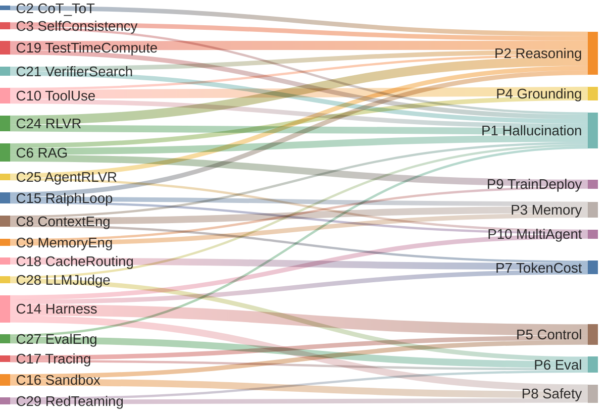

# 第一章　绪论

## 一、LLM 的基础性问题

ChatGPT (2022 末) 之后，规模化的下一词预测被证明可以涌现出惊人的语言、知识、初步推理能力。但很快，工业界与学界发现——**模型本身越强，"它不该这样"的失败模式越显眼**。可大致归为六类基础病：

1. **P1. 幻觉 (Hallucination)** — *Hallucination*
   研究证明这是下一词目标 + 评测激励"自信猜测"叠加的结构性后果，并非数据或参数能简单消除 [[1]](https://arxiv.org/abs/2401.11817)；当下前沿模型在低资源语言、多模态、长文档 QA 上仍有 15%–52% 的事实错误率 [[2]](https://www.lakera.ai/blog/guide-to-hallucinations-in-large-language-models), [[3]](https://blogs.library.duke.edu/blog/2026/01/05/its-2026-why-are-llms-still-hallucinating/)。"定位相关信息"和"抗虚构"是两个弱相关的能力，benchmark 高分 ≠ 可信 [[1]](https://arxiv.org/abs/2401.11817)。

2. **P2. 推理与长程规划缺失** — *Reasoning & Planning*
   LLM 是"逐 token"地预测，没有显式的世界状态、目标栈、回溯机制。CoT 看似在思考，本质是把"中间步骤"也变成 token 分布——LeCun 等人指出，这只是在**模式匹配的轨迹上多走几步**，并不解决组合泛化与新情境推理 [[4]](https://www.newsweek.com/nw-ai/ai-impact-interview-yann-lecun-llm-limitations-analysis-2054255)。

3. **P3. 上下文与记忆** — *Context & Memory*
   "context window"是一次性的滑动缓冲，不是结构化记忆：无持久状态、无优先级、无遗忘曲线、无对话级一致性。长上下文模型并不真正理解"这件事十分钟前已经决定了"。

4. **P4. 现实 Grounding** — *Real-World Grounding*
   缺乏感知 grounding，不能验证自己的输出是否对应外部世界。代码能不能跑、SQL 能不能查、API 是否真的存在——纯模型无法判断。

5. **P5. 不可控与不可审计** — *Controllability & Auditability*
   同一个 prompt、同一个温度，不同时间、不同 batch、不同 KV cache 命中情况下结果可能不同；偏好对齐之后又会出现谄媚、过度拒答、风格漂移。模型行为不是一个可签名的工件。

6. **P6. 评测危机** — *Evaluation Crisis*
   Benchmark 污染、leaderboard 优化、单次准确率掩盖了尾部失败。"模型能做到 X" 与 "在生产中可靠地做到 X"之间出现了一个鸿沟——后者要求成功率分布、长尾、漂移监控，而不是一个均值数。

此外还有几条工程上不容忽视的"次生病灶"：

7. **P7. Token 经济学** — *Token Economics*：上下文越塞越长，单步成本与延迟线性甚至超线性上升。
8. **P8. 安全边界** — *Safety Boundary*：模型一旦被允许"动手"，提示注入、越权调用、不可逆操作就成了一类全新的攻击面。
9. **P9. 训练—部署割裂** — *Train–Deploy Gap*：模型是离线训练的"冻结大脑"，但任务是在线、私有、长尾的；微调贵、不可持续。
10. **P10. 多智能体协调** — *Multi-Agent Coordination*：多 agent 系统会出现死锁、互相幻觉、目标漂移等系统性而非模型性的故障。

这十类问题，**没有一类可以靠"再大十倍"的模型本身解决**。这就是为什么 2023 年以后行业重心从"训更大的模型"逐步移向了"在模型外面建工程"。

---

## 二、2022 年以后涌现的概念地图

下面把广为流传的与稍冷门的概念按"在哪一层解决问题"摆开。

### A. 输入侧 (Input Layer)
- **C1. Prompt Engineering**：单轮文本指令的写法（角色、few-shot、格式约束、CoT 触发词）。
- **C2. Chain-of-Thought / Tree-of-Thoughts / Graph-of-Thoughts (CoT/ToT/GoT)**：让模型把中间推理显式化、并行化、可回溯。
- **C3. Self-Consistency**：多次采样 + 多数投票，用统计稳定性盖过单次随机性。
- **C4. Self-Refine / Reflexion / Self-Critique**：让模型读自己的输出再改一遍。
- **C5. Constitutional AI / Principles-based Prompting**：用一组明文"宪法"约束行为，部分替代 RLHF。

### B. 上下文侧 (Context Layer)
- **C6. RAG (Retrieval-Augmented Generation)**：把外部知识检索回来塞进上下文，给"无记忆 + 易幻觉"打补丁 [[17]](https://arxiv.org/pdf/2507.09477)。
- **C7. Agentic RAG / RAT (Retrieval-Augmented Thoughts)**：把检索从"一次性前置"变成"推理过程中按需触发" [[17]](https://arxiv.org/pdf/2507.09477)。
- **C8. Context Engineering**：2024–2025 兴起的提法，把"上下文里出现什么"作为一等公民来设计——指令、状态、记忆、工具输出、检索结果、历史的拼装、压缩、淘汰策略。Prompt Engineering 是它的子集 [[11]](https://www.philschmid.de/context-engineering), [[12]](https://www.elastic.co/search-labs/blog/context-engineering-vs-prompt-engineering), [[13]](https://www.gartner.com/en/articles/context-engineering)。
- **C9. Memory Engineering**：长期/短期/语义/情景记忆分层，向量库、KV 摘要、scratchpad、persona store。

### C. 行动侧 (Action Layer)
- **C10. Tool Use / Function Calling**：模型输出结构化调用，外部代码执行后回灌结果。
- **C11. ReAct**：推理 (Thought) ↔ 行动 (Action) ↔ 观察 (Observation) 的交替循环，是几乎所有 agent 框架的祖型。
- **C12. Agent / Multi-Agent**：把"循环 + 工具 + 规划 + 记忆"打包成一个可被任务驱动的实体；多 agent 再加上协议、角色、调度。
- **C13. Computer Use / Browser Use / Code Execution Sandbox**：把"工具"扩展为操作系统级、浏览器级、IDE 级的全能力面。

### D. 运行时与基础设施 (Runtime & Infra)
- **C14. Harness Engineering**：2025–2026 最重要的范式转变 [[5]](https://martinfowler.com/articles/harness-engineering.html), [[6]](https://www.firecrawl.dev/blog/what-is-an-agent-harness), [[7]](https://parallel.ai/articles/what-is-an-agent-harness), [[8]](https://addyosmani.com/blog/agent-harness-engineering/)。Harness = 包裹模型的整套运行时：执行循环、工具白名单、上下文生命周期、子任务派发、沙箱、审计、回滚、限速、预算、hooks、可观测性 [[5]](https://martinfowler.com/articles/harness-engineering.html), [[7]](https://parallel.ai/articles/what-is-an-agent-harness)。Claude Agent SDK、Codex SDK、OpenAI Agents SDK 都属于 harness API 的实例化 [[9]](https://aakashgupta.medium.com/2025-was-agents-2026-is-agent-harnesses-heres-why-that-changes-everything-073e9877655e)。一句话：**"2025 是 agent 之年，2026 是 agent harness 之年"** [[9]](https://aakashgupta.medium.com/2025-was-agents-2026-is-agent-harnesses-heres-why-that-changes-everything-073e9877655e)。
- **C15. Ralph Loop (Ralph Wiggum Technique)**：Geoffrey Huntley 在 2025 年末提出、迅速病毒式传播的极简 agent loop——核心就是一个 `while true; do cat PROMPT.md | claude-code; done` 的死循环，每轮以**干净上下文**重启，让 agent 反复读 PRD/状态文件、自我决定下一步、直到所有清单项完成 [[19]](https://ghuntley.com/ralph/), [[20]](https://ghuntley.com/loop/)。它把"上下文管理"外置成磁盘上的 markdown，把"长程规划"换成"无限重试 + 持久化便签"，对 greenfield 项目效果惊人，是 harness 极简主义的代表。
- **C16. Sandboxing & Permission Modes**：可读/可写/可执行的细粒度权限模型，从 OS 安全借来的思路。
- **C17. Observability / Tracing**（LangSmith, Langfuse, OpenLLMetry）：把每一步 prompt、token、工具调用、耗时、成本变成可索引的 trace。
- **C18. Cache / Routing / Cascade**：KV 复用、prompt cache、按难度路由到不同模型，是 token 经济学的主要工程手段。

### E. 推理时增强 (Inference-Time)
- **C19. Test-Time Compute Scaling / Inference Scaling Laws**：在推理阶段花更多算力（采样、搜索、验证）能在很多任务上比把模型再放大更划算（OpenAI o1、DeepSeek-R1 路线）[[14]](https://iclr.cc/virtual/2025/oral/31924), [[15]](https://arxiv.org/html/2506.12928v1), [[18]](https://rlhfbook.com/c/14-reasoning)。
- **C20. Process Reward Model (PRM) / Outcome Reward Model (ORM)**：训练一个"打分器"对中间步骤或最终答案打分，引导 best-of-N、束搜索或 MCTS [[14]](https://iclr.cc/virtual/2025/oral/31924), [[16]](https://arxiv.org/abs/2504.02495)。
- **C21. Verifier-Guided Search / Self-Evolving Verification**：用可验证信号（编译通过、单元测试通过、形式证明）作为"硬"奖励 [[16]](https://arxiv.org/abs/2504.02495)。

### F. 训练侧 (Training)
- **C22. RLHF / DPO / KTO**：用人类偏好把模型对齐到"听话"。
- **C23. RLAIF / Constitutional RL**：用 AI 生成的偏好替代部分人类标注。
- **C24. RLVR (RL from Verifiable Rewards)**：奖励来自**可机器验证**的信号——数学题对不对、代码 test 跑不跑得过、形式证明检查器接不接受。这是 o1 / R1 / Kimi-k1.5 类推理模型的关键配方 [[18]](https://rlhfbook.com/c/14-reasoning)。
- **C25. Agent-RLVR**：把 RLVR 从"题目对错"扩展到多步 agent 轨迹，对软件工程类任务尤其重要 [[10]](https://arxiv.org/html/2506.11425v2)。
- **C26. Curriculum / Self-Play / Synthetic Data**：用模型自己生成、再用 verifier 过滤的数据回训。

### G. 评测与治理 (Eval & Governance)
- **C27. Eval Engineering**：把评测从静态 benchmark 升级为**面向产品的、可持续运行的评测系统**——回归集、A/B、对抗集、漂移监控、生产监控。
- **C28. LLM-as-a-Judge**：用一个（通常更强的）LLM 给另一个 LLM 的输出打分或两两比较，是 Eval Engineering 与 RLAIF 的共同基石 [[21]](https://openreview.net/forum?id=3GTtZFiajM), [[22]](https://en.wikipedia.org/wiki/LLM-as-a-Judge)。GPT-4 级 judge 与人类一致性可达 ~80%（≈人–人之间的水平）；但研究反复指出 judge 自身存在**位置偏置、冗长偏置、立场偏置、打分漂移**，在专业领域（医学、法律、心理）一致性会跌到 60% 出头 [[21]](https://openreview.net/forum?id=3GTtZFiajM)——所以"用 LLM 做评委"是必要却不可信的工具，必须配 judge 校准与对抗集。
- **C29. Red-Teaming / Jailbreak Eval / Prompt Injection Benchmarks**：把安全也变成可量化的评测维度。
- **C30. Model Cards / System Cards / Responsible Scaling Policies**：治理层。

---

## 三、这些概念解决了多少基础性问题？

把第一节的十类病和第二节的"药"对一下账，结论并不乐观。

下面这张 Sankey 图先给一个直观的"流向"——左边是各类工程概念（对应 §二 的 C 编号），右边是十类基础病（对应 §一 的 P 编号），连线粗细代表该概念对该问题的**缓解贡献强度**（主观打分 1–5，仅作可视化参考；不代表完全消除）。可以一眼看出：Harness 与 Ralph Loop 这类"运行时"集中在 P5 / P8 / P10 与 P3 Memory，RLVR 与 Test-time Compute 集中砸在 P2 Reasoning + P1 Hallucination，RAG/Tool 同时承担 P1 + P4 + P9 三件事，Eval-Eng 与 LLM-as-Judge 共撑 P6 Eval，而 **P10 Multi-Agent 与 P9 Train-Deploy（深层个性化）右侧入流仍显稀薄**——这正是当前最弱的两环。

| 基础病 | 主要对应工程 | 缓解程度 | 残余问题 |
|---|---|---|---|
| 1. 幻觉 | RAG、Tool use、RLVR、Verifier-guided search、Self-consistency [[1]](https://arxiv.org/abs/2401.11817), [[17]](https://arxiv.org/pdf/2507.09477) | **中**：在有外部真值/可验证器的领域（代码、数学、检索 QA）显著下降；在开放域、长文写作仍系统性存在 | 没有"硬地面"的领域在结构上无解 [[1]](https://arxiv.org/abs/2401.11817)；retrieval 本身也会被错误/恶意内容污染（PoisonedRAG 已系统证明，2025 基准测试 13 种攻击面前现有防御普遍失效）[[23]](https://arxiv.org/abs/2402.07867), [[24]](https://arxiv.org/abs/2505.18543) |
| 2. 推理与规划 | CoT/ToT、ReAct、Test-time compute、PRM、RLVR、Agent loop [[14]](https://iclr.cc/virtual/2025/oral/31924), [[15]](https://arxiv.org/html/2506.12928v1), [[18]](https://rlhfbook.com/c/14-reasoning) | **中到高（窄域）**：在数学/竞赛编程上接近人类顶尖；在跨领域、长程、需要常识的开放规划上仍脆弱 | "更长的思考链 ≠ 真正的规划"——CoT 经常**不忠实于模型真实计算路径**，前沿模型表面给出的链条只是事后合理化 [[25]](https://arxiv.org/abs/2503.08679)；多步累积误差仍在 [[4]](https://www.newsweek.com/nw-ai/ai-impact-interview-yann-lecun-llm-limitations-analysis-2054255) |
| 3. 上下文/记忆 | Context Engineering、Memory store、长上下文、摘要压缩 [[11]](https://www.philschmid.de/context-engineering), [[13]](https://www.gartner.com/en/articles/context-engineering) | **低到中**：能"塞下"，但分辨、淘汰、一致性维护仍是手工活 | 没有原生的、可微的、可学习的长期记忆机制——参数级持续学习仍受灾难性遗忘困扰 [[26]](https://arxiv.org/abs/2404.16789), [[27]](https://arxiv.org/abs/2504.01241) |
| 4. 现实 grounding | Tool use、Computer use、RAG、Code execution | **中**：在数字世界里 grounding 已经相当可用；物理世界仍要靠 VLA / 机器人专门栈 | 模型"知道工具说了什么"未必"理解为什么这么说"——LLM **绕开**而非解决 Symbol Grounding 问题，符号操作与语义内容仍是两件事 [[28]](https://arxiv.org/html/2512.09117) |
| 5. 不可控/不可审计 | Harness、Sandboxing、Tracing、Permission mode、Hooks [[5]](https://martinfowler.com/articles/harness-engineering.html), [[6]](https://www.firecrawl.dev/blog/what-is-an-agent-harness), [[8]](https://addyosmani.com/blog/agent-harness-engineering/) | **中到高（工程上）**：可重放、可审计、可限权已经是工程现实 | 模型本身的随机性没消失——同一 prompt 在不同 batch size、不同 GPU、不同并发负载下输出会变（浮点不结合性 + batching），需要 batch-invariant kernel 才能复现 [[29]](https://thinkingmachines.ai/blog/defeating-nondeterminism-in-llm-inference/), [[30]](https://arxiv.org/abs/2506.09501) |
| 6. 评测危机 | Eval engineering、LLM-as-judge、对抗集、生产监控 | **中**：从"刷 benchmark"转向"持续评测"是真实进步 | judge 自身偏差（位置/冗长/立场）系统存在 [[21]](https://openreview.net/forum?id=3GTtZFiajM)；评测污染问题严重——LessLeak / AntiLeakBench 等 2025 工作显示主流 benchmark 的训练集泄漏普遍，需要持续构造"训练后才存在"的新题才能避免 [[31]](https://aclanthology.org/2025.acl-long.901/) |
| 7. token 经济学 | Context 压缩、缓存、KV reuse、模型路由、级联 | **中**：缓存与小模型分流大幅降本 | 上下文越来越长 + test-time compute 越烧越多是结构性趋势，单位成本下降跑不赢需求增长 [[14]](https://iclr.cc/virtual/2025/oral/31924), [[15]](https://arxiv.org/html/2506.12928v1) |
| 8. 安全边界 | Sandboxing、Permission、Prompt injection eval、Constitutional AI | **低到中**：注入攻击仍在持续演化，是猫鼠游戏 | 提示注入是**架构性**漏洞：LLM 在内部不区分"代码"和"数据"，OWASP 已把 Prompt Injection 列为 LLM Top-10 的 #1 风险，业界共识认为现有架构下不可根治 [[32]](https://genai.owasp.org/llmrisk/llm01-prompt-injection/) |
| 9. 训练—部署割裂 | RAG、In-context learning、轻量微调 (LoRA/PEFT)、Agent memory | **中**：把"知识"外置确实可行 | "技能"仍难外置；个性化与持续学习未真正解决——任何参数级更新都可能触发灾难性遗忘，且模型规模越大遗忘越严重 [[26]](https://arxiv.org/abs/2404.16789), [[27]](https://arxiv.org/abs/2504.01241) |
| 10. 多智能体协调 | Orchestration、协议（A2A、MCP）、调度框架 | **低**：还在早期，多 agent 经常带来更多失败模式而非更少 | 没有公认的"多 agent 操作系统"：MAST 分类法基于 7 个主流框架的 1600+ 失败 trace 给出 14 种系统性失败模式，生产中失败率 41–86.7%，超过 4 个 agent 就出现"协调税"（coordination tax）[[33]](https://arxiv.org/abs/2503.13657) |

一句话总结：

> **这一波"周边工程"不是在治病，而是在给一个先天有结构性缺陷的器官搭支架、装监控、配护士。** 它把 LLM 从"会说话的怪物"驯化成"在可控环境里能完成任务的劳动力"。但凡是 LLM 自身的根问题——幻觉、组合泛化、真正的世界模型——这些工程都没动它们的根，只是把它们的影响**收敛在可承受的范围内**。

---

## 四、软件工程语境

把 §一 的十类基础病放到软件工程几十年来的病理学中检视，**它们没有一类是新症状——只是把发作主体从"人"换成了"模型"，发作的时间常数被压缩了一两个数量级**。是**软件开发生命周期 (SDLC) 在时间维度上的整体压缩**：构建变快，腐化也按同比例变快。

### 1.4.1 LLM 的"基础病"与软件工程的"老难题"是同构的

软件工程从 Brooks 的《人月神话》《No Silver Bullet》[34] 到 Fowler 的《重构》，几十年来关注的从来不是算法和机器算得不够快，而是 **人的记忆、沟通、协调、知识传递、注意力极限**。

| §一 的 LLM 基础病 | 软件工程语境里早就存在的"老难题" |
|---|---|
| **P1 幻觉** | 工程师凭印象写错 API、记串依赖版本——code review 实证研究显示 reviewer 主要靠"理解代码"而非"找 bug"，缺陷发现率有限 [43]；CoT 不忠实 [[25]](https://arxiv.org/abs/2503.08679) ↔ 设计文档随系统演化对真实代码失真，最终成为事后合理化 [[37]](https://www.cs.drexel.edu/~yc349/CS451/RequiredReadings/SoftwareAging.pdf) |
| **P2 推理与长程规划缺失** | 需求漂移、估算永远偏乐观——**Hofstadter 定律**："任务总是比你预期的更花时间，即便你已经把这条定律考虑进去" [40]；软件本质复杂性不可消除、设计中途偏离初衷是常态而非异常 [34] |
| **P3 上下文与记忆** | 文档随系统演化必然腐化、注释与代码不再一致——Parnas 把这称为"软件老化" [[37]](https://www.cs.drexel.edu/~yc349/CS451/RequiredReadings/SoftwareAging.pdf)；Lehman 第一定律："E 型系统必须持续演化否则会渐失效用"，文档与设计意图随之漂移 [36]；onboarding 实证显示 tribal knowledge 主要靠 mentor 传递而非文档 [[42]](https://www.semanticscholar.org/paper/Novice-software-developers,-all-over-again-Begel-Simon/0d34d4c7618d531b84d0fe78cb36c4e1b02e0709)；模型的灾难性遗忘 [[26]](https://arxiv.org/abs/2404.16789), [[27]](https://arxiv.org/abs/2504.01241) ↔ 关键工程师离职后系统知识断层 |
| **P4 Grounding** | "在我笔记本上能跑"——软件随真实环境变化而老化 [[37]](https://www.cs.drexel.edu/~yc349/CS451/RequiredReadings/SoftwareAging.pdf)；Brooks 区分软件的 **essence**（概念结构）与 **accident**（语法表示），即便代码能编译，语义本质仍可能错 [34]；LLM 绕开 Symbol Grounding [[28]](https://arxiv.org/html/2512.09117) ↔ 工程师写出能通过编译但行为错误的代码 |
| **P5 不可控/不可审计** | 难以复现的 bug——Jim Gray 1985 年用 **"Heisenbug"** 命名"重新观察就消失"的瞬态故障，并实测发现 132 个生产故障里有 131 个属于这一类（约 99%）[[39]](https://www.hpl.hp.com/techreports/tandem/TR-85.7.pdf)；模型的非确定行为 [[29]](https://thinkingmachines.ai/blog/defeating-nondeterminism-in-llm-inference/), [[30]](https://arxiv.org/abs/2506.09501) ↔ 工程师早就熟悉的 heisenbug 与"玄学问题" |
| **P6 评测危机** | 测试覆盖率漂亮但漏关键路径——Inozemtseva & Holmes 在 5 个系统、31000 个测试套件上证明：**控制测试数量后，覆盖率与缺陷发现能力之间只有低到中等相关性，覆盖率不应作为质量指标** [[38]](https://www.cs.ubc.ca/~rtholmes/papers/icse_2014_inozemtseva.pdf)；benchmark 污染 [[31]](https://aclanthology.org/2025.acl-long.901/) ↔ "我跑了所有测试"的虚假安全感 |
| **P7 Token 经济学** | 工程师的认知带宽有限——长上下文成本上升 ↔ 大型项目的人均产出递减；**Brooks's Law："给迟到的项目加人只会让它更迟"**，原因正是沟通开销随团队规模超线性上涨 [34] |
| **P8 安全边界** | 提示注入是架构级缺陷 [[32]](https://genai.owasp.org/llmrisk/llm01-prompt-injection/) ↔ 社会工程对人同样有效——Mitnick 在《The Art of Deception》中反复论证：**"人是安全链中最薄弱的一环"**，再强的加密与防火墙也挡不住会说话的攻击者 [41] |
| **P9 训练—部署割裂** | 新员工 onboarding 慢、培训昂贵——Begel & Simon 在 Microsoft 跟踪新工程师前 6 个月发现，编码、调试、设计、团队协作等关键能力的获取主要依赖 mentor 而非文档 [[42]](https://www.semanticscholar.org/paper/Novice-software-developers,-all-over-again-Begel-Simon/0d34d4c7618d531b84d0fe78cb36c4e1b02e0709)；模型的灾难性遗忘 [[26]](https://arxiv.org/abs/2404.16789), [[27]](https://arxiv.org/abs/2504.01241) ↔ "技能"从来不能像"文档"一样直接外置 |
| **P10 多 agent 协调** | **Conway 定律**："任何系统的设计结构都是其设计组织通信结构的镜像" [[35]](https://www.melconway.com/Home/pdf/committees.pdf)；Brooks 进一步指出 n 人协作的沟通开销随 O(n²) 增长 [34]；MAST 给出 41–86.7% 的多 agent 失败率 [[33]](https://arxiv.org/abs/2503.13657) ↔ 任何超过四五个人的工程团队都熟悉的"协调税" |

这张表有意挑明：**LLM 没有制造任何全新的失败模式**。它继承了人类智能体在软件工程中的全部既有病，只是把这些病的发作频率从"周/月"压缩到了"秒/分"。

### 1.4.2 那 LLM/Agent 在软件工程中真正改变了什么？——速度

AI Coding 工具（Copilot、Cursor、Claude Code、Codex、Ralph Loop 等）更接近"**加了一个永远不累、能并行 N 倍但有点不靠谱的初/中级工程师**"，而不是"一种新的工程范式"。三条经验性证据：

1. **失败模式同构**：MAST 对 7 个主流多 agent 框架 1600+ 失败 trace 总结出的 14 类失败 [[33]](https://arxiv.org/abs/2503.13657)——角色误解、重复劳动、跳过验证、级联幻觉、规格歧义……几乎可以逐条对回 Brooks/DeMarco/Fowler 多年来对**人类团队**总结过的失败模式 [34]。
2. **工程护栏的回收利用**：Harness Engineering [[5]](https://martinfowler.com/articles/harness-engineering.html) 大量复用 OS、分布式系统、团队管理的成熟概念——权限模型、审计日志、code review 钩子、预算上限、回滚——这本身就承认了"我们没在解新问题，只是在给一个更快的执行主体加上熟悉的护栏"。
3. **可验证性是 70 年代纪律的回归**：RLVR、verifier-guided search [[10]](https://arxiv.org/html/2506.11425v2), [[16]](https://arxiv.org/abs/2504.02495), [[18]](https://rlhfbook.com/c/14-reasoning) 的本质，是把 TDD / 形式验证这套老规矩重新提炼成给模型的反馈信号。**让 agent 学会写对的方法，仍然是让它面对编译器和测试**——和教会一个新人是同一条路径。

换句话说，**LLM 是软件工程方法论的一次"主体替换实验"**：所有过去对人有效的工程纪律（小步提交、可逆操作、显式契约、渐进重构、回归测试），对 agent 仍然有效；所有过去对人无效的（"把规范写得无懈可击"、"让团队自然达成默契"），对 agent 也仍然无效。

### 1.4.3 真正的变化是时间常数：SDLC 的加速 = 加速建造 + 加速腐化

如果接受"主体替换"的判断，那 AI Coding 的影响就不是"质变"，而是 **SDLC 沿时间维度的等比例压缩**：

- **建造过程被压缩**：从需求到 MVP 的时间从周降到天甚至小时；Ralph Loop 这类极简循环 [[19]](https://ghuntley.com/ralph/), [[20]](https://ghuntley.com/loop/) 把"过夜跑出 6 个仓库"变成现实。
- **腐化过程被同步压缩**：
  - 代码冗余、抽象失当、隐式耦合的增长速度，与生成速度**同比上升**；
  - 文档/注释的语义漂移（即 P3）随提交速率上升而恶化 [[26]](https://arxiv.org/abs/2404.16789), [[27]](https://arxiv.org/abs/2504.01241)；
  - 评测污染与 benchmark 失真 [[31]](https://aclanthology.org/2025.acl-long.901/) 的速度也随生成速度上升；
  - 多 agent 协调税 [[33]](https://arxiv.org/abs/2503.13657) 让"加更多 agent"在 4 个之后边际收益为负——与"加更多人"同律。

这意味着软件工程实践的重心会从"在不完整信息和持续变化的约束下，对复杂系统做出权衡（trade-offs）决策"，转向**新问题**：

#### 1.4.3.1 如何建立新的质量标准、取得用户信任

当代码生成的速度远超人类审阅的速度，"提交后 review、上线后回归"这套以人为中心的质量门已经在原理上失效。值得用户信任的，不再是"代码量"或"覆盖率"，而是**生成的过程**和**生成—验证回路里能被持续证明、对齐用户预期的那些东西**。

- **AI 生成过程记录成为标准要求的交付制品**——在传统的开发中记录 tribal knowledge、过程和比代码更高抽象程度语义的文档都是额外的工作量，难免疏漏。而 LLM 参与的开发中人类直接用更高抽象程度的语义与系统沟通，Agent 的生成过程消息都是文字化的，都可以更完整的记录与分析。
- **评测与监控（§二 C27–C29）成为开发的同步工序，而非事后工序**——质量必须随生成同步度量、随产物一同交付（而不是事后补做的报告），并且这些信号要可被用户检阅、可被回放、可被审计。Inozemtseva & Holmes 已经证明覆盖率不能等同于质量 [[38]](https://www.cs.ubc.ca/~rtholmes/papers/icse_2014_inozemtseva.pdf)；在 agent 时代，"评测信号本身的真实度"会成为新的护城河，而 LLM-as-Judge 的偏置 [[21]](https://openreview.net/forum?id=3GTtZFiajM) 提醒这层信任不是免费的。

#### 1.4.3.2 如何在被加速过的生命周期里，让"有效时间"的比例尽可能高

如果建造与腐化都被同等加速，那么决定一个系统价值的，就不是"它跑了多久"而是 **"它在跑的这段时间里，有多少比例处于可被理解、可被修改、可被信任的状态"**。这是一个工程上的"有效时间比"问题。

- **持续重构与可逆性 (reversibility) 取代一次性设计**：腐化加速下，系统的"新陈代谢"必须和"生成"一样快；任何不可回退的决策都会被加速放大成不可挽救的事故，所以可逆性比一次到位更值钱。
- **外置记忆（PRD、ADR、`fix_plan.md` 这类磁盘上的"组织记忆"）从可有可无变成生命线**——模型自己没有 P3 意义上的真记忆 [[26]](https://arxiv.org/abs/2404.16789), [[27]](https://arxiv.org/abs/2504.01241)，正如人类组织自己也没有；不持续沉淀就意味着每次重启都会重新犯同一个错，"有效时间"会被反复浪费在重新发现同一件事上。

#### 1.4.3.3 解除不完整信息和持续变化的约束，创造那些原先因为"不知道 / 无法算 / 做不起"而不存在的新价值

当一种工程动作的边际成本掉到接近零，原先因为**不知道——学不过来、 无法建立解析模型——想不过来、需要太多人和时间——做不起**而无法进入实践的工作会被重新打开，或者解决问题的工作重点完全转移。

1. **Agent-based Simulation 取代有限经验外推**。以往涉及组织、经济、架构、用户行为的设计与决策，工程师只能依赖局部经验 + 过度简化模型推演（费米估算、白板兵棋、单点压测），因为缺少廉价的"在做之前先把它跑一遍"的能力。当 agent 单位成本足够低，可以用 N 个具备不同立场/约束/失败模式的 agent 群体把"系统真实行为"模拟出来，把设计与决策从**凭直觉拍**升级为**可重复、可对比、可灰度的数值实验**——这是经济学 ABM 与运筹学 Monte Carlo 思路向软件工程实践的一次延伸。

2. **大规模并行探索"实现空间"**。传统上一个架构、一次重构、一条性能优化路径，是由 1–2 位资深工程师拍板的——因为同时尝试 50 种实现的人力代价太高。AI Coding 把这项的边际成本压到接近 0 后，**实现选择从"最有经验工程师的一次猜测"变成"对 N 个候选并发跑评测后的择优"**。这相当于把 ML 里 hyperparameter sweep / Neural Architecture Search（NAS，神经架构搜索）那套搬进代码空间——架构、重构、API 设计开始具备可枚举、可基准化的属性，"少数高手凭直觉"被"群体并行 + 自动评测"部分替代。这条思路也与近期"**超越梯度的学习** (learning beyond gradients)"的讨论同源。

François Chollet 在 2026 年 2 月给出一个更直接的断言：**"足够先进的 agentic coding 在本质上就是机器学习"**——工程师设定优化目标（spec）与搜索空间约束（tests），agent 作为优化过程迭代到目标达成；产物（生成出来的代码库）实质上是一个**黑盒模型**——你部署它而不审视内部逻辑，正如我们部署神经网络时不去关心单个权重 [[44]](https://x.com/fchollet/status/2024519439140737442)。由此推论，经典 ML 问题都会很快变成 agentic coding 的工程问题：对 spec 的过拟合、在 test 之外不泛化的 Clever Hans 捷径、数据泄漏、概念漂移…… [[44]](https://x.com/fchollet/status/2024519439140737442)

Weng (Trinkle) 把coding agent修改heuristic（也就是手写规则和程序策略）与 gradient-based 权重优化并列成为"学习"的新路径，甚至某种结合：“用 HL 处理在线数据快速生成在线经验，把在线经验内化成可训练、可回归、可筛选的数据，再周期性更新神经网络。” [[45]](https://trinkle23897.github.io/learning-beyond-gradients/#zh)。

| ML 训练侧 | Agentic Coding 侧 | 传统软件工程侧 |
|---|---|---|
| Loss function（优化目标） | 需求文档 / PRD / Spec | 需求文档 / 用户故事 |
| 验证集 (held-out eval set) | 测试用例 / 验收用例 / 生产流量回放 | 测试用例 / UAT |
| 模型架构 (network architecture) | Coding agent 本体（含 harness、工具集、子 agent 编排） | 程序员 + 团队（人 + 流程） |
| 一个 training step（一次梯度更新） | Agent 一轮迭代（read → edit → run → observe） | 一次 commit / PR |
| 训练好的模型权重（部署制品） | 生成出来的代码库（部署制品） | 人写的代码库（部署制品） |
| Hyperparameters (lr / batch / optimizer) | Prompt 模板、temperature、system prompt、context 组织策略 | 编码规范、code review 标准、团队公约 |
| Training pipeline (DDP / orchestration) | CI/CD + agent orchestration | CI/CD + 项目管理 |
| 训练算力预算 (FLOPs / $) | 推理算力预算 (tokens / $) | 人月预算 |
| **解：需求信息不完整** —— 用数据 / 偏好 / verifier 代替显式 spec：监督学习用样本反推目标；RLHF / DPO 用人类两两偏好；RLVR / verifier-guided search 用机器可判对错的硬信号；active learning 让模型主动询问不确定处 | 把 spec 当成**会被持续迭代修正的 proxy**；用 test、lint、生产 trace 做硬验证；让 agent 在歧义处主动反问澄清 | 迭代式需求工程（Agile）、用户访谈、原型、MVP；接受 spec 在交付前不断变化 |
| **解：持续变化的约束** —— Drift 检测 + 增量训练（LoRA / adapters）；replay buffer / EWC 抑制灾难性遗忘；**按变化速度解耦**：foundation model（慢变） + 下游 adapter（快变） | 生产 trace 重放当 eval；高频变的需求走 PRD / `fix_plan.md`，低频变的架构沉淀进基座；session 隔离避免长链漂移 | 版本迭代、回归测试、双轨 / 灰度发布、配置外置；接口契约 + 适配层吸收变化 |
| **解：复杂系统权衡** —— End-to-end learning 放弃手工分解中间表征；MoE 按输入路由专家；**Scaling laws** 把"应该堆多少参数 / 数据 / 算力"变成可预测工程量；differentiable composition 让反向传播能跨整个系统 | 并行搜索实现空间 + verifier 择优（§1.4.3.3 第 2 点）；sub-agent 按角色分工（MoE 思路）；test-time compute 把"想得更深"明码标价 | 分层架构、模块化、抽象层、领域驱动设计；康威定律拆团队；以稳定接口隔离复杂度 |

3. **"一次性/每用户级软件"在经济上变得可行**。长期以来软件追求"一套方案服务多人"，是因为单位开发成本高到必须摊销才合算。当生成单位代码的成本掉到几分钱量级，**"为这个会议、这条工单、这位用户单独写一个工具"** 就变成正常选项：报告、抓数、ETL、内部 dashboard、定制 SOP——这些原先因为"不值得专门开发"而被留在 Excel 与人工里的长尾需求，可以被 agent 一次性产出、用完即弃。这是软件经济学的结构性变化：**把"复用"作为美德的前提被部分弱化**，软件第一次有机会真正"贴身定制"而不只是"批量交付"。

以下章节将具体探讨这些新问题和新方法。

另一个方向上，目前（2026年初）产业界主要通过直接照搬人类软件工程管理人力的方式来管理AI，争取达到人类平均和人类团队平均的效果，典型的例子包括 Superpowers [[46]](https://github.com/obra/superpowers) 要求AI Agent执行一套人类最佳实践的工作流，等等。下文也会涉及。

---

## 参考文献

[1] Z. Xu, S. Jain, and M. Kankanhalli, "Hallucination is Inevitable: An Innate Limitation of Large Language Models," *arXiv preprint*, arXiv:2401.11817, Jan. 2024. [Online]. Available: <https://arxiv.org/abs/2401.11817>

[2] Lakera, "LLM Hallucinations in 2026: How to Understand and Tackle AI's Most Persistent Quirk," *Lakera Blog*, 2026. [Online]. Available: <https://www.lakera.ai/blog/guide-to-hallucinations-in-large-language-models>

[3] Duke University Libraries, "It's 2026. Why Are LLMs Still Hallucinating?," *Duke University Libraries Blogs*, Jan. 5, 2026. [Online]. Available: <https://blogs.library.duke.edu/blog/2026/01/05/its-2026-why-are-llms-still-hallucinating/>

[4] M. Picard, "Yann LeCun, Pioneer of AI, Thinks Today's LLMs Are Nearly Obsolete," *Newsweek*, 2025. [Online]. Available: <https://www.newsweek.com/nw-ai/ai-impact-interview-yann-lecun-llm-limitations-analysis-2054255>

[5] M. Fowler, "Harness Engineering for Coding Agent Users," *martinfowler.com*, 2025. [Online]. Available: <https://martinfowler.com/articles/harness-engineering.html>

[6] Firecrawl, "What Is an Agent Harness? The Infrastructure That Makes AI Agents Actually Work," *Firecrawl Blog*, 2025. [Online]. Available: <https://www.firecrawl.dev/blog/what-is-an-agent-harness>

[7] Parallel Web Systems, "What is an agent harness in the context of large-language models?," *parallel.ai*, 2025. [Online]. Available: <https://parallel.ai/articles/what-is-an-agent-harness>

[8] A. Osmani, "Agent Harness Engineering," *addyosmani.com*, 2025. [Online]. Available: <https://addyosmani.com/blog/agent-harness-engineering/>

[9] A. Gupta, "2025 Was Agents. 2026 Is Agent Harnesses. Here's Why That Changes Everything.," *Medium*, 2026. [Online]. Available: <https://aakashgupta.medium.com/2025-was-agents-2026-is-agent-harnesses-heres-why-that-changes-everything-073e9877655e>

[10] J. Lu *et al.*, "Agent-RLVR: Training Software Engineering Agents via Guidance and Environment Rewards," *arXiv preprint*, arXiv:2506.11425v2, Jun. 2025. [Online]. Available: <https://arxiv.org/html/2506.11425v2>

[11] P. Schmid, "The New Skill in AI is Not Prompting, It's Context Engineering," *philschmid.de*, 2025. [Online]. Available: <https://www.philschmid.de/context-engineering>

[12] Elastic, "Context engineering vs. prompt engineering," *Elasticsearch Labs*, 2025. [Online]. Available: <https://www.elastic.co/search-labs/blog/context-engineering-vs-prompt-engineering>

[13] Gartner, "Context Engineering: Why it's Replacing Prompt Engineering for Enterprise AI Success," *Gartner Insights*, 2025. [Online]. Available: <https://www.gartner.com/en/articles/context-engineering>

[14] C. Snell, J. Lee, K. Xu, and A. Kumar, "Scaling LLM Test-Time Compute Optimally Can be More Effective than Scaling Parameters for Reasoning," in *Proc. Int. Conf. Learn. Representations (ICLR)*, 2025. [Online]. Available: <https://iclr.cc/virtual/2025/oral/31924>

[15] K. Zhu *et al.*, "Scaling Test-time Compute for LLM Agents," *arXiv preprint*, arXiv:2506.12928, Jun. 2025. [Online]. Available: <https://arxiv.org/html/2506.12928v1>

[16] Z. Liu *et al.*, "Inference-Time Scaling for Generalist Reward Modeling," *arXiv preprint*, arXiv:2504.02495, Apr. 2025. [Online]. Available: <https://arxiv.org/abs/2504.02495>

[17] D. Zhang *et al.*, "A Survey of RAG-Reasoning Systems in LLMs," *arXiv preprint*, arXiv:2507.09477, Jul. 2025. [Online]. Available: <https://arxiv.org/pdf/2507.09477>

[18] N. Lambert, "Reasoning Training & Inference-Time Scaling," in *The RLHF Book*, ch. 14, 2025. [Online]. Available: <https://rlhfbook.com/c/14-reasoning>

[19] G. Huntley, "Ralph Wiggum as a 'software engineer'," *ghuntley.com*, 2025. [Online]. Available: <https://ghuntley.com/ralph/>

[20] G. Huntley, "Everything Is a Ralph Loop," *ghuntley.com*, 2025. [Online]. Available: <https://ghuntley.com/loop/>

[21] J. Ye *et al.*, "Justice or Prejudice? Quantifying Biases in LLM-as-a-Judge," *OpenReview*, 2025. [Online]. Available: <https://openreview.net/forum?id=3GTtZFiajM>

[22] Wikipedia contributors, "LLM-as-a-Judge," *Wikipedia*, 2025. [Online]. Available: <https://en.wikipedia.org/wiki/LLM-as-a-Judge>

[23] W. Zou, R. Geng, B. Wang, and J. Jia, "PoisonedRAG: Knowledge Corruption Attacks to Retrieval-Augmented Generation of Large Language Models," in *Proc. USENIX Security Symposium*, 2025; *arXiv preprint*, arXiv:2402.07867. [Online]. Available: <https://arxiv.org/abs/2402.07867>

[24] B. Chen *et al.*, "Benchmarking Poisoning Attacks against Retrieval-Augmented Generation," *arXiv preprint*, arXiv:2505.18543, May 2025. [Online]. Available: <https://arxiv.org/abs/2505.18543>

[25] I. Arcuschin *et al.*, "Chain-of-Thought Reasoning In The Wild Is Not Always Faithful," *arXiv preprint*, arXiv:2503.08679, Mar. 2025. [Online]. Available: <https://arxiv.org/abs/2503.08679>

[26] H. Shi *et al.*, "Continual Learning of Large Language Models: A Comprehensive Survey," *ACM Computing Surveys*, 2025; *arXiv preprint*, arXiv:2404.16789. [Online]. Available: <https://arxiv.org/abs/2404.16789>

[27] T. Li *et al.*, "Catastrophic Forgetting in LLMs: A Comparative Analysis Across Language Tasks," *arXiv preprint*, arXiv:2504.01241, Apr. 2025. [Online]. Available: <https://arxiv.org/abs/2504.01241>

[28] "A Categorical Analysis of Large Language Models and Why LLMs Circumvent the Symbol Grounding Problem," *arXiv preprint*, arXiv:2512.09117, Dec. 2025. [Online]. Available: <https://arxiv.org/html/2512.09117>

[29] H. He *et al.*, "Defeating Nondeterminism in LLM Inference," *Thinking Machines Lab Blog*, Sept. 2025. [Online]. Available: <https://thinkingmachines.ai/blog/defeating-nondeterminism-in-llm-inference/>

[30] Y. Wu *et al.*, "Understanding and Mitigating Numerical Sources of Nondeterminism in LLM Inference," *arXiv preprint*, arXiv:2506.09501, Jun. 2025. [Online]. Available: <https://arxiv.org/abs/2506.09501>

[31] X. Wu *et al.*, "AntiLeakBench: Preventing Data Contamination by Automatically Constructing Benchmarks with Updated Real-World Knowledge," in *Proc. ACL 2025*. [Online]. Available: <https://aclanthology.org/2025.acl-long.901/>

[32] OWASP GenAI Security Project, "LLM01:2025 Prompt Injection," *OWASP Top 10 for LLM Applications*, 2025. [Online]. Available: <https://genai.owasp.org/llmrisk/llm01-prompt-injection/>

[33] M. Cemri *et al.*, "Why Do Multi-Agent LLM Systems Fail?," in *Proc. NeurIPS 2025*; *arXiv preprint*, arXiv:2503.13657. [Online]. Available: <https://arxiv.org/abs/2503.13657>

[34] F. P. Brooks Jr., *The Mythical Man-Month: Essays on Software Engineering*, Anniversary Ed. Reading, MA, USA: Addison-Wesley, 1995. (Includes reprint of "No Silver Bullet—Essence and Accident in Software Engineering," *IEEE Computer*, vol. 20, no. 4, pp. 10–19, Apr. 1987; and the original formulation of Brooks's Law on adding manpower to late projects.)

[35] M. E. Conway, "How Do Committees Invent?," *Datamation*, vol. 14, no. 5, pp. 28–31, Apr. 1968. [Online]. Available: <https://www.melconway.com/Home/pdf/committees.pdf>

[36] M. M. Lehman, "Programs, Life Cycles, and Laws of Software Evolution," *Proceedings of the IEEE*, vol. 68, no. 9, pp. 1060–1076, Sept. 1980.

[37] D. L. Parnas, "Software Aging," in *Proc. 16th Int. Conf. Software Engineering (ICSE)*, Sorrento, Italy, May 1994, pp. 279–287. [Online]. Available: <https://www.cs.drexel.edu/~yc349/CS451/RequiredReadings/SoftwareAging.pdf>

[38] L. Inozemtseva and R. Holmes, "Coverage Is Not Strongly Correlated with Test Suite Effectiveness," in *Proc. 36th Int. Conf. Software Engineering (ICSE)*, Hyderabad, India, 2014, pp. 435–445. [Online]. Available: <https://www.cs.ubc.ca/~rtholmes/papers/icse_2014_inozemtseva.pdf>

[39] J. Gray, "Why Do Computers Stop and What Can Be Done About It?," Tandem Technical Report TR-85.7, Tandem Computers, Cupertino, CA, USA, June 1985. [Online]. Available: <https://www.hpl.hp.com/techreports/tandem/TR-85.7.pdf>

[40] D. R. Hofstadter, *Gödel, Escher, Bach: An Eternal Golden Braid*. New York, NY, USA: Basic Books, 1979. (Source of Hofstadter's Law on time estimation.)

[41] K. D. Mitnick and W. L. Simon, *The Art of Deception: Controlling the Human Element of Security*. Indianapolis, IN, USA: Wiley, 2002.

[42] A. Begel and B. Simon, "Novice Software Developers, All Over Again," in *Proc. 4th Int. Workshop on Computing Education Research (ICER)*, Sydney, Australia, 2008, pp. 3–14. [Online]. Available: <https://www.semanticscholar.org/paper/Novice-software-developers,-all-over-again-Begel-Simon/0d34d4c7618d531b84d0fe78cb36c4e1b02e0709>

[43] A. Bacchelli and C. Bird, "Expectations, Outcomes, and Challenges of Modern Code Review," in *Proc. 35th Int. Conf. Software Engineering (ICSE)*, San Francisco, CA, USA, May 2013, pp. 712–721.

[44] F. Chollet, "Sufficiently advanced agentic coding is essentially machine learning…" *X (Twitter)*, Feb. 19, 2026. (Key claims: agentic coding = ML where engineer sets the optimization goal (spec) and search-space constraints (tests), the agent is the optimizer, and the generated codebase is a black-box model; therefore classic ML pathologies—spec overfitting, Clever Hans shortcuts, data leakage, concept drift—will all reappear in agentic coding.) [Online]. Available: <https://x.com/fchollet/status/2024519439140737442>

[45] J. Weng ("Trinkle"), "Learning Beyond Gradients (超越梯度的学习)," *Personal Blog*, 2025. (A survey-style essay grouping evolutionary strategies, Bayesian optimization, and search-based RL as a unified non-gradient optimization family for modern AI systems.) [Online]. Available: <https://trinkle23897.github.io/learning-beyond-gradients/#zh>

[46] J. Bernstein (obra), "Superpowers: A Claude Code plugin that gives Claude superpowers," *GitHub repository*, 2025. (An opinionated plugin packaging human software-engineering best-practice workflows—planning, TDD, code review, debugging skills—as reusable instructions for Claude Code agents.) [Online]. Available: <https://github.com/obra/superpowers>
