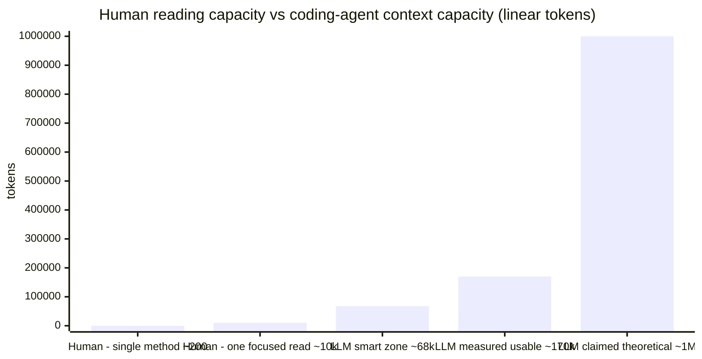

# Chapter 2. New Quality Standards for Software

> Once AI becomes part of the development subject, "what counts as good code" must be re-examined — not because AI changes the nature of software, but because it changes both the **target reader of the quality criteria** and the **cost structure of generation and modification**. Building on the observation in §1.4.2.1 that AI capability is a **"jagged frontier"** — stably above the human average on some dimensions, persistently below the human baseline on others — this **asymmetry** pushes the classical software-quality canon (readability, abstraction, reuse, comments, test coverage…) item by item onto a recalibration track.

## 2.1 Several Structural Shocks the Jagged Frontier Delivers to Traditional Software Quality

Combining §1.4.2.2.1 and §1.4.2.2.2, a set of traditional software-engineering quality views is **repriced** — not overturned, but with their respective "cost / value" coefficients rewritten by AI.

### 2.1.1 Readability: Readable to *whom*?

Classical definition: readability = code that lets another **human** programmer reach understanding quickly. The implicit premise is "the reader is a fatigued, attention-limited human who needs contextual cues."

Under AI collaboration the code has at least two classes of readers — **humans (reviewer / decision-maker)** and **agents (generator / modifier / debugger)** — and their preferences are not aligned:

- Humans favor **high information density and semantic compression**: one elegant higher-order function beats 20 lines of if/else;
- Agents favor **explicit structure and self-contained context**: flat, verbosely-named, well-commented code with explicit side effects is easier to modify unambiguously;
- Humans are sensitive to **screen height** (one paragraph per screen is best); agents are sensitive to **token distance / same-file co-location** (related information in the same file is more reliable).

#### Human vs LLM "readability ceiling" — absolute capacity and effective depth

The "target reader" question of readability is not just preference, but a difference of **absolute capacity**. Putting both sides on the same token-count scale:

**Human side (cognitive psychology + software-engineering empirics + physiological validation, three mutually corroborating layers).**

**Macro context**: developers spend roughly **58% of their working time on reading and understanding code** — this is the hard number from Xia et al. (TSE 2018) from a field study of 7 real projects, 79 professional developers, and 3,244 working hours [[13]](https://baolingfeng.github.io/papers/tsecomprehension.pdf). In other words, software engineering is essentially a reading-intensive rather than writing-intensive activity, and "readability" in the AI era is not deprecated but reallocated.

The capacity of short-term memory that can be actively manipulated at once is about **7±2 chunks (Miller 1956) [1]**, revised by Cowan (2001) under stricter methodology to **4±1 [2]** — this is the hard ceiling on "holding and integrating simultaneously." Extrapolating this ceiling to code, the software-engineering literature provides three **progressively coarser** layers of empirical evidence:

- **The "glance-and-grok" scale — a single complete unit**: large-scale measurements of open-source codebases show that **Eclipse averages about 8.6 lines per method** and "the vast majority of modern functions are < 50 lines" [[9]](https://softwarebyscience.com/very-short-functions-are-a-code-smell-an-overview-of-the-science-on-function-length/); Robert Martin's rule of thumb in *Clean Code* is ≤ 20 lines per function — rule of thumb and measured distribution agree. Converting to tokens, this is roughly **100–300 tokens per method**, which lines up with Cowan's 4±1 chunks.

- **The "concentrated read-through" scale — one chunk of code / one PR**: Scalabrino et al. (JSEP 2019) ran correlation analysis on 121 code metrics versus "measured understanding time" with professional developers, and found that **LOC alone correlates weakly with understandability; what really correlates strongly is nesting depth, control-flow complexity, and Cognitive Complexity** [[10]](https://sscalabrino.github.io/files/2018/JSEP2018AComprehensiveModel.pdf). The ceiling is not set by line count but by the **interaction complexity inside the code** — the same few-thousand tokens, written linearly, can be read in one pass; written as nested tangles, may resist understanding altogether.

- **Physiological validation — program comprehension ≈ natural-language reading + structural reasoning**: Peitek et al. (ICSE 2021) used fMRI to directly measure the brain regions activated during program comprehension, finding that **they overlap heavily with the regions activated by natural-language reading**, and correlate strongly with Cognitive Complexity [[11]](https://www.tu-chemnitz.de/informatik/ST/publications/papers/ICSE21.pdf); the same group used eye-tracking (PACMHCI 2023, 207 developers) to further confirm that pupil dilation and fixation counts of novices are significantly higher than experts — the comprehension limit is **directly tied to experience-correlated chunking ability** [[12]](https://dl.acm.org/doi/10.1145/3591135). This evidence elevates the previous two layers from "engineering experience" to "physiologically measurable."

Combining the evidence above, the scale at which a human engineer can "absorb effortlessly in one breath" is roughly **a method of 8–20 lines (~100–300 tokens)**; the scale that can be "read through in one focused sitting" lies somewhere **between a few hundred and a couple thousand lines (~a few k to ~10k tokens)**, but **the real ceiling is not set by line count — it is set by the cognitive / cyclomatic complexity inside the code**, i.e. it must stay below ~a few k to ~10k tokens. This mirrors the LLM side analyzed below: "stated theoretical window length (1M by 2026 mainstream) → measured ~170k → smart zone ~68k" — both sides exhibit **absolute capacity > effective depth**.

**LLM side (claimed theoretical → measured effective → smart zone).** Frontier models have made 1M-token context windows mainstream in 2025–2026 (Claude Opus 4.6 ships the full 1M with no beta tag [[3]](https://claudefa.st/blog/guide/mechanics/context-management)). But **the measured effective length is far shorter than the stated theoretical value**:

- Liu et al., *Lost in the Middle*, demonstrated empirically as early as 2023 that model performance drops significantly when the relevant information sits in the middle of the prompt [[4]](https://arxiv.org/abs/2307.03172);
- Databricks' 2024 long-context RAG benchmark: Llama-3.1-405B starts degrading past 32k, GPT-4-0125-preview past 64k [[5]](https://www.databricks.com/blog/long-context-rag-performance-llms);
- 2025 practitioner experience summarized this "stated vs usable" trade-off as **"~170k usable, of which roughly 40% is the smart zone (≈ 68k)"** [[6]](https://www.youtube.com/watch?v=rmvDxxNubIg) — **retrieval capability in long context ≠ complex understanding capability**; an early-2026 study sampling real sessions raised this threshold to about 200k — the so-called **"the 200k ghost"** [[15]](https://github.com/WaspBeeNSOSWE/the-200k-ghost), with degradation differing between single-task and diverse-task settings, slightly more permissive (~18% higher) than [[6]](https://www.youtube.com/watch?v=rmvDxxNubIg); for robustness of argument the rest of this section uses the more conservative **~170k** as the effective ceiling.

A rough side-by-side of the "claimed window" vs the "measured effective working zone" for mainstream coding agents (influenced by prompt templates, system prompts, caching strategies, etc.; the table is an approximation aggregating public evaluations):

| Coding agent / model | Claimed context window | Measured effective / smart zone |
|---|---|---|
| Claude Code (Sonnet 4) | 200k | About **176k usable** after system prompt; begins degrading after **147–152k**; official guidance is to exit the session within 70–75% capacity [[7]](https://www.turboai.dev/blog/claude-code-context-window-management) |
| Claude Code (Opus 4.6, 1M) | 1M | **~170k usable, of which ~40% is smart zone (≈ 68k)** [[6]](https://www.youtube.com/watch?v=rmvDxxNubIg) |
| Cursor | Depends on chosen model (commonly 200k) | Auto-summarize + truncation; specific thresholds not disclosed [[8]](https://www.qodo.ai/blog/claude-code-vs-cursor/) |
| GPT-4-0125-preview (RAG) | 128k | Noticeable degradation past **~64k** [[5]](https://www.databricks.com/blog/long-context-rag-performance-llms) |
| Llama-3.1-405B (RAG) | 128k | Noticeable degradation past **~32k** [[5]](https://www.databricks.com/blog/long-context-rag-performance-llms) |

Placing the two sets of numbers side by side makes it self-evident that readability must rest on entirely different criteria.

What follows:

- **Absolute capacity**: the LLM smart zone (60–80k tokens) is roughly **10× or more** the human one-focused-read window (taking the mid-to-high end of the ~few k to ~10k estimate), and **200× or more** the single-method scale (~100–300 tokens) — this is the physical basis for §1.4.2.2.1 E's "bulk skim work is essentially free";
- **Relative depth**: but the LLM curve "claimed 1M → measured ~170k → smart zone ~68k" is a **stepwise shrinkage** — retrieval in long context does not equal complex understanding [[4]](https://arxiv.org/abs/2307.03172); that said, as hardware and Transformer optimizations improve, the practical working zone may gradually approach the theoretical maximum, while the human brain has no comparable rapid-progress path.
- **Readability design principle**: "readable to agents" should be organized around the **smart zone** rather than the maximum window — compress task-relevant context to within 60–80k tokens, and place the most critical content at the **head and tail** of the window to avoid *lost-in-the-middle*; "readable to human reviewers" still organizes around the ~5k-tokens-per-screen scale. **The two scales differ by an order of magnitude.**

The new readability standard will **lean toward the agent-friendly end** — because in the generate-modify-regress loop, the agent is by far the most frequent reader. This is a reverse correction to the decades-old creed that "terseness = quality."

### 2.1.2 Abstraction patterns: from "reducing duplication" to "reducing irreversibility"

DRY, deep inheritance, and the menagerie of design patterns largely emerged in an era when "every line of code was expensive," with the goal of compressing total "understanding / maintenance / modification" cost. When marginal generation cost approaches 0:

- **Duplication** is no longer the chief sin — its cost shifts from "write it again" to "miss it during a change," but agents can do cross-file batch rewrites;
- **The real cost** becomes the **irreversibility of early decisions** — choose the wrong framework, the wrong abstraction layer, the wrong protocol, and the faster a downstream agent builds on top of the bad foundation, the worse the loss.

So the goal of abstraction drifts from "DRY" toward **"locality of change"** and **"reversibility"**: a good abstraction is judged not by how many lines it saves, but by **how narrow the semantic boundary is that you'll have to explain to an agent when the time to change comes**.

### 2.1.3 Reuse: from "library" to "capability"

The economics of reuse have also shifted. The premise of a library is that "re-implementing is too expensive"; once generation cost approaches 0, **vendoring + on-the-spot customization** is in many scenarios more economical than **dependency + general-purpose abstraction** — no more dependency baggage, no more being tied to a library's API design, and when bugs appear you patch the source directly.

The granularity of reuse also moves up from "code snippet / class / module" to **"capability / interface spec / evaluation set"**: what you reuse is no longer a chunk of code, but a "verifiable specification for a problem + its associated tests / evaluations / monitoring." This in turn raises the asset value of **specs** and **evals**, and correspondingly lowers the value of "which code passage is the sacred truth."

### 2.1.4 Testing and coverage: from "coverage" to "trustworthy signal"

Writing tests once was a quality bottleneck; now it's a cheap by-product for AI. **Writing tests is easy; writing them correctly and with discriminating power is not** — Chapter 1's P6 already anchored this empirically with Inozemtseva & Holmes (coverage correlates only low-to-moderately with defect-finding capability). In the AI era, "tests" lose their scarcity as a labor quantity, while their scarcity as **effective signal** is amplified: adversarial sets, mutation testing, property-based testing, production-trace replay, and continuous evaluation become the new moats.

### 2.1.5 Comments and documentation: from synchronization headache to "Single source of truth"

The root cause of documentation rot in the human era was "expensive to write once, more expensive to change" (cf. Chapter 1's citation of Parnas on software aging). Given the exponential amplification of AI reading capacity argued above, code as **Single Source of Truth** becomes more reliable, and documentation's formatting and phrasing matter much less. Moreover, under human-in-the-loop development with language models, more of the process — including deliverables and the process itself — is naturally "documented," which is equivalent to preparing the very artifacts a CMM assessment looks for, in parallel with development. A good example is the **AI Codebase Maturity Model (ACMM)** and its demonstration cases [[14]](https://arxiv.org/abs/2604.09388): treating "the codebase's maturity for AI collaboration" as a gradable evaluation indicator, whose evolution path internalizes many engineering actions previously labeled "additional documentation" (decision records, specifications, runtime observation, evaluation suites) as **first-class artifacts of the codebase itself** — further blurring the boundary between docs and code.

In short, the evaluation function for software quality has been quietly rewritten. It is no longer just "friendly to human reviewers + friendly to long-term maintainers" — a **single pair of human-facing preferences** — but a new set of quality constraints that **explicitly recognizes AI as both author and reader**:

- Readable = optimized for both **human decision-making** and **agent modification**, organized at each side's effective reading scale, where the former can be supplied by the latter;
- Abstraction = goal switches from "reducing duplication" to "reducing irreversibility," so that the cost of future reversible refactoring stays bounded;
- Reuse = reuse **specs + evaluation sets + monitoring**, not the code itself;
- Testing = shift from "coverage" to "discriminating power," embedding **continuous evaluation** into the production loop;
- Documentation = treat **code as Single Source of Truth**, and let the human-in-the-loop generation process naturally crystallize as a retrievable process record.

To turn this new set of standards into **actionable engineering methods**, the rest of this chapter develops the following directions:

- **2.3 Full-process thinking and generation record** — treat the AI generation session itself as a first-class deliverable.
- **2.4 Audit and evaluation** — embed quality signals inside the generation loop rather than as after-the-fact reports.
- **2.5 Session + Git approach** — provide a traceable, reproducible, branchable version-control substrate for both "process" and "product."

These mainly address engineering **deliverables**; standards and methods for the engineering process and organizational management will be discussed in the next chapter.

---

## References

[1] G. A. Miller, "The Magical Number Seven, Plus or Minus Two: Some Limits on Our Capacity for Processing Information," *Psychological Review*, vol. 63, no. 2, pp. 81–97, 1956.

[2] N. Cowan, "The Magical Number 4 in Short-Term Memory: A Reconsideration of Mental Storage Capacity," *Behavioral and Brain Sciences*, vol. 24, no. 1, pp. 87–114, 2001.

[3] "Claude Code Context Window: Optimize Your Token Usage," *claudefa.st*, 2026. [Online]. Available: <https://claudefa.st/blog/guide/mechanics/context-management>

[4] N. F. Liu, K. Lin, J. Hewitt, A. Paranjape, M. Bevilacqua, F. Petroni, and P. Liang, "Lost in the Middle: How Language Models Use Long Contexts," *Transactions of the Association for Computational Linguistics (TACL)*, 2024; *arXiv preprint*, arXiv:2307.03172. [Online]. Available: <https://arxiv.org/abs/2307.03172>

[5] Databricks Mosaic Research, "Long Context RAG Performance of LLMs," *Databricks Blog*, 2024. [Online]. Available: <https://www.databricks.com/blog/long-context-rag-performance-llms>

[6] "Coding agent context window practical limits (~170k usable, ~40% smart zone)," YouTube, 2025. [Online]. Available: <https://www.youtube.com/watch?v=rmvDxxNubIg>

[7] "Claude Code Context Window Management," *TurboAI Blog*, 2025. [Online]. Available: <https://www.turboai.dev/blog/claude-code-context-window-management>

[8] Qodo, "Claude Code vs Cursor: Deep Comparison for Dev Teams," *Qodo Blog*, 2025. [Online]. Available: <https://www.qodo.ai/blog/claude-code-vs-cursor/>

[9] "Very Short Functions Are a Code Smell — An Overview of the Science on Function Length," *Software by Science*, 2024. (Reports Eclipse codebase mean ≈ 8.6 lines/method; majority of modern functions < 50 lines.) [Online]. Available: <https://softwarebyscience.com/very-short-functions-are-a-code-smell-an-overview-of-the-science-on-function-length/>

[10] S. Scalabrino, M. Linares-Vásquez, R. Oliveto, and D. Poshyvanyk, "A Comprehensive Model for Code Readability," *Journal of Software: Evolution and Process*, vol. 30, no. 6, e1958, 2018; with follow-up empirical evaluation in S. Scalabrino *et al.*, "An Empirical Evaluation of the 'Cognitive Complexity' Measure as a Predictor of Code Understandability," *Journal of Systems and Software*, 2022. [Online]. Available: <https://sscalabrino.github.io/files/2018/JSEP2018AComprehensiveModel.pdf>

[11] N. Peitek, S. Apel, C. Parnin, A. Brechmann, and J. Siegmund, "Program Comprehension and Code Complexity Metrics: An fMRI Study," in *Proc. 43rd Int. Conf. Software Engineering (ICSE)*, 2021, pp. 524–536. [Online]. Available: <https://www.tu-chemnitz.de/informatik/ST/publications/papers/ICSE21.pdf>

[12] N. Peitek *et al.*, "Studying Developer Eye Movements to Measure Cognitive Workload and Visual Effort for Expertise Assessment," *Proc. ACM Hum.-Comput. Interact. (PACMHCI)*, vol. 7, no. ETRA, Art. 218, 2023. (n = 207 developers; expert vs novice pupil dilation and fixation analysis.) [Online]. Available: <https://dl.acm.org/doi/10.1145/3591135>

[13] X. Xia, L. Bao, D. Lo, Z. Xing, A. E. Hassan, and S. Li, "Measuring Program Comprehension: A Large-Scale Field Study with Professionals," *IEEE Transactions on Software Engineering*, vol. 44, no. 10, pp. 951–976, Oct. 2018. (7 projects, 79 professional developers, 3,244 working hours; ~58% of dev time spent on program comprehension.) [Online]. Available: <https://baolingfeng.github.io/papers/tsecomprehension.pdf>

[14] "AI Codebase Maturity Model (ACMM) and Reference Cases," *arXiv preprint*, arXiv:2604.09388. [Online]. Available: <https://arxiv.org/abs/2604.09388>

[15] WaspBeeNSOSWE, "the-200k-ghost: A Reproduction of Coding-Agent Effective Context Length on Real Sessions," *GitHub Repository*, 2026. (Empirical re-measurement of long-context usable window for frontier coding agents; finds the practical degradation threshold sits closer to ~200k tokens rather than the earlier ~170k estimate.) [Online]. Available: <https://github.com/WaspBeeNSOSWE/the-200k-ghost>
