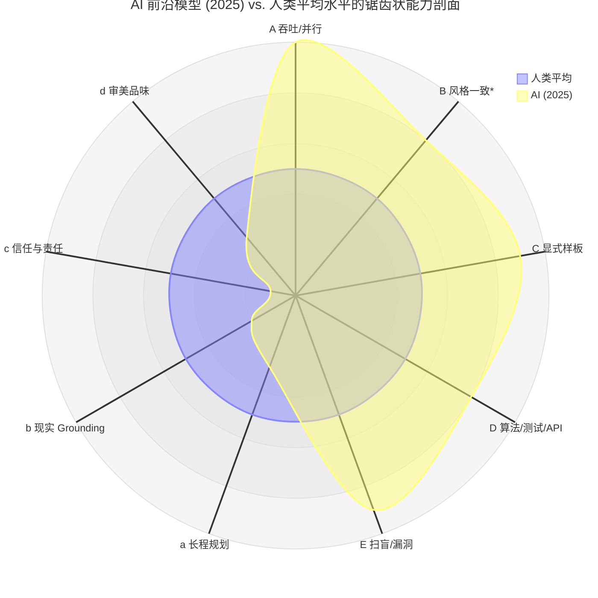
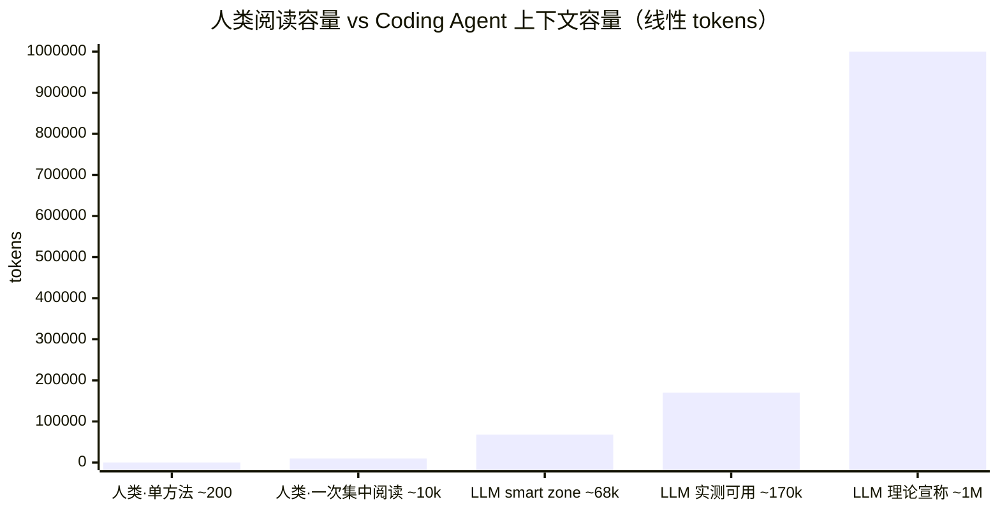

# 第二章　软件质量新标准

> 当 AI 介入开发主体之后，"什么样的代码算好代码"这件事必须被重新审视——不是因为 AI 改变了软件的本质，而是因为它改变了**评判标准的目标读者**与**生成—修改的成本结构**。本章先论证一个关键观察：AI 的能力呈 **"锯齿状" (jagged)** 分布——在一些维度上稳定超过人类平均水平，在另一些维度上又长期低于人类基线；正是这种**不对称**把传统的软件质量观（可读性、抽象、复用、注释、测试覆盖率……）逐项推上了重新校准的轨道。

## 2.1 起点：AI 能力的"锯齿状边界" (Jagged Frontier)

"Jagged Technological Frontier"（锯齿状技术边界）这个提法来自 2023 年 Dell'Acqua 等人与 BCG 合作进行的大规模田野实验 [1]：758 名 BCG 顾问被随机分配是否使用 GPT-4 完成 18 项现实咨询任务。结果惊人地分裂：

- 落在能力**边界之内**的任务上，使用 AI 的顾问平均完成数多 **12.2%**、完成速度快 **25.1%**、质量高 **40%+**；
- 在专门挑选的边界**之外**的任务上（描述上看与之内任务难度相近），使用 AI 的顾问给出正确答案的概率反而**低 19 个百分点**。

也就是说——AI 的能力不是一个"整体高 / 低于人类 X%"的标量，而是一个**形状不规则的曲面**：两个表面看起来相邻的任务，可能一个落在能力之内、一个掉在能力之外，且边界的形状无法直接由"任务描述的难度"预测出来。Ethan Mollick 把这种现象进一步称为 **"Jagged AGI"**：同一个前沿模型既能秒解高难度商业战略题，又会在儿童谜语上跌跤。

Karpathy 在 2025 年末的复盘里给这条曲线一个机制性的解释 [2]：LLM 的能力会**在 RLVR（可验证奖励强化学习）覆盖到的领域附近"长出尖刺"**——数学题、竞赛编程、形式证明、强类型代码这些有硬验证器的窄域里，模型的表现迅速逼近甚至越过人类专家；而在没有可验证信号的开放域（创意、长程规划、社会与物理常识、品味判断）里，模型仍维持类似中等水平人类的输出。所以"锯齿"不是训练不足造成的瑕疵，而是**优化目标本身的结构性产物**。

*Source:karpathy.bearblog.dev*

把这条结论搬进软件工程，得到一个指导性的判断：

> **AI 不是"全能但偏弱"的初级工程师，也不是"全能且超人"的资深工程师；它是一名能力分布与人类正交的执行体——在我们一直觉得"难"的某些维度上轻松超过人均，又在我们一直觉得"理所当然"的某些维度上反复栽跟头。**

下图把 §2.1.1 将要展开的能力**优势**轴 (A–E) 与 §2.1.2 将要展开的能力**短板**轴 (a–d) 放在同一张雷达上做主观对照。人类平均水平统一取作 5（基准锚），AI 的得分在 0–10 之间相对它浮动；前半周（A–E）多在 5 之外，后半周（a–d）多在 5 之内——这正是"锯齿"二字在工程语境里的可视化形态：

> 读图说明：
> - 人类平均（青色多边形）在所有轴上恒为 5——它**就是基准**，不是"人类的真实能力分布"。
> - AI（橙色多边形）的得分是基于 §2.2 / §2.3 论据的主观估计，**仅用于呈现"锯齿形状"**，不应被解读为精确测量；不同模型、不同 harness、不同领域上的具体分布会有差异。
> - **B 风格一致**的 AI 数值取**多采样 + verifier 反馈** 配置；single-shot 模式下该轴会接近 5（详见 §2.1.1 B）。
> - **c 信任与责任** 给到接近 0 是因为在多数法律/合规语境下这一项**结构上**无法由模型承担，与其能力强弱无关。

下面把这条锯齿映射到软件工程的具体维度。

### 2.1.1 在哪些维度上 AI 已稳定超过人类平均

**A. 吞吐与并行度**。生成代码的速度是人类工程师的 10²–10³ 倍，且天然并行。它的直接后果不是"代码写得更好"，而是"凡是只有在生成速度小于审阅速度时才成立的质量观，在原则上已经失效"。

**B. 风格 / 命名 / 模板的一致性（"多次生成 + 自我校对"配置下）**。

需要先做一个重要的限定：**单次生成 (single-shot)** 层面，由于 LLM 的采样温度随机性 + 推理时的非确定性（参见第一章 P5 关于浮点不结合性 + batching 的讨论），AI 在"重复执行同一规约"时的一致性**未必**高于一名经过良好 onboarding 的人类工程师——同一段 prompt 在不同时间、不同负载下跑出来的命名、留白、错误处理顺序都可能轻微漂移。

但当生成回路扩展为 **多次采样 + 自我校对 / 验证器筛选** 时，情况发生质变。Brown 等人 2024 年的 *Large Language Monkeys: Scaling Inference Compute with Repeated Sampling* [3] 实证表明：**只要拥有可机器验证的成功信号**，覆盖率（任何一次采样能解掉的任务比例）会随采样数在四个数量级上呈对数线性上升——例如在 SWE-bench Lite 上，DeepSeek-Coder-V2-Instruct 单样本解出比例 15.9%，250 次采样后升至 56%。这是一个虽然**间接但强烈**的证据：当我们把"一致性"也视为一个可被 verifier / linter / judge 量化的目标，**多次生成 + 选优**能让 AI 系统的一致性收敛到远高于人类平均的水平——大尺度代码库里贯彻同一种命名、同一种 import 顺序、同一种错误处理范式，对人类是体力活，对配了 verifier 反馈的 AI harness 是默认行为。

> ⚠ **声明**：截至目前还没有**直接对照实验**把"AI 多次生成 + 自我校对 vs. 人类工程师在大尺度代码库中的风格一致性"作为同一变量同台测量。本节的判断是从相邻领域（数学 / 代码任务的覆盖率扩展）类比推断出来的，仍需面向真实代码库做专门的实证评估。

由此推出对 lint / code style 工程实践的影响：以"一致性"为表面目标的传统 lint 规则、code style 守则在 single-shot 设置下不一定立刻免费，**但在配合 lint / verifier 反馈 + 多轮重生的 harness 下，会从"人类需要努力达到的目标"降格为"AI 系统的近零成本基线"**。

**C. 把 boilerplate 写得显式而非"用抽象省掉"**。模板、胶水代码、适配器、转换层这些原先被 DRY 教条压抑的"重复但显式"的代码，AI 写起来不嫌烦——你可以选择"展开 100 行显式样板"而不是"用三层抽象省 70 行"。

**D. 在已有 RLVR 覆盖的窄域内逼近 / 越过人均**：算法实现、单元测试编写、API 形状契合度、跨语言机械翻译、SQL / 正则 / grep 类查询表达——这些有强反馈信号的领域里，AI 在 2025 年已稳定超过中等水平人类。

**E. 跨大上下文的"扫盲式"工作（含安全漏洞挖掘）**。读完整个代码库找出所有命名违例、过期注释、死代码、未捕获异常——这种"耐心活"对人类极其昂贵，对 AI 是几乎免费的副产品。**安全漏洞发现**是这条特性的高价值延伸：在 2025 年 DARPA **AIxCC (AI Cyber Challenge)** 决赛中，一个 LLM 驱动的"All You Need Is A Fuzzing Brain"系统在真实的开源 C / Java 项目上**自主发现了 28 个安全漏洞，其中 6 个为此前未公开的 0day，并成功自动修补了 14 个** [4]；2025 年 ACM Computing Surveys 上的综述对这一年起 LLM 在漏洞检测领域的快速成长做了系统总结 [5]。也就是说，从"代码异味扫盲"延伸到"零日漏洞挖掘"这条连续谱上，AI 正在用**耐心 + 跨上下文检索**这两项被放大到接近免费的能力，做一些**对一般人类工程师团队在经济上不划算去做**的事。

### 2.1.2 在哪些维度上 AI 仍低于人类

**a. 长程规划与架构判断**：跨多个模块、多次需求迭代、面对"模糊不完整需求"的系统性设计，仍是 AI 的弱项（参见第一章 P2）。

**b. 现实 grounding 与约束感知**：哪些性能预算是硬约束、哪些用户痛点是真痛点、哪些"看起来可行但会踩到生产事故的边"——这类靠现场经验锚定的判断，AI 仍依赖被显式喂入而不能自发感知（参见第一章 P4）。

**c. 信任与责任承担**：当一段输出需要承担后果（合规、安全、商业承诺），"人对人的问责链"仍是机器无法替代的契约基础。

**d. 审美与品味**：哪些抽象优雅、哪些 API 设计让人愿意用十年——这类"长期可读性"上的取舍，AI 仍倾向于复述训练集里的多数派，而不能建立独立判断。

## 2.2 锯齿对传统软件质量观的几条结构性冲击

把 §2.1.1 / §2.1.2 合在一起，传统软件工程的一组质量观被**重新定价**——不是被推翻，而是它们各自的"成本 / 价值"系数被 AI 改了。

### 2.2.1 可读性：面向 *谁* 的可读？

经典定义：可读性 = 能让另一个**人类**程序员快速理解的代码。隐含前提是"读代码的是疲劳、注意力受限、需要语境提示的人类"。

AI 协作下，代码至少有两类读者——**人类（reviewer / 决策者）** 与 **agent（生成者 / 修改者 / 调试者）**——它们的偏好并不一致：

- 人类偏好**信息密度高、语义压缩**：一段优雅的高阶函数胜过 20 行 if/else；
- agent 偏好**结构显式、上下文自洽**：扁平、命名长、注释充分、副作用显式声明的代码更容易被无歧义地修改；
- 人类对**屏幕高度**敏感（一屏内看完一段最好）；agent 对 **token 距离 / 同文件内置性**敏感（相关信息出现在同一文件内更可靠）。

#### 人类 vs LLM 的"可读上限"——绝对量与有效深度

可读性的"目标读者"问题不止是偏好差异，还有**绝对容量**差异。把双方按 token 量同台估算：

**人类侧（认知心理学 + 软件工程实证 + 生理验证三层互证）。**

**宏观语境**：开发者约 **58% 的工作时间花在阅读理解代码**——这是 Xia et al. (TSE 2018) 在 7 个真实项目、79 名职业开发者、3,244 工时的字段研究给出的硬数字 [18]。也就是说软件工程本质是阅读密集而非写作密集的工作，"可读性"在 AI 时代不是被淘汰而是被重新分配。

短时记忆同时可主动操作的容量约为 **7±2 chunks（Miller 1956）[6]**，被 Cowan (2001) 用更严格的方法修正到 **4±1 [7]**——这是"同时持有并整合"的硬上限。把这个上限往代码场景外推，软件工程文献提供了**三个尺度递进**的实证证据：

- **"一眼就懂"尺度——单个完整单元**：大型开源代码库的实测显示，**Eclipse 平均每个方法约 8.6 行**，"绝大多数现代函数 < 50 行" [14]；Robert Martin 在 *Clean Code* 中给出的经验法则是函数 ≤ 20 行——经验法则与实测分布同向。换算成 token 大致是 **100–300 tokens / 方法**，与 Cowan 4±1 chunks 的认知容量对得上。

- **"集中精力一次吃透"尺度——一段代码 / 一个 PR**：Scalabrino et al. (JSEP 2019) 在职业开发者上对 121 种代码度量与"实测理解时间"做了相关性分析，**LOC 本身与理解度相关性弱；真正强相关的是 nesting 深度、控制流复杂度、Cognitive Complexity** [15]。也就是说"上限"不是被行数决定，而是被一段代码内部的**交互复杂度**决定——同样几千 tokens，平铺直叙的代码可以一次读完，嵌套缠绕的可能怎么读也理不顺。

- **生理验证——程序理解 ≈ 自然语言阅读 + 结构推理**：Peitek et al. (ICSE 2021) 用 fMRI 直接测量程序理解时被激活的脑区，发现**它与自然语言阅读所激活的脑区高度重叠**，并与 Cognitive Complexity 强相关 [16]；同组用眼动 (PACMHCI 2023, 207 名开发者) 进一步证实新手的瞳孔扩张和注视次数显著高于专家——理解极限**直接挂钩于经验相关的 chunking 能力** [17]。这条证据把前两层从"工程经验"提升到"生理可测"。

综合以上证据得出人类工程师"一口气毫不费力吃透"的代码尺度大约是**一个方法 8–20 行 (~100–300 tokens)**；"集中精力一次读懂"的范围在**几百到一两千行 (~几 k 到 ~10k tokens) 之间**，但**真正的上限不是被行数决定的，而是被代码内部的 cognitive / cyclomatic complexity 决定**，也就是要小于~几 k 到 ~10k tokens。这与下面分析的LLM 侧宣称的理论窗口长度（2026年普及1M） → 实测 ~170k → smart zone ~68k"的情况相似：两者都是**绝对容量>有效深度**。

**LLM 侧（理论宣称值 → 实测有效 → smart zone）。** 前沿模型 2025–2026 年的 1M token context window 已经普及（Claude Opus 4.6 全可用 1M、无 beta 标识 [8]）。但**实测有效长度远短于理论宣称值**：

- Liu et al. *Lost in the Middle* 早在 2023 年就实证：当相关信息出现在 prompt 中段时模型性能显著下降 [9]；
- Databricks 2024 长上下文 RAG benchmark：Llama-3.1-405B 在 32k 后开始劣化、GPT-4-0125-preview 在 64k 后开始劣化 [10]；
- 2025 年实践经验把这种"理论宣称 vs 可用"的 trade-off 直接概括为 **"~170k 可用，其中约 40% 是 smart zone（≈ 68k）"** [11]——长上下文里的**检索能力 ≠ 复杂理解能力**。

主流 coding agent 的"理论宣称窗口"与"实测最佳工作区"近似对照（受 prompt 模板、系统提示、缓存策略等因素影响，下表仅为公开测评的综合近似）：

| Coding Agent / 模型 | 理论宣称 Context Window | 实测有效 / Smart Zone |
|---|---|---|
| Claude Code (Sonnet 4) | 200k | 系统提示后约 **176k 可用**；约 **147–152k** 后开始劣化；官方建议在 70–75% 容量内退出 session [12] |
| Claude Code (Opus 4.6, 1M) | 1M | **~170k 可用，其中 ~40% 是 smart zone（≈ 68k）** [11] |
| Cursor | 取决于所选模型（通常 200k） | 自动摘要 + 截断；具体阈值未公开 [13] |
| GPT-4-0125-preview (RAG) | 128k | **~64k** 后明显劣化 [10] |
| Llama-3.1-405B (RAG) | 128k | **~32k** 后明显劣化 [10] |

把这两组数字并排看，可读性要基于完全不同的标准就不言而喻了。

由此推导出：

- **绝对量**：LLM 的 smart zone（60–80k tokens）大约是人类一次集中阅读窗的 **10 倍以上**（取人类 ~几 k 到 ~10k tokens 的中高位估计），是单个方法尺度（~100–300 tokens）的 **200 倍以上**——这是 §2.1.1 E 那条"扫盲式工作几乎免费"在底层的物理基础；
- **相对深度**：但 LLM 的 "理论宣称 1M → 实测 ~170k → smart zone ~68k" 是一条**逐级缩水**的曲线，长上下文中的"检索"能力不等同于"复杂理解"能力 [9]；不过随着硬件算力和Transformer优化的进步，实际最佳工作区可能逐步逼近理论最大值，而人类大脑难以实现快速进步。
- **可读性设计原则**：面向 agent 的"可读"应按 **smart zone** 而非最大窗口长度组织——把任务相关上下文压缩到 60–80k tokens 之内，最关键的内容放在窗口**首尾**避开 *lost-in-the-middle*；面向人类 reviewer 的"可读"则仍按 ~5k tokens / 屏幕一屏的尺度组织。**两者尺度差一个数量级，因此优秀代码必须同时通过两套衡量。**

新的可读性标准会**向 agent 友好的一端倾斜**——因为生成—修改—回归的循环里，agent 是出现频次最高的读者。这是对几十年来"言简意赅 = 高质量"信条的一次反向校正。

### 2.2.2 抽象模式：从"减少重复"到"减少不可逆"

DRY、深度继承、各类设计模式大量产生于"代码每写一行都贵"的时代，目的是把"理解 / 维护 / 修改"的总成本压低。当生成边际成本接近 0：

- **重复**不再是主罪——它的代价从"重复编写"变成了"修改时漏改"，但 agent 能做跨文件批量改写；
- **真正的代价**变成了**早期决策的不可逆性**——选错框架、选错抽象层、选错协议，后续 agent 在错误地基上越快盖楼，损失越大。

所以抽象的目标从"DRY"漂移到 **"locality of change"** 与 **"reversibility"**：好的抽象不是省了多少行，而是**未来要改的时候，需要解释给 agent 的语义边界有多窄**。

### 2.2.3 复用：从"库"到"能力"

复用经济学也变了。库 (library) 的存在前提是"复刻一遍太贵"；当生成成本接近 0，**vendor + 二次定制**在很多场景下比**依赖 + 通用抽象**更划算——不再背依赖、不再被库的 API 设计绑定、出问题直接改源。

复用的粒度也从"代码片段 / 类 / 模块"上移到 **"能力 / 接口规约 / 评测集"**：你复用的不再是一段代码，而是"对一个问题的可验证规约 + 它对应的测试 / 评测 / 监控"。这反过来抬高了**规约 (spec)** 与**评测 (eval)** 的资产价值，相对压低了"哪段代码是金科玉律"的资产价值。

### 2.2.4 测试与覆盖率：从"覆盖"到"可信信号"

写测试一度是质量瓶颈，现在它对 AI 是廉价副产品。**写测试容易，写得对、写得有判别力则不容易**——这件事第一章 P6 已用 Inozemtseva & Holmes 的实证锚定（覆盖率与缺陷发现能力只有低到中等相关性）。AI 时代，"测试"作为劳动量的稀缺性消失了，"作为有效信号"的稀缺性反而被放大：对抗集、变异测试、property-based、生产 trace 重放成为新的护城河。

### 2.2.5 注释与文档：从"事后写不写得动"到"是否与代码同源"

人类时代文档腐化的根因是"写一次很贵 / 改起来更贵"（参见第一章对 Parnas 软件老化的引用）。AI 时代两端的成本都掉了，于是**"是否与代码、规范、决策、AI 生成会话同源同步"** 成为文档质量的新主指标——这一条直接为 §2.3 与 §2.4 即将展开的"全过程的思考与生成记录"埋下伏笔。

## 2.3 一句话与本章后续

把 §2.1 / §2.2 合起来，软件质量的目标函数已被悄悄改写。它不再是"对人类 reviewer 友好 + 对长期维护者友好"的一对偏序，而是一组新的、**显式承认 AI 既是作者又是读者**的质量约束：

> *可读 = 对人类决策与对 agent 修改都自洽；
> 抽象 = 让未来的可逆改造代价可控；
> 复用 = 复用规约与评测，而非复用代码；
> 测试 = 信号的判别力而非覆盖率；
> 文档 = 与代码与生成过程同源。*

要让这一组新标准变成**可操作的工程纪律**，本章接下来会围绕三件具体的事展开：

- **2.4 全过程的思考与生成记录**——把 AI 生成会话本身作为一等可交付物。
- **2.5 审计与评测**——把质量信号嵌入生成回路，而非事后报告。
- **2.6 Session + Git 方案**——给"过程"和"产物"提供可追溯、可复现、可分支的版本控制底座。

---

## 参考文献

[1] F. Dell'Acqua, E. McFowland III, E. R. Mollick, H. Lifshitz-Assaf, K. Kellogg, S. Rajendran, L. Krayer, F. Candelon, and K. R. Lakhani, "Navigating the Jagged Technological Frontier: Field Experimental Evidence of the Effects of Artificial Intelligence on Knowledge Worker Productivity and Quality," Harvard Business School Working Paper No. 24-013, Sept. 2023. [Online]. Available: <https://www.hbs.edu/faculty/Pages/item.aspx?num=64700>

[2] A. Karpathy, "2025 LLM Year in Review," *karpathy.bearblog.dev*, Dec. 2025. [Online]. Available: <https://karpathy.bearblog.dev/year-in-review-2025/>

[3] B. Brown, J. Juravsky, R. Ehrlich, R. Clark, Q. V. Le, C. Ré, and A. Mirhoseini, "Large Language Monkeys: Scaling Inference Compute with Repeated Sampling," *arXiv preprint*, arXiv:2407.21787, Jul. 2024. [Online]. Available: <https://arxiv.org/abs/2407.21787>

[4] Z. Wang *et al.*, "All You Need Is A Fuzzing Brain: An LLM-Powered System for Automated Vulnerability Detection and Patching," *arXiv preprint*, arXiv:2509.07225, Sept. 2025. (DARPA AI Cyber Challenge 2025 finalist; autonomously discovered 28 vulnerabilities including 6 zero-days in real-world open-source C/Java projects and patched 14.) [Online]. Available: <https://arxiv.org/html/2509.07225v1>

[5] Z. Zhang *et al.*, "LLMs in Software Security: A Survey of Vulnerability Detection Techniques and Insights," *ACM Computing Surveys*, 2025. [Online]. Available: <https://dl.acm.org/doi/10.1145/3769082>

[6] G. A. Miller, "The Magical Number Seven, Plus or Minus Two: Some Limits on Our Capacity for Processing Information," *Psychological Review*, vol. 63, no. 2, pp. 81–97, 1956.

[7] N. Cowan, "The Magical Number 4 in Short-Term Memory: A Reconsideration of Mental Storage Capacity," *Behavioral and Brain Sciences*, vol. 24, no. 1, pp. 87–114, 2001.

[8] "Claude Code Context Window: Optimize Your Token Usage," *claudefa.st*, 2026. [Online]. Available: <https://claudefa.st/blog/guide/mechanics/context-management>

[9] N. F. Liu, K. Lin, J. Hewitt, A. Paranjape, M. Bevilacqua, F. Petroni, and P. Liang, "Lost in the Middle: How Language Models Use Long Contexts," *Transactions of the Association for Computational Linguistics (TACL)*, 2024; *arXiv preprint*, arXiv:2307.03172. [Online]. Available: <https://arxiv.org/abs/2307.03172>

[10] Databricks Mosaic Research, "Long Context RAG Performance of LLMs," *Databricks Blog*, 2024. [Online]. Available: <https://www.databricks.com/blog/long-context-rag-performance-llms>

[11] "Coding agent context window practical limits (~170k usable, ~40% smart zone)," YouTube, 2025. [Online]. Available: <https://www.youtube.com/watch?v=rmvDxxNubIg>

[12] "Claude Code Context Window Management," *TurboAI Blog*, 2025. [Online]. Available: <https://www.turboai.dev/blog/claude-code-context-window-management>

[13] Qodo, "Claude Code vs Cursor: Deep Comparison for Dev Teams," *Qodo Blog*, 2025. [Online]. Available: <https://www.qodo.ai/blog/claude-code-vs-cursor/>

[14] "Very Short Functions Are a Code Smell — An Overview of the Science on Function Length," *Software by Science*, 2024. (Reports Eclipse codebase mean ≈ 8.6 lines/method; majority of modern functions < 50 lines.) [Online]. Available: <https://softwarebyscience.com/very-short-functions-are-a-code-smell-an-overview-of-the-science-on-function-length/>

[15] S. Scalabrino, M. Linares-Vásquez, R. Oliveto, and D. Poshyvanyk, "A Comprehensive Model for Code Readability," *Journal of Software: Evolution and Process*, vol. 30, no. 6, e1958, 2018; with follow-up empirical evaluation in S. Scalabrino *et al.*, "An Empirical Evaluation of the 'Cognitive Complexity' Measure as a Predictor of Code Understandability," *Journal of Systems and Software*, 2022. [Online]. Available: <https://sscalabrino.github.io/files/2018/JSEP2018AComprehensiveModel.pdf>

[16] N. Peitek, S. Apel, C. Parnin, A. Brechmann, and J. Siegmund, "Program Comprehension and Code Complexity Metrics: An fMRI Study," in *Proc. 43rd Int. Conf. Software Engineering (ICSE)*, 2021, pp. 524–536. [Online]. Available: <https://www.tu-chemnitz.de/informatik/ST/publications/papers/ICSE21.pdf>

[17] N. Peitek *et al.*, "Studying Developer Eye Movements to Measure Cognitive Workload and Visual Effort for Expertise Assessment," *Proc. ACM Hum.-Comput. Interact. (PACMHCI)*, vol. 7, no. ETRA, Art. 218, 2023. (n = 207 developers; expert vs novice pupil dilation and fixation analysis.) [Online]. Available: <https://dl.acm.org/doi/10.1145/3591135>

[18] X. Xia, L. Bao, D. Lo, Z. Xing, A. E. Hassan, and S. Li, "Measuring Program Comprehension: A Large-Scale Field Study with Professionals," *IEEE Transactions on Software Engineering*, vol. 44, no. 10, pp. 951–976, Oct. 2018. (7 projects, 79 professional developers, 3,244 working hours; ~58% of dev time spent on program comprehension.) [Online]. Available: <https://baolingfeng.github.io/papers/tsecomprehension.pdf>
