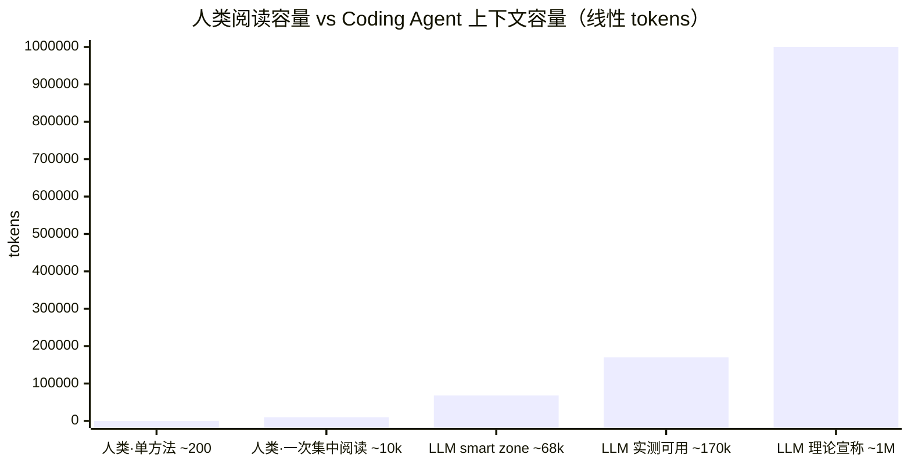

# 第二章　软件质量新标准

> 当 AI 介入开发主体之后，"什么样的代码算好代码"这件事必须被重新审视——不是因为 AI 改变了软件的本质，而是因为它改变了**评判标准的目标读者**与**生成—修改的成本结构**。基于 §1.4.2.1 提出的 AI 能力 **"锯齿状边界" (jagged frontier)** 观察——在一些维度上稳定超过人类平均水平，在另一些维度上又长期低于人类基线——这种**不对称**把传统的软件质量观（可读性、抽象、复用、注释、测试覆盖率……）逐项推上了重新校准的轨道。

## 2.1 锯齿对传统软件质量观的几条结构性冲击

把 §1.4.2.2.1 / §1.4.2.2.2 合在一起，传统软件工程的一组质量观被**重新定价**——不是被推翻，而是它们各自的"成本 / 价值"系数被 AI 改了。

### 2.1.1 可读性：面向 *谁* 的可读？

经典定义：可读性 = 能让另一个**人类**程序员快速理解的代码。隐含前提是"读代码的是疲劳、注意力受限、需要语境提示的人类"。

AI 协作下，代码至少有两类读者——**人类（reviewer / 决策者）** 与 **agent（生成者 / 修改者 / 调试者）**——它们的偏好并不一致：

- 人类偏好**信息密度高、语义压缩**：一段优雅的高阶函数胜过 20 行 if/else；
- agent 偏好**结构显式、上下文自洽**：扁平、命名长、注释充分、副作用显式声明的代码更容易被无歧义地修改；
- 人类对**屏幕高度**敏感（一屏内看完一段最好）；agent 对 **token 距离 / 同文件内置性**敏感（相关信息出现在同一文件内更可靠）。

#### 人类 vs LLM 的"可读上限"——绝对量与有效深度

可读性的"目标读者"问题不止是偏好差异，还有**绝对容量**差异。把双方按 token 量同台估算：

**人类侧（认知心理学 + 软件工程实证 + 生理验证三层互证）。**

**宏观语境**：开发者约 **58% 的工作时间花在阅读理解代码**——这是 Xia et al. (TSE 2018) 在 7 个真实项目、79 名职业开发者、3,244 工时的字段研究给出的硬数字 [[13]](https://baolingfeng.github.io/papers/tsecomprehension.pdf)。也就是说软件工程本质是阅读密集而非写作密集的工作，"可读性"在 AI 时代不是被淘汰而是被重新分配。

短时记忆同时可主动操作的容量约为 **7±2 chunks（Miller 1956）[1]**，被 Cowan (2001) 用更严格的方法修正到 **4±1 [2]**——这是"同时持有并整合"的硬上限。把这个上限往代码场景外推，软件工程文献提供了**三个尺度递进**的实证证据：

- **"一眼就懂"尺度——单个完整单元**：大型开源代码库的实测显示，**Eclipse 平均每个方法约 8.6 行**，"绝大多数现代函数 < 50 行" [[9]](https://softwarebyscience.com/very-short-functions-are-a-code-smell-an-overview-of-the-science-on-function-length/)；Robert Martin 在 *Clean Code* 中给出的经验法则是函数 ≤ 20 行——经验法则与实测分布同向。换算成 token 大致是 **100–300 tokens / 方法**，与 Cowan 4±1 chunks 的认知容量对得上。

- **"集中精力一次吃透"尺度——一段代码 / 一个 PR**：Scalabrino et al. (JSEP 2019) 在职业开发者上对 121 种代码度量与"实测理解时间"做了相关性分析，**LOC 本身与理解度相关性弱；真正强相关的是 nesting 深度、控制流复杂度、Cognitive Complexity** [[10]](https://sscalabrino.github.io/files/2018/JSEP2018AComprehensiveModel.pdf)。也就是说"上限"不是被行数决定，而是被一段代码内部的**交互复杂度**决定——同样几千 tokens，平铺直叙的代码可以一次读完，嵌套缠绕的可能怎么读也理不顺。

- **生理验证——程序理解 ≈ 自然语言阅读 + 结构推理**：Peitek et al. (ICSE 2021) 用 fMRI 直接测量程序理解时被激活的脑区，发现**它与自然语言阅读所激活的脑区高度重叠**，并与 Cognitive Complexity 强相关 [[11]](https://www.tu-chemnitz.de/informatik/ST/publications/papers/ICSE21.pdf)；同组用眼动 (PACMHCI 2023, 207 名开发者) 进一步证实新手的瞳孔扩张和注视次数显著高于专家——理解极限**直接挂钩于经验相关的 chunking 能力** [[12]](https://dl.acm.org/doi/10.1145/3591135)。这条证据把前两层从"工程经验"提升到"生理可测"。

综合以上证据得出人类工程师"一口气毫不费力吃透"的代码尺度大约是**一个方法 8–20 行 (~100–300 tokens)**；"集中精力一次读懂"的范围在**几百到一两千行 (~几 k 到 ~10k tokens) 之间**，但**真正的上限不是被行数决定的，而是被代码内部的 cognitive / cyclomatic complexity 决定**，也就是要小于~几 k 到 ~10k tokens。这与下面分析的LLM 侧宣称的理论窗口长度（2026年普及1M） → 实测 ~170k → smart zone ~68k"的情况相似：两者都是**绝对容量>有效深度**。

**LLM 侧（理论宣称值 → 实测有效 → smart zone）。** 前沿模型 2025–2026 年的 1M token context window 已经普及（Claude Opus 4.6 全可用 1M、无 beta 标识 [[3]](https://claudefa.st/blog/guide/mechanics/context-management)）。但**实测有效长度远短于理论宣称值**：

- Liu et al. *Lost in the Middle* 早在 2023 年就实证：当相关信息出现在 prompt 中段时模型性能显著下降 [[4]](https://arxiv.org/abs/2307.03172)；
- Databricks 2024 长上下文 RAG benchmark：Llama-3.1-405B 在 32k 后开始劣化、GPT-4-0125-preview 在 64k 后开始劣化 [[5]](https://www.databricks.com/blog/long-context-rag-performance-llms)；
- 2025 年实践经验把这种"理论宣称 vs 可用"的 trade-off 直接概括为 **"~170k 可用，其中约 40% 是 smart zone（≈ 68k）"** [[6]](https://www.youtube.com/watch?v=rmvDxxNubIg)——长上下文里的**检索能力 ≠ 复杂理解能力**；2026 年初一项基于真实 session 抽样的研究把这一阈值**上调到约 200k**——即所谓 **"the 200k ghost"** [[15]](https://github.com/WaspBeeNSOSWE/the-200k-ghost)，而且在单调任务或多样性任务中退化程度不同，这比 [[6]](https://www.youtube.com/watch?v=rmvDxxNubIg) 估计略宽松（高 ~18%）；为论证稳健，**下文统一采用更保守的 ~170k** 作为有效上限。

主流 coding agent 的"理论宣称窗口"与"实测最佳工作区"近似对照（受 prompt 模板、系统提示、缓存策略等因素影响，下表仅为公开测评的综合近似）：

| Coding Agent / 模型 | 理论宣称 Context Window | 实测有效 / Smart Zone |
|---|---|---|
| Claude Code (Sonnet 4) | 200k | 系统提示后约 **176k 可用**；约 **147–152k** 后开始劣化；官方建议在 70–75% 容量内退出 session [[7]](https://www.turboai.dev/blog/claude-code-context-window-management) |
| Claude Code (Opus 4.6, 1M) | 1M | **~170k 可用，其中 ~40% 是 smart zone（≈ 68k）** [[6]](https://www.youtube.com/watch?v=rmvDxxNubIg) |
| Cursor | 取决于所选模型（通常 200k） | 自动摘要 + 截断；具体阈值未公开 [[8]](https://www.qodo.ai/blog/claude-code-vs-cursor/) |
| GPT-4-0125-preview (RAG) | 128k | **~64k** 后明显劣化 [[5]](https://www.databricks.com/blog/long-context-rag-performance-llms) |
| Llama-3.1-405B (RAG) | 128k | **~32k** 后明显劣化 [[5]](https://www.databricks.com/blog/long-context-rag-performance-llms) |

把这两组数字并排看，可读性要基于完全不同的标准就不言而喻了。

由此推导出：

- **绝对量**：LLM 的 smart zone（60–80k tokens）大约是人类一次集中阅读窗的 **10 倍以上**（取人类 ~几 k 到 ~10k tokens 的中高位估计），是单个方法尺度（~100–300 tokens）的 **200 倍以上**——这是 §1.4.2.2.1 E 那条"扫盲式工作几乎免费"在底层的物理基础；
- **相对深度**：但 LLM 的 "理论宣称 1M → 实测 ~170k → smart zone ~68k" 是一条**逐级缩水**的曲线，长上下文中的"检索"能力不等同于"复杂理解"能力 [[4]](https://arxiv.org/abs/2307.03172)；不过随着硬件算力和Transformer优化的进步，实际最佳工作区可能逐步逼近理论最大值，而人类大脑难以实现快速进步。
- **可读性设计原则**：面向 agent 的"可读"应按 **smart zone** 而非最大窗口长度组织——把任务相关上下文压缩到 60–80k tokens 之内，最关键的内容放在窗口**首尾**避开 *lost-in-the-middle*；面向人类 reviewer 的"可读"则仍按 ~5k tokens / 屏幕一屏的尺度组织。**两者尺度差一个数量级。**

新的可读性标准会**向 agent 友好的一端倾斜**——因为生成—修改—回归的循环里，agent 是出现频次最高的读者。这是对几十年来"言简意赅 = 高质量"信条的一次反向校正。

### 2.1.2 抽象模式：从"减少重复"到"减少不可逆"

DRY、深度继承、各类设计模式大量产生于"代码每写一行都贵"的时代，目的是把"理解 / 维护 / 修改"的总成本压低。当生成边际成本接近 0：

- **重复**不再是主罪——它的代价从"重复编写"变成了"修改时漏改"，但 agent 能做跨文件批量改写；
- **真正的代价**变成了**早期决策的不可逆性**——选错框架、选错抽象层、选错协议，后续 agent 在错误地基上越快盖楼，损失越大。

所以抽象的目标从"DRY"漂移到 **"locality of change"** 与 **"reversibility"**：好的抽象不是省了多少行，而是**未来要改的时候，需要解释给 agent 的语义边界有多窄**。

### 2.1.3 复用：从"库"到"能力"

复用经济学也变了。库 (library) 的存在前提是"复刻一遍太贵"；当生成成本接近 0，**vendor + 二次定制**在很多场景下比**依赖 + 通用抽象**更划算——不再背依赖、不再被库的 API 设计绑定、出问题直接改源。

复用的粒度也从"代码片段 / 类 / 模块"上移到 **"能力 / 接口规约 / 评测集"**：你复用的不再是一段代码，而是"对一个问题的可验证规约 + 它对应的测试 / 评测 / 监控"。这反过来抬高了**规约 (spec)** 与**评测 (eval)** 的资产价值，相对压低了"哪段代码是金科玉律"的资产价值。

### 2.1.4 测试与覆盖率：从"覆盖"到"可信信号"

写测试一度是质量瓶颈，现在它对 AI 是廉价副产品。**写测试容易，写得对、写得有判别力则不容易**——这件事第一章 P6 已用 Inozemtseva & Holmes 的实证锚定（覆盖率与缺陷发现能力只有低到中等相关性）。AI 时代，"测试"作为劳动量的稀缺性消失了，"作为有效信号"的稀缺性反而被放大：对抗集、变异测试、property-based、生产 trace 重放、持续的评估（Evaluation）成为新的护城河。

### 2.1.5 注释与文档：从同步难题到"Single source of truth"

人类时代文档腐化的根因是"写一次很贵 / 改起来更贵"（参见第一章对 Parnas 软件老化的引用）。由于以上论证的AI阅读能力的指数级放大，代码作为"Single source of truth"更为可靠，文档的格式、措辞等问题也不再那么重要。而且基于语言模型的人在回路的开发过程中更多的信息——包括交付物和流程本身——自然被“文档化”，相当于在开发的同时就准备好了CMM评估需要考察的内容。一个很好的例子是 **AI Codebase Maturity Model (ACMM)** 及其示范案例 [[14]](https://arxiv.org/abs/2604.09388)：把"代码库面向 AI 协作的成熟度"作为可分级评估的指标，对应的演进路径里大量原本属于"另写文档"的工程动作（决策记录、规约、运行时观测、评测套件）都已**内化为代码库自身的一等制品**——文档与代码的边界进一步模糊。

总之软件质量的评价函数已被悄悄改写。它不再只是"对人类 reviewer 友好 + 对长期维护者友好"这**一对人类向偏好**，而是一组新的、**显式承认 AI 既是作者又是读者**的质量约束：

- 可读 = 对**人类决策**与对**agent 修改**两类目的都优化，并按各自的有效阅读尺度组织，而前者是可以由后者提供的；
- 抽象 = 把目标从"减少重复"换成"减少不可逆"，让未来的可逆改造代价可控；
- 复用 = 复用**规约 + 评测集 + 监控**，而非复用代码本身；
- 测试 = 从"覆盖率"转向"判别力"，并把**持续评估 (Evaluation)** 嵌入生产回路；
- 文档 = 把**代码当作 Single Source of Truth**，把人在回路的生成过程自然沉淀为可检索的过程记录。

要让这一组新标准变成**可操作的工程方法**，本章接下来会围绕以下方向展开：

- **2.3 全过程的思考与生成记录**——把 AI 生成会话本身作为一等可交付物。
- **2.4 审计与评测**——把质量信号嵌入生成回路，而非事后报告。
- **2.5 Session + Git 方案**——给"过程"和"产物"提供可追溯、可复现、可分支的版本控制底座。

这些主要针对工程的交付制品(Deliverables)，对于工程过程和组织管理的标准和方法将在下一章探讨。

---

## 参考文献

[1] G. A. Miller, "The Magical Number Seven, Plus or Minus Two: Some Limits on Our Capacity for Processing Information," *Psychological Review*, vol. 63, no. 2, pp. 81–97, 1956.

[2] N. Cowan, "The Magical Number 4 in Short-Term Memory: A Reconsideration of Mental Storage Capacity," *Behavioral and Brain Sciences*, vol. 24, no. 1, pp. 87–114, 2001.

[3] "Claude Code Context Window: Optimize Your Token Usage," *claudefa.st*, 2026. [Online]. Available: <https://claudefa.st/blog/guide/mechanics/context-management>

[4] N. F. Liu, K. Lin, J. Hewitt, A. Paranjape, M. Bevilacqua, F. Petroni, and P. Liang, "Lost in the Middle: How Language Models Use Long Contexts," *Transactions of the Association for Computational Linguistics (TACL)*, 2024; *arXiv preprint*, arXiv:2307.03172. [Online]. Available: <https://arxiv.org/abs/2307.03172>

[5] Databricks Mosaic Research, "Long Context RAG Performance of LLMs," *Databricks Blog*, 2024. [Online]. Available: <https://www.databricks.com/blog/long-context-rag-performance-llms>

[6] "Coding agent context window practical limits (~170k usable, ~40% smart zone)," YouTube, 2025. [Online]. Available: <https://www.youtube.com/watch?v=rmvDxxNubIg>

[7] "Claude Code Context Window Management," *TurboAI Blog*, 2025. [Online]. Available: <https://www.turboai.dev/blog/claude-code-context-window-management>

[8] Qodo, "Claude Code vs Cursor: Deep Comparison for Dev Teams," *Qodo Blog*, 2025. [Online]. Available: <https://www.qodo.ai/blog/claude-code-vs-cursor/>

[9] "Very Short Functions Are a Code Smell — An Overview of the Science on Function Length," *Software by Science*, 2024. (Reports Eclipse codebase mean ≈ 8.6 lines/method; majority of modern functions < 50 lines.) [Online]. Available: <https://softwarebyscience.com/very-short-functions-are-a-code-smell-an-overview-of-the-science-on-function-length/>

[10] S. Scalabrino, M. Linares-Vásquez, R. Oliveto, and D. Poshyvanyk, "A Comprehensive Model for Code Readability," *Journal of Software: Evolution and Process*, vol. 30, no. 6, e1958, 2018; with follow-up empirical evaluation in S. Scalabrino *et al.*, "An Empirical Evaluation of the 'Cognitive Complexity' Measure as a Predictor of Code Understandability," *Journal of Systems and Software*, 2022. [Online]. Available: <https://sscalabrino.github.io/files/2018/JSEP2018AComprehensiveModel.pdf>

[11] N. Peitek, S. Apel, C. Parnin, A. Brechmann, and J. Siegmund, "Program Comprehension and Code Complexity Metrics: An fMRI Study," in *Proc. 43rd Int. Conf. Software Engineering (ICSE)*, 2021, pp. 524–536. [Online]. Available: <https://www.tu-chemnitz.de/informatik/ST/publications/papers/ICSE21.pdf>

[12] N. Peitek *et al.*, "Studying Developer Eye Movements to Measure Cognitive Workload and Visual Effort for Expertise Assessment," *Proc. ACM Hum.-Comput. Interact. (PACMHCI)*, vol. 7, no. ETRA, Art. 218, 2023. (n = 207 developers; expert vs novice pupil dilation and fixation analysis.) [Online]. Available: <https://dl.acm.org/doi/10.1145/3591135>

[13] X. Xia, L. Bao, D. Lo, Z. Xing, A. E. Hassan, and S. Li, "Measuring Program Comprehension: A Large-Scale Field Study with Professionals," *IEEE Transactions on Software Engineering*, vol. 44, no. 10, pp. 951–976, Oct. 2018. (7 projects, 79 professional developers, 3,244 working hours; ~58% of dev time spent on program comprehension.) [Online]. Available: <https://baolingfeng.github.io/papers/tsecomprehension.pdf>

[14] "AI Codebase Maturity Model (ACMM) and Reference Cases," *arXiv preprint*, arXiv:2604.09388. [Online]. Available: <https://arxiv.org/abs/2604.09388>

[15] WaspBeeNSOSWE, "the-200k-ghost: A Reproduction of Coding-Agent Effective Context Length on Real Sessions," *GitHub Repository*, 2026. (Empirical re-measurement of long-context usable window for frontier coding agents; finds the practical degradation threshold sits closer to ~200k tokens rather than the earlier ~170k estimate.) [Online]. Available: <https://github.com/WaspBeeNSOSWE/the-200k-ghost>
