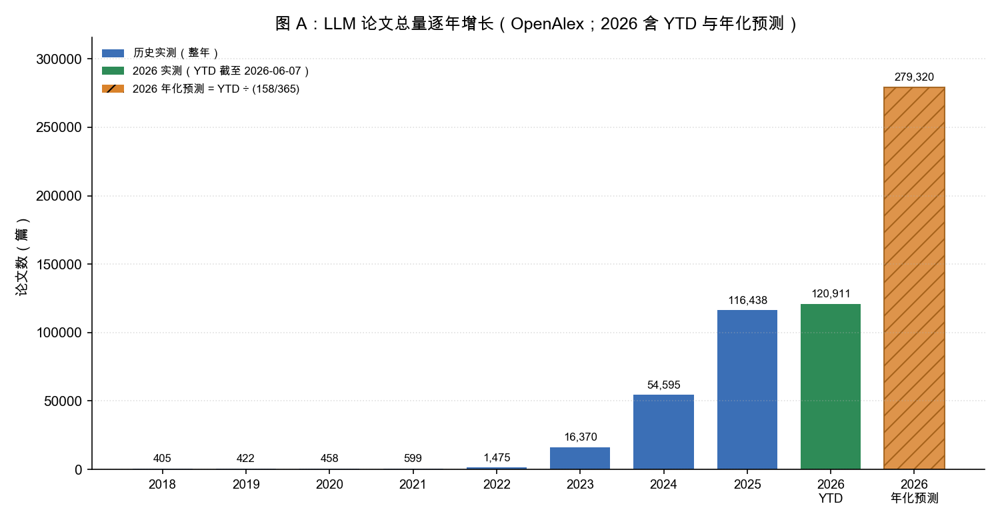
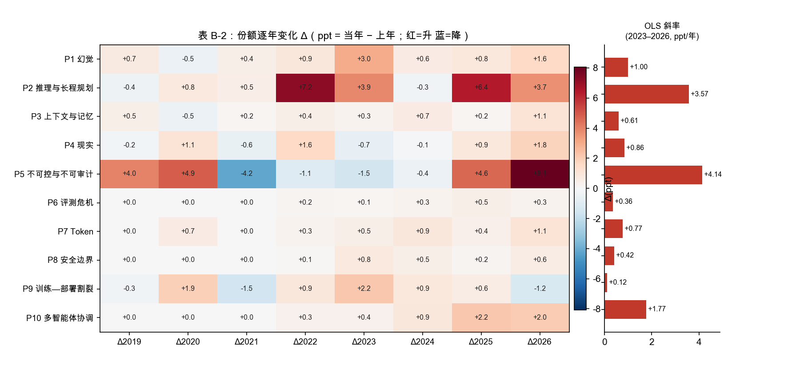
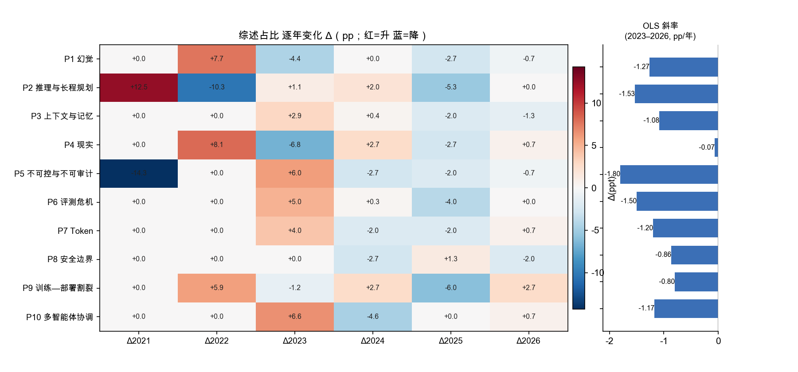
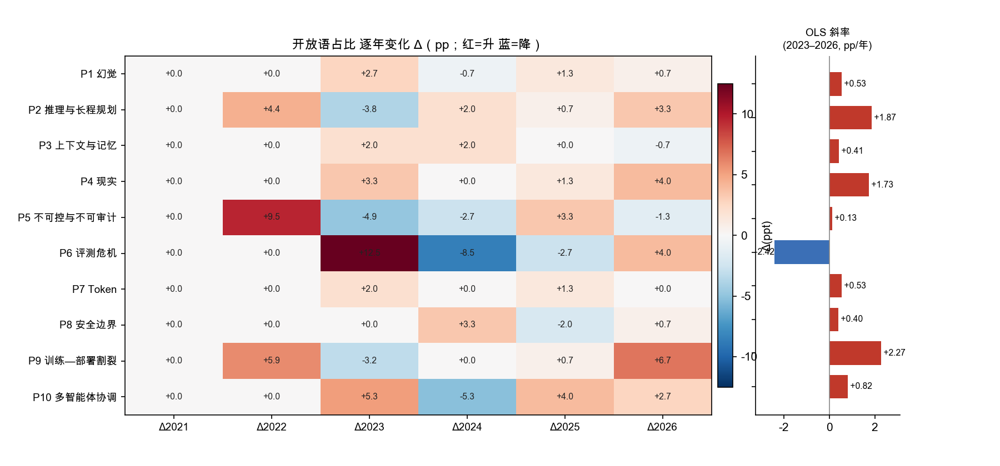
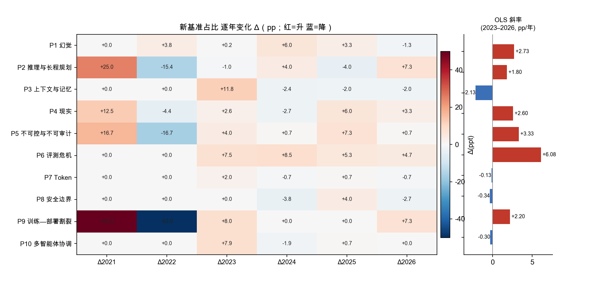
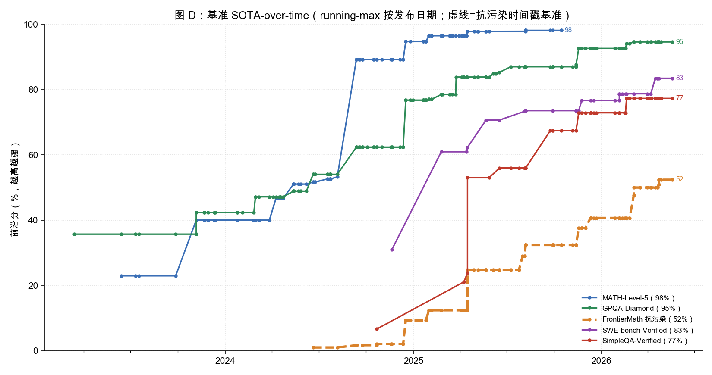
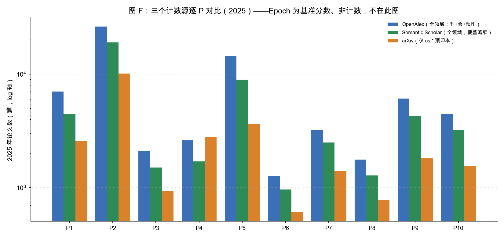

# P1–P10 基础病的论文趋势与能力前沿（自动生成）

> 由 `scripts/analyze_trends.py` 生成。数据源：OpenAlex（计数主源）、Semantic Scholar（交叉验证）、arXiv（摘要文本挖掘）、Epoch AI（基准 SOTA-over-time）。

> **2026 为年初至今（YTD，截至 2026-06-07）**：实测该年计数 99.9% 日期 ≤ 当日。**绝对计数**（图 A）因此不可与整年直接比；但**份额是比值**（分子分母同为 YTD、部分年抵消），故各图份额与斜率（图 B/C/E）把 **2026 YTD 当全年纳入（窗口 2023–2026）**。另注：OpenAlex 把「只知年份」的论文默认压到 01-01（每年都有此假峰）。

## 图 A：LLM 总语料逐年增长（分母）

> 读图说明：检索口径内（标题/摘要含 large language model / LLM / foundation model）的全部论文数，作为后面「份额」的分母。2026 画**两根柱**：左为实测 YTD（截至 2026-06-07），右为**年化预测** = YTD ÷ (158/365) ≈ 279,320。年化为等比折算，假设全年均速、**仅供量级参考**。

> 由此推导：2018→2025 增长约 **288×**；2026 仅 158/365 天就已实测 120,911 篇、年化外推约 **279,320 篇**（≈2025 的 2.4×）。绝对计数被这股大潮整体抬高，所以判定**只能看归一化份额**，且年化值不入斜率（仅展示）。

## 图 B：各基础病在 LLM 语料中的份额（%）

> 读图说明：share = 该 P 的论文数 / LLM 总语料数，回答「所有 LLM 论文里有多大比例触及这类病」。**share 是比值**，2026 的分子分母同为 YTD、部分年在比值里抵消，故 **2026 YTD 直接代表全年**纳入。**表 B-2 末列的 OLS 斜率即判定矩阵（图 E）「份额↗」一列的数据源——来自 OpenAlex 计数，是唯一的硬判据。**

**表 B-1　份额水平（%，逐年）**

| P | 病 | 2018 | 2019 | 2020 | 2021 | 2022 | 2023 | 2024 | 2025 | 2026 |
|---|---|---|---|---|---|---|---|---|---|---|
| P1 | 幻觉 Hallucination | 0.0 | 0.7 | 0.2 | 0.7 | 1.6 | 4.6 | 5.2 | 6.0 | 7.6 |
| P2 | 推理与长程规划 Reasoning & Planning | 4.4 | 4.0 | 4.8 | 5.3 | 12.5 | 16.4 | 16.1 | 22.5 | 26.2 |
| P3 | 上下文与记忆 Context & Memory | 0.0 | 0.5 | 0.0 | 0.2 | 0.6 | 0.9 | 1.6 | 1.8 | 2.9 |
| P4 | 现实 Grounding | 0.2 | 0.0 | 1.1 | 0.5 | 2.1 | 1.4 | 1.4 | 2.2 | 4.0 |
| P5 | 不可控与不可审计 Controllability & Auditability | 5.9 | 10.0 | 14.8 | 10.7 | 9.6 | 8.1 | 7.7 | 12.3 | 20.4 |
| P6 | 评测危机 Evaluation Crisis | 0.0 | 0.0 | 0.0 | 0.0 | 0.2 | 0.3 | 0.6 | 1.1 | 1.4 |
| P7 | Token 经济学 Token Economics | 0.0 | 0.0 | 0.7 | 0.7 | 0.9 | 1.4 | 2.3 | 2.8 | 3.9 |
| P8 | 安全边界 Safety Boundary | 0.0 | 0.0 | 0.0 | 0.0 | 0.1 | 0.8 | 1.3 | 1.5 | 2.1 |
| P9 | 训练—部署割裂 Train-Deploy Gap | 0.5 | 0.2 | 2.2 | 0.7 | 1.6 | 3.8 | 4.6 | 5.2 | 4.0 |
| P10 | 多智能体协调 Multi-Agent Coordination | 0.0 | 0.0 | 0.0 | 0.0 | 0.3 | 0.7 | 1.6 | 3.8 | 5.9 |

**表 B-2　份额逐年变化 Δ（ppt = 当年 − 上年；末列为 2023–2026 最小二乘拟合斜率）**

| P | 病 | Δ2019 | Δ2020 | Δ2021 | Δ2022 | Δ2023 | Δ2024 | Δ2025 | Δ2026 | OLS 斜率(ppt/年) |
|---|---|---|---|---|---|---|---|---|---|---|
| P1 | 幻觉 Hallucination | +0.7 | -0.5 | +0.4 | +0.9 | +3.0 | +0.6 | +0.8 | +1.6 | **+1.00** |
| P2 | 推理与长程规划 Reasoning & Planning | -0.4 | +0.8 | +0.5 | +7.2 | +3.9 | -0.3 | +6.4 | +3.7 | **+3.57** |
| P3 | 上下文与记忆 Context & Memory | +0.5 | -0.5 | +0.2 | +0.4 | +0.3 | +0.7 | +0.2 | +1.1 | **+0.61** |
| P4 | 现实 Grounding | -0.2 | +1.1 | -0.6 | +1.6 | -0.7 | -0.1 | +0.9 | +1.8 | **+0.86** |
| P5 | 不可控与不可审计 Controllability & Auditability | +4.0 | +4.9 | -4.2 | -1.1 | -1.5 | -0.4 | +4.6 | +8.1 | **+4.14** |
| P6 | 评测危机 Evaluation Crisis | +0.0 | +0.0 | +0.0 | +0.2 | +0.1 | +0.3 | +0.5 | +0.3 | **+0.36** |
| P7 | Token 经济学 Token Economics | +0.0 | +0.7 | +0.0 | +0.3 | +0.5 | +0.9 | +0.4 | +1.1 | **+0.77** |
| P8 | 安全边界 Safety Boundary | +0.0 | +0.0 | +0.0 | +0.1 | +0.8 | +0.5 | +0.2 | +0.6 | **+0.42** |
| P9 | 训练—部署割裂 Train-Deploy Gap | -0.3 | +1.9 | -1.5 | +0.9 | +2.2 | +0.9 | +0.6 | -1.2 | **+0.12** |
| P10 | 多智能体协调 Multi-Agent Coordination | +0.0 | +0.0 | +0.0 | +0.3 | +0.4 | +0.9 | +2.2 | +2.0 | **+1.77** |

> 下图把表 B-2 可视化：左为份额逐年变化 Δ 的热力图（**红=升 蓝=降**），右为 2023–2026 的 OLS 拟合斜率。

> 由此推导：份额增速 top-4 为 P5 不可控与不可审计、P2 推理与长程规划、P10 多智能体协调、P1 幻觉。热力图里**红格（份额回落）零星散布**（如 P5 早期、P9 的 2026 YTD），但右侧 **10 类 OLS 斜率条无一向左（无一为负）**——没有任何一类病的份额形成持续下降趋势；最平的是 **P9（斜率 +0.12，近持平）**。基础病不是被解决而退场，而是整体仍在升温。

## 图 C：arXiv 摘要文本信号细览（综述 / 开放语 / 新基准）

> 读图说明：本图是判定矩阵（图 E）里**三个 arXiv 摘要文本信号**的定义与底层数据（都来自 6029 篇摘要、每 (P,年) 抽样 ≤150 篇的正则命中占比，再取 2023–2026 的 OLS 斜率；**正则均不分大小写**，下列即完整命中词表，与 `scripts/analyze_trends.py` 的 SURVEY_RE/OPEN_RE/NEWBENCH_RE 一致）。每个信号都给「水平表 + 变化表 + 热力图」：
>
> - **综述↗**：命中 `survey | a review | systematic review | position paper | we survey | an overview of | comprehensive review` 的占比，**升=领域趋成熟/开始盘点，降=仍在出新方法**。
> - **开放语↗**：命中 `remain(s) [a|an] open/unsolved/challenging/elusive | still [a|an] open/challenging/unsolved | far from solved/being solved | open problem/challenge/question | yet to be solved/addressed | unsolved problem` 的占比，**升=领域仍自认未解，降=自认在收敛**。
> - **新基准↗**：命中 `we introduce/propose/present/construct/build/create/develop/release …(同句内 ≤45 字符)… benchmark/dataset/evaluation suite/test set/test suite` 的占比（`…` 为同句内 ≤45 字符邻近约束），**升=还在造更难的新题**。
>
> **arXiv 检索条件**：每个 P 的查询 = `abs:(该 P 上列关键词) AND abs:(large language model OR LLM OR foundation model) AND (cat:cs.CL OR cat:cs.AI OR cat:cs.LG)`，按 `submittedDate` 逐年切片、每 (P,年) 按最新取 ≤150 篇（2020 年起）。故占比的**分母 = 该 (P,年) 抽样篇数（≤150），不是全部论文**。
> 三者数值小、抖动大、仅覆盖 cs.* 预印本，**只作描述性参考**。

### 图 C-1　综述（survey）

**表 C-1a　综述占比水平（%，逐年；抽样 ≤150 篇/格）**

| P | 病 | 2020 | 2021 | 2022 | 2023 | 2024 | 2025 | 2026 |
|---|---|---|---|---|---|---|---|---|
| P1 | 幻觉 Hallucination | 0.0 | 0.0 | 7.7 | 3.3 | 3.3 | 0.7 | 0.0 |
| P2 | 推理与长程规划 Reasoning & Planning | 0.0 | 12.5 | 2.2 | 3.3 | 5.3 | 0.0 | 0.0 |
| P3 | 上下文与记忆 Context & Memory | – | 0.0 | 0.0 | 2.9 | 3.3 | 1.3 | 0.0 |
| P4 | 现实 Grounding | 0.0 | 0.0 | 8.1 | 1.3 | 4.0 | 1.3 | 2.0 |
| P5 | 不可控与不可审计 Controllability & Auditability | 14.3 | 0.0 | 0.0 | 6.0 | 3.3 | 1.3 | 0.7 |
| P6 | 评测危机 Evaluation Crisis | – | – | 0.0 | 5.0 | 5.3 | 1.3 | 1.3 |
| P7 | Token 经济学 Token Economics | 0.0 | 0.0 | 0.0 | 4.0 | 2.0 | 0.0 | 0.7 |
| P8 | 安全边界 Safety Boundary | – | – | – | 4.7 | 2.0 | 3.3 | 1.3 |
| P9 | 训练—部署割裂 Train-Deploy Gap | 0.0 | 0.0 | 5.9 | 4.7 | 7.3 | 1.3 | 4.0 |
| P10 | 多智能体协调 Multi-Agent Coordination | – | – | 0.0 | 6.6 | 2.0 | 2.0 | 2.7 |

**表 C-1b　综述占比逐年变化 Δ（pp = 当年 − 上年；末列为 2023–2026 最小二乘拟合斜率）**

| P | 病 | Δ2021 | Δ2022 | Δ2023 | Δ2024 | Δ2025 | Δ2026 | OLS 斜率(pp/年) |
|---|---|---|---|---|---|---|---|---|
| P1 | 幻觉 Hallucination | +0.0 | +7.7 | -4.4 | +0.0 | -2.7 | -0.7 | **-1.27** |
| P2 | 推理与长程规划 Reasoning & Planning | +12.5 | -10.3 | +1.1 | +2.0 | -5.3 | +0.0 | **-1.53** |
| P3 | 上下文与记忆 Context & Memory | +0.0 | +0.0 | +2.9 | +0.4 | -2.0 | -1.3 | **-1.08** |
| P4 | 现实 Grounding | +0.0 | +8.1 | -6.8 | +2.7 | -2.7 | +0.7 | **-0.07** |
| P5 | 不可控与不可审计 Controllability & Auditability | -14.3 | +0.0 | +6.0 | -2.7 | -2.0 | -0.7 | **-1.80** |
| P6 | 评测危机 Evaluation Crisis | +0.0 | +0.0 | +5.0 | +0.3 | -4.0 | +0.0 | **-1.50** |
| P7 | Token 经济学 Token Economics | +0.0 | +0.0 | +4.0 | -2.0 | -2.0 | +0.7 | **-1.20** |
| P8 | 安全边界 Safety Boundary | +0.0 | +0.0 | +0.0 | -2.7 | +1.3 | -2.0 | **-0.86** |
| P9 | 训练—部署割裂 Train-Deploy Gap | +0.0 | +5.9 | -1.2 | +2.7 | -6.0 | +2.7 | **-0.80** |
| P10 | 多智能体协调 Multi-Agent Coordination | +0.0 | +0.0 | +6.6 | -4.6 | +0.0 | +0.7 | **-1.17** |

### 图 C-2　开放语（open problem）

**表 C-2a　开放语占比水平（%，逐年；抽样 ≤150 篇/格）**

| P | 病 | 2020 | 2021 | 2022 | 2023 | 2024 | 2025 | 2026 |
|---|---|---|---|---|---|---|---|---|
| P1 | 幻觉 Hallucination | 0.0 | 0.0 | 0.0 | 2.7 | 2.0 | 3.3 | 4.0 |
| P2 | 推理与长程规划 Reasoning & Planning | 0.0 | 0.0 | 4.4 | 0.7 | 2.7 | 3.3 | 6.7 |
| P3 | 上下文与记忆 Context & Memory | – | 0.0 | 0.0 | 2.0 | 4.0 | 4.0 | 3.3 |
| P4 | 现实 Grounding | 0.0 | 0.0 | 0.0 | 3.3 | 3.3 | 4.7 | 8.7 |
| P5 | 不可控与不可审计 Controllability & Auditability | 0.0 | 0.0 | 9.5 | 4.7 | 2.0 | 5.3 | 4.0 |
| P6 | 评测危机 Evaluation Crisis | – | – | 0.0 | 12.5 | 4.0 | 1.3 | 5.3 |
| P7 | Token 经济学 Token Economics | 0.0 | 0.0 | 0.0 | 2.0 | 2.0 | 3.3 | 3.3 |
| P8 | 安全边界 Safety Boundary | – | – | – | 0.0 | 3.3 | 1.3 | 2.0 |
| P9 | 训练—部署割裂 Train-Deploy Gap | 0.0 | 0.0 | 5.9 | 2.7 | 2.7 | 3.3 | 10.0 |
| P10 | 多智能体协调 Multi-Agent Coordination | – | – | 0.0 | 5.3 | 0.0 | 4.0 | 6.7 |

**表 C-2b　开放语占比逐年变化 Δ（pp = 当年 − 上年；末列为 2023–2026 最小二乘拟合斜率）**

| P | 病 | Δ2021 | Δ2022 | Δ2023 | Δ2024 | Δ2025 | Δ2026 | OLS 斜率(pp/年) |
|---|---|---|---|---|---|---|---|---|
| P1 | 幻觉 Hallucination | +0.0 | +0.0 | +2.7 | -0.7 | +1.3 | +0.7 | **+0.53** |
| P2 | 推理与长程规划 Reasoning & Planning | +0.0 | +4.4 | -3.8 | +2.0 | +0.7 | +3.3 | **+1.87** |
| P3 | 上下文与记忆 Context & Memory | +0.0 | +0.0 | +2.0 | +2.0 | +0.0 | -0.7 | **+0.41** |
| P4 | 现实 Grounding | +0.0 | +0.0 | +3.3 | +0.0 | +1.3 | +4.0 | **+1.73** |
| P5 | 不可控与不可审计 Controllability & Auditability | +0.0 | +9.5 | -4.9 | -2.7 | +3.3 | -1.3 | **+0.13** |
| P6 | 评测危机 Evaluation Crisis | +0.0 | +0.0 | +12.5 | -8.5 | -2.7 | +4.0 | **-2.42** |
| P7 | Token 经济学 Token Economics | +0.0 | +0.0 | +2.0 | +0.0 | +1.3 | +0.0 | **+0.53** |
| P8 | 安全边界 Safety Boundary | +0.0 | +0.0 | +0.0 | +3.3 | -2.0 | +0.7 | **+0.40** |
| P9 | 训练—部署割裂 Train-Deploy Gap | +0.0 | +5.9 | -3.2 | +0.0 | +0.7 | +6.7 | **+2.27** |
| P10 | 多智能体协调 Multi-Agent Coordination | +0.0 | +0.0 | +5.3 | -5.3 | +4.0 | +2.7 | **+0.82** |

### 图 C-3　新基准（new benchmark）

**表 C-3a　新基准占比水平（%，逐年；抽样 ≤150 篇/格）**

| P | 病 | 2020 | 2021 | 2022 | 2023 | 2024 | 2025 | 2026 |
|---|---|---|---|---|---|---|---|---|
| P1 | 幻觉 Hallucination | 0.0 | 0.0 | 3.8 | 4.0 | 10.0 | 13.3 | 12.0 |
| P2 | 推理与长程规划 Reasoning & Planning | 0.0 | 25.0 | 9.6 | 8.7 | 12.7 | 8.7 | 16.0 |
| P3 | 上下文与记忆 Context & Memory | – | 0.0 | 0.0 | 11.8 | 9.3 | 7.3 | 5.3 |
| P4 | 现实 Grounding | 0.0 | 12.5 | 8.1 | 10.7 | 8.0 | 14.0 | 17.3 |
| P5 | 不可控与不可审计 Controllability & Auditability | 0.0 | 16.7 | 0.0 | 4.0 | 4.7 | 12.0 | 12.7 |
| P6 | 评测危机 Evaluation Crisis | – | – | 0.0 | 7.5 | 16.0 | 21.3 | 26.0 |
| P7 | Token 经济学 Token Economics | 0.0 | 0.0 | 0.0 | 2.0 | 1.3 | 2.0 | 1.3 |
| P8 | 安全边界 Safety Boundary | – | – | – | 10.5 | 6.7 | 10.7 | 8.0 |
| P9 | 训练—部署割裂 Train-Deploy Gap | 0.0 | 50.0 | 0.0 | 8.0 | 8.0 | 8.0 | 15.3 |
| P10 | 多智能体协调 Multi-Agent Coordination | – | – | 0.0 | 7.9 | 6.0 | 6.7 | 6.7 |

**表 C-3b　新基准占比逐年变化 Δ（pp = 当年 − 上年；末列为 2023–2026 最小二乘拟合斜率）**

| P | 病 | Δ2021 | Δ2022 | Δ2023 | Δ2024 | Δ2025 | Δ2026 | OLS 斜率(pp/年) |
|---|---|---|---|---|---|---|---|---|
| P1 | 幻觉 Hallucination | +0.0 | +3.8 | +0.2 | +6.0 | +3.3 | -1.3 | **+2.73** |
| P2 | 推理与长程规划 Reasoning & Planning | +25.0 | -15.4 | -1.0 | +4.0 | -4.0 | +7.3 | **+1.80** |
| P3 | 上下文与记忆 Context & Memory | +0.0 | +0.0 | +11.8 | -2.4 | -2.0 | -2.0 | **-2.13** |
| P4 | 现实 Grounding | +12.5 | -4.4 | +2.6 | -2.7 | +6.0 | +3.3 | **+2.60** |
| P5 | 不可控与不可审计 Controllability & Auditability | +16.7 | -16.7 | +4.0 | +0.7 | +7.3 | +0.7 | **+3.33** |
| P6 | 评测危机 Evaluation Crisis | +0.0 | +0.0 | +7.5 | +8.5 | +5.3 | +4.7 | **+6.08** |
| P7 | Token 经济学 Token Economics | +0.0 | +0.0 | +2.0 | -0.7 | +0.7 | -0.7 | **-0.13** |
| P8 | 安全边界 Safety Boundary | +0.0 | +0.0 | +0.0 | -3.8 | +4.0 | -2.7 | **-0.34** |
| P9 | 训练—部署割裂 Train-Deploy Gap | +50.0 | -50.0 | +8.0 | +0.0 | +0.0 | +7.3 | **+2.20** |
| P10 | 多智能体协调 Multi-Agent Coordination | +0.0 | +0.0 | +7.9 | -1.9 | +0.7 | +0.0 | **-0.30** |

> 由此推导：三个信号 OLS 斜率为正的类数——**综述 0/10、开放语 9/10、新基准 6/10**。综述普遍**降**（仍在出新方法、未到盘点期），开放语与新基准多为**升/持平**（仍自认未解、仍在造更难的题）——三者都指向「热门未解」。但数值小、抖动大，仅作描述性参考；硬判据仍是图 B 份额与图 D 基准。

## 图 D：基准 SOTA-over-time（推理「升级链」最能说明问题）

> 读图说明：**能力前沿曲线**——把每个基准历代模型的分数按**发布日期**排序、取**累计最大值（running-max）**，得到一条只升不降的「当时人类最强模型能拿到的最高分」轨迹（每个圆点 = 一个刷新纪录的新模型）。数据来自 **Epoch AI**（每基准 CSV 含 模型 / 发布日期 / mean_score）。**虚线 = 抗污染基准**：题目在模型训练截止后才出/逐年换新，分数不易被数据泄漏抬高，最可信。这条曲线即判定矩阵（图 E）「基准前沿」一列的来源。
>
> 各基准测什么、现状：

| 基准 | 测什么 | 抗污染 | 最新前沿 | 状态 |
|---|---|---|---|---|
| MATH-Level-5 | 高中竞赛数学最难档（MATH 第 5 级） | 否 | 98% | 已饱和（≈刷爆） |
| GPQA-Diamond | 研究生级科学多选（Google-proof） | 否 | 95% | 已饱和（≈刷爆） |
| FrontierMath | 研究级数学，专家命题、极难 | 是 | 52% | **前沿未饱和** |
| SWE-bench-Verified | 真实 GitHub issue 修复（agentic 编程） | 否 | 83% | 上升中 |
| SimpleQA-Verified | 事实性短问答（抗幻觉） | 否 | 77% | 上升中 |

> 由此推导：MATH/AIME/GPQA 这类老推理基准已**压顶饱和（≥95%）**，但接棒的**抗污染 FrontierMath 仍停在 ~50%**——P2「推理」不是被解决，而是**基准在升级、难度在外推**，这正是「窄域饱和 ≠ 根治」。解读基准要避三个坑：①**饱和退役=幸存者偏差**（基准被刷爆后没人再报，曲线停在高位 ≠ 进步停滞）；②**污染抬高**（老基准高分可能来自训练泄漏，故优先信虚线的抗污染基准）；③**Goodhart**（刷满某基准 ≠ 解决该病）。

## 图 E：判定矩阵（注意力信号 × 能力前沿 → 分类）

> **各列信号的定义见对应图**（本图只做综合判定）：
>
> - **份额↗** → 图 B（OpenAlex 计数，份额 OLS 斜率；唯一**硬判据**）
> - **综述↗ / 开放语↗ / 新基准↗** → 图 C（arXiv 摘要文本挖掘的三个占比斜率）
> - **基准前沿** → 图 D（Epoch AI running-max 分数；能力**硬裁决**）
>
> ⚠ 三列 arXiv 文本信号数值小、抖动大、仅覆盖 cs.\* 预印本，**只作描述性参考**；分类标签只用份额（OpenAlex）与基准（Epoch）两条硬信号决定。详见 `calibration_notes.md`。

| P | 病 | 份额↗ | 综述↗ | 开放语↗ | 新基准↗ | 基准前沿 | 分类 |
|---|---|---|---|---|---|---|---|
| P1 | 幻觉 Hallucination | ↑ | ↓ | ↑ | ↑ | SimpleQA-Verified 77% | **能力快速上升中** |
| P2 | 推理与长程规划 Reasoning & Planning | ↑ | ↓ | ↑ | ↑ | GPQA-Diamond 95%; MATH-Level-5 98%; FrontierMath 52%·抗污染; OTIS-Mock-AIME 100%·抗污染 | **热门未解·前沿基准未饱和** |
| P3 | 上下文与记忆 Context & Memory | ↑ | ↓ | ↑ | ↓ | —（无对口基准） | **热门未解·持续升级（无基准裁决）** |
| P4 | 现实 Grounding | ↑ | → | ↑ | ↑ | SWE-bench-Verified 83% | **能力快速上升中** |
| P5 | 不可控与不可审计 Controllability & Auditability | ↑ | ↓ | → | ↑ | —（无对口基准） | **热门未解·持续升级（无基准裁决）** |
| P6 | 评测危机 Evaluation Crisis | ↑ | ↓ | ↓ | ↑ | —（无对口基准） | **热门未解·持续升级（无基准裁决）** |
| P7 | Token 经济学 Token Economics | ↑ | ↓ | ↑ | → | —（无对口基准） | **热门未解·持续升级（无基准裁决）** |
| P8 | 安全边界 Safety Boundary | ↑ | ↓ | ↑ | ↓ | —（无对口基准） | **热门未解·持续升级（无基准裁决）** |
| P9 | 训练—部署割裂 Train-Deploy Gap | ↑ | ↓ | ↑ | ↑ | —（无对口基准） | **份额平稳·持续投入（无基准裁决）** |
| P10 | 多智能体协调 Multi-Agent Coordination | ↑ | ↓ | ↑ | ↓ | —（无对口基准） | **热门未解·持续升级（无基准裁决）** |

## 图 F：四个数据源的差别（口径 / 覆盖 / 各管什么）

> 读图说明：四源里 **OpenAlex / Semantic Scholar / arXiv 是「论文计数」源**（可直接比），**Epoch AI 是「基准分数」源**（另一种模态，不可与计数比）。

| 源 | 模态 | 覆盖范围 | 本管线用途 | 已知偏置 |
|---|---|---|---|---|
| **OpenAlex** | 论文计数 | 全领域：期刊+会议+预印本 | **份额主源**（图 A/B/E 份额列） | 只知年份的论文压到 01-01 假峰 |
| **Semantic Scholar** | 论文计数 | 全领域，覆盖/去重略窄 | 交叉验证（本图 F） | bulk 接口限流 429 |
| **arXiv** | 论文计数 + **全文摘要** | **仅 cs.* 预印本** | 摘要文本挖掘（图 C 细览、图 E 三列箭头） | 漏掉非 CS / 非预印本 |
| **Epoch AI** | **基准分数 over time** | 前沿模型 × 基准 | 能力前沿硬裁决（图 D/E） | 仅覆盖少数热门基准 |

**三个计数源逐 P 对比（2025，绝对数）：**

| P | OpenAlex | S2 | arXiv | OA/S2 | OA/arXiv |
|---|---|---|---|---|---|
| P1 | 7021 | 4444 | 2567 | 1.58 | 2.74 |
| P2 | 26212 | 18981 | 10107 | 1.38 | 2.59 |
| P3 | 2084 | 1506 | 934 | 1.38 | 2.23 |
| P4 | 2598 | 1704 | 2778 | 1.52 | 0.94 |
| P5 | 14342 | 8907 | 3609 | 1.61 | 3.97 |
| P6 | 1266 | 962 | 611 | 1.32 | 2.07 |
| P7 | 3222 | 2503 | 1406 | 1.29 | 2.29 |
| P8 | 1765 | 1278 | 773 | 1.38 | 2.28 |
| P9 | 6065 | 4245 | 1807 | 1.43 | 3.36 |
| P10 | 4461 | 3214 | 1559 | 1.39 | 2.86 |
| **合计** | 69036 | 47744 | 26151 | 1.45 | 2.64 |

> 形状一致性（各 P log 计数 Pearson r）：OpenAlex×S2 = **0.997**，OpenAlex×arXiv = **0.916**。

> 由此推导：①**OpenAlex 与 S2 形状几乎重合（r≈1.00）**，S2 绝对数约为 OpenAlex 的 69%（覆盖略窄）——两源互证，份额不是单源 artifact。②**arXiv 系统性偏小**（合计仅 OpenAlex 的 38%），且偏差随主题而变：**P5 不可控 OA/arXiv≈4.0、P9 训练部署≈3.4**（这些主题大量发在非 CS / 期刊，arXiv 抓不到），而 **P4 grounding≈0.9**（arXiv 原生 CS 话题，反而齐平）。③正因 arXiv 的计数有此偏，管线**不拿它做计数**，只用它独有的**全文摘要**做文本信号。④Epoch 回答的是「能力涨没涨」，与「发了多少论文」正交，故单列、不入此对比。

## 威胁有效性（务必随图一起读）

1. **计数是注意力的代理，不是进度的代理。** 关键词检索有 precision/recall 误差；P2「reasoning」、P5「reproducibility」等词对全域语义渗透强，绝对值偏高。

2. **OpenAlex 与 S2 绝对数不同**（覆盖/去重差异），故只比形状与比值，不比绝对数。

3. **arXiv 偏 CS、偏 preprint**，且摘要信号为**抽样**（每 P 每年 ≤150 篇）估计，比率有抽样噪声。

4. **基准三陷阱**：①饱和退役=幸存者偏差（刷爆即弃报）；②污染抬高（老基准高分或来自泄漏，故优先信抗污染时间戳基准）；③Goodhart（刷满≠解决该病）。

5. **多数 P（P3/P5/P7/P8/P9/P10）无对口公开前沿榜** → 只有论文三源的软结论，已在表中标注「无基准裁决」。

6. **2026 部分年**：**绝对计数**（图 A）因 YTD + 01-01 假峰而虚高，不与整年比；但**份额是比值**，分子分母同为 YTD、部分年抵消，故份额斜率把 2026 纳入（窗口 2023–2026）。

7. **探照灯效应**：份额低未必=已解决，可能是「太难以至于没法研究」。

> 一句话：**没有任何一类基础病的份额在下降**；少数有基准的病（P2/P4）出现「窄域饱和」，但抗污染基准（FrontierMath 52%）证明根问题未解。计数能告诉你「大家还在拼命投入」，但「投入仍在涨」本身就是「尚未解决」的最强信号。
